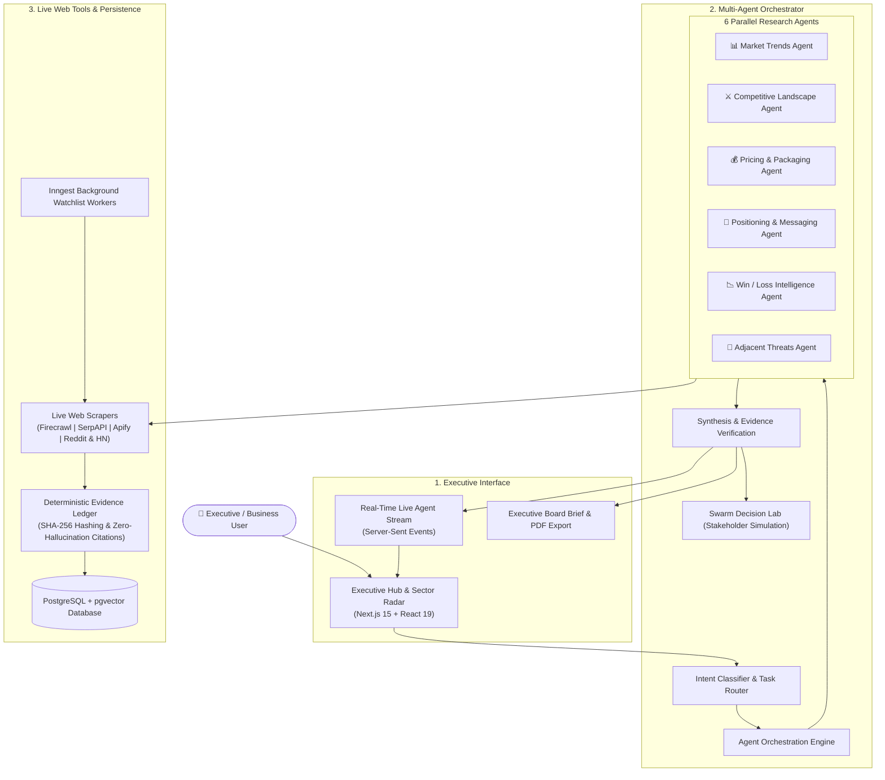

# Veracity

<div align="center">

```
 __      __                     _ _         
 \ \    / /                    (_) |        
  \ \  / /__ _ __ __ _  ___ _ _| |_ _   _ 
   \ \/ / _ \ '__/ _` |/ __| | | __| | | |
    \  /  __/ | | (_| | (__| | | |_| |_| |
     \/ \___|_|  \__,_|\___|_|_|\__|\__, |
                                     __/ |
                                    |___/ 
```

**Autonomous Market Intelligence & Competitive Strategy Engine**

*Know what changed, prove it with real web evidence, and decide what to do next.*

</div>

---

## What is Veracity?

**Veracity** is an autonomous market intelligence platform designed for business leaders, product teams, and strategists. 

Instead of relying on general chatbots that guess or make things up, Veracity launches a team of specialized AI agents that continuously scan real web sources, detect competitor moves over time, and deliver boardroom-ready decision briefs with verified citations.

---

## Why is Veracity Useful?

- **Zero Hallucinations & Real Proof**: Every metric, price, and claim is strictly backed by real web sources. If data is not available, it says "No source found" instead of guessing.
- **6 AI Agents in Parallel**: Spawns 6 specialized agents at the same time to research market trends, feature comparisons, pricing plans, positioning, win/loss reasons, and disruptor threats.
- **Remembers Competitor History**: Tracks competitor changes over an 8-month historical timeline. You can see exactly when a competitor raised prices, launched features, or changed messaging.
- **Automated Watchlists & Alerts**: Continuously monitors competitor websites in the background and sends alerts only when meaningful changes occur.
- **Synthetic Stakeholder Testing (Swarm Lab)**: Stress-tests your business strategies against simulated buyer and customer personas before you launch.
- **Executive Board Briefs & Actionable Playbooks**: Delivers direct summaries, comparison tables, decision tradeoffs, and exportable PDF board packs with role-based tasks for executives.

---

## System Architecture



---

## Available Technologies

- **Frontend**: Next.js 15 (App Router), React 19, Tailwind CSS v4, Motion, Recharts, Lucide Icons
- **AI & Agents**: Google Gemini 2.5 (`@google/genai`), LangGraph / Custom TypeScript Orchestrator
- **Live Search & Scraping**: Firecrawl API, SerpAPI, Apify, Reddit & Hacker News APIs
- **Database & Storage**: PostgreSQL, `pgvector` (semantic memory), Supabase, Upstash Redis
- **Background Automation**: Inngest (automated watchlist monitoring)
- **Exports & Documents**: `@react-pdf/renderer` (Executive PDF briefs), `docx` (Word reports)
- **Testing & Quality**: Vitest, Playwright E2E, TypeScript 5.9

---

## How the System Works (In 4 Simple Steps)

1. **Ask or Compare**: Enter a business question or pick two competitors (e.g., *Dialog vs. SLT-Mobitel* or *PickMe vs. Uber*).
2. **10-Second Multi-Agent Wave**: 6 specialist agents run in parallel to gather real-time data from pricing pages, news, feature logs, and community forums.
3. **Verification & Evidence Check**: All extracted facts are checked, hashed, and linked to verified web URLs.
4. **Board Brief & Strategy Playbook**: You receive a comprehensive executive brief with key takeaways, side-by-side matrices, and ready-to-use execution plans.

---

## Quick Start

### 1. Install Dependencies
```bash
npm install
```

### 2. Configure Environment Variables
Copy `.env.example` to `.env` and add your API keys:
```bash
cp .env.example .env
```

### 3. Setup Database & Seed Demo Data
```bash
npm run db:migrate
npm run dev:seed
npm run seed:demo
npm run seed:watchlists
```

### 4. Start Development Server
```bash
npm run dev
```

Open [http://localhost:3000](http://localhost:3000) and click **"Demo user"** on `/auth` for instant access with loaded enterprise data.

---

## Project Structure

- `app/` — Next.js 15 pages, auth, and API routes (`/api/chat`, `/api/watchlists`, etc.)
- `components/` — UI design system, radar charts, executive board mode, and chat panels
- `lib/agents/` — Multi-agent orchestrator and the 6 research specialists
- `lib/tools/` — Live web search and scraper connectors (Firecrawl, SerpAPI, Apify)
- `docs/` — Architecture notes, product specs, and development plans
- `scripts/` — Database migrations, seed scripts, and output quality validators

---

## Useful Commands

- `npm run dev` — Start the local web application
- `npm run build` — Build for production
- `npm run typecheck` — Verify TypeScript types
- `npm test` — Run unit and integration tests
- `npm run test:quality` — Validate output quality and citation grounding rules
