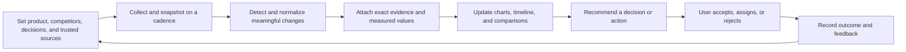
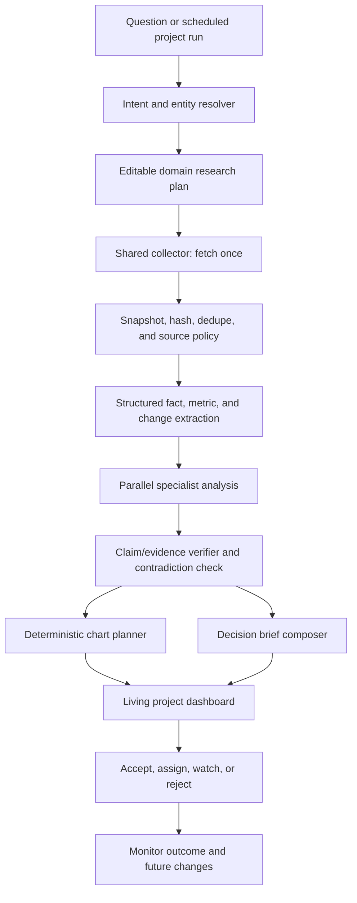

# Veracity Product-First Market Research and Functional Roadmap

**Date:** 2026-08-01  
**Status:** Product direction and implementation priority source  
**Audience:** Product owner, designers, AI engineers, and full-stack developers  
**Companion technical audit:** [VERACITY_FULL_TECHNICAL_AUDIT_2026-08-01.md](./VERACITY_FULL_TECHNICAL_AUDIT_2026-08-01.md)

---

## 1. Decision in one page

### The market conclusion

Do **not** build Veracity as “ChatGPT/Gemini with more agents and prettier charts.” That category is already commoditized. As of this research date:

- ChatGPT can perform multi-step deep research over the web, uploads, and connected apps, lets the user review a proposed research plan, produces cited reports, analyzes files with Python, creates charts and tables, stores work in projects, and supports scheduled monitoring. Even its free plan includes limited search, projects, data analysis, and deep research. See OpenAI's current [deep research guide](https://help.openai.com/en/articles/10500283-deep-research), [data-analysis guide](https://help.openai.com/en/articles/8437071-data-analysis-with-chatgpt), [projects guide](https://help.openai.com/en/articles/10169521-projects-in-chatgpt), [scheduled tasks guide](https://help.openai.com/en/articles/10291617-tasks-in-chatgpt), and [plan comparison](https://chatgpt.com/pricing/).
- Gemini Deep Research creates an editable research plan, searches Google and selected Gmail/Drive/uploads/NotebookLM sources, produces cited reports, exports to Docs, and can generate charts, diagrams, and interactive visuals on eligible plans. Gemini also supports recurring scheduled actions. See Google's [Deep Research help](https://support.google.com/gemini/answer/15719111?hl=en), [scheduled actions help](https://support.google.com/gemini/answer/16316416?hl=en), and [Gemini in Sheets](https://workspace.google.com/intl/en/resources/spreadsheet-ai/).
- Perplexity's current research product similarly advertises deeper web research, document analysis, calculations, progress visibility, clarifying questions, and editable/shareable reports. See its [Advanced Deep Research update](https://www.perplexity.ai/help-center/en/articles/13600190-what-s-new-in-advanced-deep-research).

Therefore, **one-off research answers are not the product moat**.

### The product Veracity should become

> **Veracity is a living competitive decision workspace that continuously turns public evidence into traceable changes, accurate charts, and recommended actions.**

The product is for a product marketer, founder, product manager, or growth lead who repeatedly asks:

- What changed among these competitors since last week?
- Which change is material to our current decision?
- What evidence proves it?
- What does the historical trend show?
- What should we do next, who owns it, and did it work?

This is different from asking a general chatbot to research the same topic again every week.

### The reason to buy

A user should pay for Veracity because it remembers and maintains a **specific market model**:

1. Their product, competitors, segments, decisions, and trusted sources are already configured.
2. Evidence is collected repeatedly and deduplicated into a longitudinal history.
3. Every chart is computed from stored facts with source and methodology links.
4. Only meaningful changes trigger alerts.
5. Research becomes a reusable product artifact—timeline, comparison, battlecard, decision brief—not a disposable chat response.
6. Feedback on recommendations and outcomes improves the next decision cycle.

### Build priority

1. Make all displayed facts and chart values honest.
2. Turn “chat sessions” into persistent research projects.
3. Build an evidence/event ledger and competitor change timeline.
4. Generate deterministic charts from stored data.
5. Add continuous monitoring and decision alerts.
6. Add decision/action tracking and outcome learning.
7. Add more connectors and enterprise controls only after users repeatedly use the core loop.

### Explicitly defer

- Full enterprise SAML/SCIM/compliance work.
- A broad organization knowledge graph.
- More decorative agent visualizations.
- General-purpose content generation.
- Simulated-persona forecasts presented as market predictions.
- Replacing the working custom planner with LangGraph.
- Building a proprietary global traffic dataset comparable to Similarweb.

Unsafe unfinished features should be **disabled**, not expanded, while the product is validated.

---

## 2. Research scope and method

This analysis reviewed the present codebase and current primary documentation from:

- General AI research products: OpenAI ChatGPT, Google Gemini, and Perplexity.
- Competitive-intelligence platforms: Klue, Crayon, and Semrush Kompyte.
- Continuous market-intelligence platforms: Feedly and Contify.
- Premium/proprietary research and digital-data platforms: AlphaSense, CB Insights, Similarweb, and Semrush.
- Public structured-data providers useful for an affordable product: SEC EDGAR, GitHub, FRED, GDELT, and the limited-access Google Trends API.

Vendor feature descriptions are vendor claims, not independent verification. This document uses them to map the category and product expectations, not to repeat claimed ROI percentages.

The repository review focused on the existing agents, watchlists, alerts, timelines, decision memory, exports, source lists, and chart components. Particular attention was given to `market-trends.ts`, `TrendChart.tsx`, `ResultsInsightCharts.tsx`, `ForecastChart.tsx`, the artifact renderer, workflow executor, evidence binding, and monitoring functions.

---

## 3. What users can already get without Veracity

### 3.1 General AI substitution matrix

| Need | ChatGPT | Gemini | Implication for Veracity |
|---|---|---|---|
| Search and synthesize the web | Deep Research | Deep Research with Google Search | Not differentiating |
| Review/edit research plan | Yes | Yes | Veracity must offer domain-specific plans and reusable presets |
| Upload documents/spreadsheets | Yes | Yes | Basic upload is table stakes |
| Search connected work sources | Connected apps | Gmail, Drive, NotebookLM and Workspace | Generic connectors alone are not a moat |
| Citations/source links | Yes | Yes | A list of URLs is table stakes; claim-to-excerpt traceability can differentiate |
| Data analysis | Python-backed analysis | Gemini/Sheets analysis | Generic calculations are not differentiating |
| Charts | Static and some interactive charts | Sheets charts and Deep Research visuals | Charts alone are not differentiating |
| Persistent context | Projects and memory | Gemini chats, Gems, Workspace sources | Veracity needs a structured market history, not only chat memory |
| Scheduled monitoring | Scheduled tasks can check changes | Scheduled actions can create recurring reports | A recurring prompt is not enough; Veracity needs deduplicated change history and materiality |
| Progress/agent behavior | Research plan/progress, agent capabilities | Research plan and background execution | Showing many agents is no longer unique |
| Report/export | Share/download and connected productivity tools | Export to Docs and other Workspace flows | PDF export is useful but not a moat |

### 3.2 Why a user will not buy the current concept

A rational user will stay with ChatGPT or Gemini if Veracity only provides:

- A text box and a longer research response.
- More named agents but no measurably better evidence.
- Charts derived from model-generated numbers.
- A source list that does not prove individual claims.
- Generic recommendations they could request in another prompt.
- A PDF export of the same disposable answer.
- A simulated “swarm” whose personas and probabilities are not observed customer data.

The general products are cheaper or already included in subscriptions, have stronger models, broader tool ecosystems, better multimodal handling, and far larger engineering budgets.

### 3.3 Where general AI still leaves room

General AI is optimized for broad, user-directed tasks. A focused product can win by maintaining a **repeatable domain workflow and longitudinal dataset**:

- It knows exactly which entities, pages, signals, metrics, and decisions matter.
- It collects comparable observations on a defined cadence.
- It understands the difference between “new evidence” and a duplicate story.
- It can show what changed between two snapshots.
- It preserves methodology so a chart remains comparable over time.
- It pushes an action to the user instead of waiting for a prompt.
- It remembers whether the team accepted the recommendation and what happened.

That workflow is the product—not the LLM response.

---

## 4. What specialist market products actually sell

### 4.1 Category pattern

Current specialist products converge on five durable value layers:

1. **Collection:** continuously acquire public, licensed, and internal data.
2. **Curation:** remove noise, normalize entities, deduplicate, tag, and prioritize.
3. **Analysis:** compare changes, find patterns, answer questions, and attach context.
4. **Delivery:** dashboards, timelines, alerts, battlecards, newsletters, CRM/Slack/Teams.
5. **Measurement:** usage, win/loss outcomes, revenue effect, or decision follow-through.

Klue describes this directly as collect, analyze, create, distribute, and measure, with website/pricing/product-change tracking, battlecards, digests, collaboration, and impact measurement. See [Klue Competitive Intelligence](https://klue.com/competitive-intelligence-software).

Semrush Kompyte combines continuous crawling with a collection feed, company profiles, configurable reports, battlecards, workflows, and analytics. Semrush's newer Competitor Monitoring product emphasizes trend graphs, timelines, links to original pages, filtering, and weekly email/Slack delivery. See [Kompyte](https://www.semrush.com/kb/1260-kompyte) and [Competitor Monitoring](https://www.semrush.com/kb/1206-traffic-and-market-competitor-monitoring).

Feedly emphasizes user-controlled source sets, long-running AI feeds, emerging-trend dashboards, real-time metrics, inline citations, spreadsheet extraction, newsletters, and integrations. See [Feedly Market Intelligence](https://feedly.com/market-intelligence) and its [AI Feeds documentation](https://docs.feedly.com/article/699-guide-to-ai-feeds-market-intel).

AlphaSense differentiates through a premium document corpus, internal knowledge, structured financial data, monitoring, scheduled agents, and work products in Excel/PowerPoint. See [AlphaSense Platform](https://www.alpha-sense.com/platform/).

Similarweb's product value comes from its data asset: direct measurements, contributor data, partnerships, public extraction, normalization, and predictive modeling. See its [data methodology](https://support.similarweb.com/hc/en-us/articles/360001631538-Similarweb-Data-Methodology). Veracity cannot recreate that asset by asking an LLM to estimate traffic.

### 4.2 Market solution comparison

| Category/product | What the buyer is really purchasing | Veracity response |
|---|---|---|
| ChatGPT / Gemini / Perplexity | Broad model capability and one-off research productivity | Do not compete on generic answers |
| Klue / Crayon | Competitive enablement, curation, battlecards, seller delivery, win/loss | Focus initially on product/founder decisions, not full sales enablement |
| Kompyte / Contify | Continuous web monitoring, change feeds, dashboards, alerts | Build a narrower, transparent, low-cost change monitor |
| Feedly Market Intelligence | Curated source universe, persistent feeds, trend discovery, sharing | Let users control sources and make source history first-class |
| AlphaSense / CB Insights | Licensed/proprietary corpus and structured company/financial data | Use open data and BYO sources; never imply equivalent coverage |
| Semrush / Similarweb | Proprietary digital traffic/search/ad datasets and comparable metrics | Integrate their APIs later; do not fabricate traffic/share metrics |

### 4.3 The unserved opportunity

There is room below large enterprise platforms for small B2B SaaS teams that need ongoing competitor and market tracking but cannot justify a dedicated CI analyst or a high-cost data platform. Their problem is not “I cannot ask AI a question.” It is:

- I repeat the same research every week.
- I forget what was previously true.
- My spreadsheet/battlecard becomes stale.
- I cannot tell whether an alert is actually new or important.
- I cannot defend the numbers in a chart.
- Research is disconnected from the decision and its outcome.

Veracity should solve that smaller, repeated workflow extremely well.

---

## 5. Target buyer, user, and job-to-be-done

### Primary initial user

**Founder, product marketer, product manager, or growth lead at a 5–200 person B2B software company** with three to ten meaningful competitors and no dedicated competitive-intelligence team.

Why this segment:

- The repository already focuses on B2B product, positioning, pricing, and growth signals.
- These users make recurring decisions but often work from spreadsheets and browser tabs.
- They can benefit from public website/changelog/pricing/review/open-data monitoring.
- They need useful artifacts but not full enterprise SSO, SCIM, analyst services, or a proprietary financial corpus.

### Core job-to-be-done

> When my market changes, help me understand what changed, verify the evidence, see the trend, and decide what to do—without rebuilding the research from scratch.

### High-value recurring decisions

1. Did a competitor change pricing, packaging, or positioning?
2. Which product features are competitors newly emphasizing or shipping?
3. Which customer pain points are becoming more frequent in a defined source set?
4. Is a trend supported by measured observations, or just repeated commentary?
5. What changed since the last product/marketing planning meeting?
6. Which evidence should change our roadmap, campaign, or sales narrative?
7. Did an action based on previous intelligence produce the expected outcome?

### Not the initial user

- Investment analysts requiring licensed financial research.
- Large sales organizations requiring full CRM/Gong/battlecard deployment.
- Consumer social-listening teams requiring firehose access.
- Security intelligence teams.
- Users seeking a general-purpose personal assistant.

---

## 6. Product promise and positioning

### Recommended one-line promise

> **Know what changed, prove it, and decide what to do next.**

### Product description

Veracity continuously monitors the competitors and market sources a team chooses. It converts page changes, launches, pricing updates, news, reviews, public metrics, and uploaded customer evidence into a deduplicated timeline. It then generates traceable charts and decision briefs where every important claim links to the underlying evidence.

### Differentiation pillars

| Pillar | User benefit | Why a general chatbot is weaker |
|---|---|---|
| Living market memory | No repeated setup; compare against prior snapshots | Chat history is not a normalized longitudinal dataset |
| Evidence-linked changes | User sees exact before/after and source excerpt | Citations in a report do not inherently prove every claim |
| Honest charts | Values, formulas, dates, and sources are inspectable | Generated charts may be based on transient uploaded/retrieved data |
| Materiality | Noise is suppressed and alerts explain why a change matters | Scheduled prompts can repeat or over-report weak signals |
| Decision loop | Recommendation, owner, review date, and outcome live together | General chat rarely maintains structured decision operations |
| User-controlled sources | Team defines trusted/blocked sources and monitored pages | Broad search optimizes general relevance rather than one team's policy |
| Reusable artifacts | Timeline, competitor profile, comparison, brief, and export update automatically | One-off reports become stale immediately |

### Product category

Use **competitive decision intelligence** or **living market intelligence**, not “AI agent platform.” Users buy outcomes, not orchestration internals.

---

## 7. The product loop



The first run creates a baseline. Every later run should be cheaper and more valuable because it answers “what changed?” rather than rediscovering the entire market.

---

## 8. Accurate charts: the core trust feature

### 8.1 Current problem in the code

The existing visual components are polished but can overstate the quality of their data:

- `lib/agents/market-trends.ts` asks Gemini to return `changePercent` even when the collected inputs are mostly search snippets and mixed signals. The prompt says not to invent precise percentages, but the schema still requires a number and no deterministic validation proves its origin.
- `components/artifacts/TrendChart.tsx` uses `Math.abs(t.changePercent || 5)`, so a missing/zero value can become a visible bar of `5`.
- `ResultsInsightCharts.tsx` converts `low/medium/high` confidence to `1/2/3`. This can be useful as an ordinal diagnostic, but it is not a measured market quantity and must be labeled as a score.
- Its “strengths vs weaknesses” pie counts model-classified comparison rows. This is a rubric summary, not market share.
- `ForecastChart.tsx` presents probability bands from synthetic personas. Those are scenario opinions, not calibrated forecasts based on observed outcomes.

This is not solved by adding more chart types. It is solved by defining what kind of number is allowed to enter a chart.

### 8.2 Three visual classes

Every visual must display one of these labels:

| Class | Definition | Examples | Allowed language |
|---|---|---|---|
| **Measured** | Computed directly from source observations with stable units | Price, release count, mention count in a fixed feed, SEC revenue, GitHub releases | “Measured,” with source, sample, period, and formula |
| **Derived** | Deterministic calculation or rubric over measured/evidenced inputs | Change materiality score, evidence coverage, feature-verification coverage | “Derived score,” with formula and limitations |
| **Synthetic** | Model judgment or scenario simulation | Strategic attractiveness, persona sentiment scenario, forecast hypothesis | “Scenario” or “model assessment”; never “observed trend” |

Users must be able to filter out derived and synthetic visuals.

### 8.3 Minimum chart contract

Introduce one validated `ChartSpec` schema used by all intelligence visuals:

```ts
type ChartSpec = {
  id: string;
  kind: 'line' | 'bar' | 'stacked-bar' | 'area' | 'scatter' | 'timeline' | 'matrix';
  dataClass: 'measured' | 'derived' | 'synthetic';
  title: string;
  questionAnswered: string;
  metricDefinition: string;
  unit: string;
  period: { start: string; end: string; cadence: 'day' | 'week' | 'month' | 'snapshot' };
  dimensions: string[];
  series: Array<{ key: string; label: string }>;
  rows: Array<Record<string, string | number | null>>;
  sourceIds: string[];
  sampleSize?: number;
  formula?: string;
  isEstimated: boolean;
  limitations: string[];
  generatedAt: string;
};
```

Rules:

- No chart renders without a unit, period, data class, and at least one source/evidence ID.
- No model-generated numeric value is accepted as measured.
- Zero remains zero; missing remains `null`; never replace it with a visually convenient default.
- Every tooltip includes the exact observation date and evidence link.
- Estimated and sampled data are visibly labeled.
- Incomparable periods/source sets produce an explanation, not a chart.
- Chart data is downloadable as CSV/JSON.

### 8.4 Highest-value charts for the MVP

| Priority | Visual | Data source | Why it helps |
|---:|---|---|---|
| 1 | Competitor activity timeline | Stored page/news/release/change events | Answers what changed and when |
| 2 | Pricing history | Pricing-page snapshots with extracted plan/price records | Shows real packaging movement |
| 3 | Release cadence | Changelog/RSS/GitHub release events | Shows product execution momentum |
| 4 | Signal-volume trend | Counts within one fixed source/query set | Shows whether a topic is becoming more visible, with sample caveat |
| 5 | Evidence coverage | Supported vs unsupported decision claims | Shows answer trust quality |
| 6 | Feature verification matrix | Official docs/pages and dated snapshots | Makes comparisons inspectable |
| 7 | Decision timeline | Intelligence event → recommendation → action → outcome | Connects research to value |
| 8 | Review pain-theme trend | Consistent review/community sample with count and denominator | Shows changes in customer language without claiming population truth |

### 8.5 Charts to avoid now

- Estimated competitor revenue or traffic without a real licensed/open dataset.
- “Market share” inferred from search-result counts.
- Precise growth percentages invented from news snippets.
- Pie charts whose categories are not mutually exclusive parts of a whole.
- Synthetic persona probability as a calibrated market forecast.
- Radar charts with hidden model scoring.
- Sentiment percentages without sample size, source policy, and repeatable classifier evaluation.

### 8.6 Free/open structured data that can support honest charts

| Source | Useful for | Access reality |
|---|---|---|
| [SEC EDGAR APIs](https://www.sec.gov/search-filings/edgar-application-programming-interfaces) | Public-company filings and standardized XBRL financial facts | No API key; real-time JSON; US public companies only; respect access policy |
| [GitHub REST API](https://docs.github.com/en/rest/using-the-rest-api/rate-limits-for-the-rest-api) | Releases, commits, issues, contributors for open-source products | Public unauthenticated access is limited; authenticated access is higher |
| [FRED API](https://fred.stlouisfed.org/docs/api/fred/overview.html) | Macro and industry-adjacent economic series | Requires a registered API key and attribution/terms compliance |
| [GDELT DOC API](https://blog.gdeltproject.org/gdelt-doc-2-0-api-debuts/) | News-event volume and geographic/media signals | Public, but noisy; normalization and source controls are essential |
| [Google Trends API alpha](https://developers.google.com/search/apis/trends) | Consistently scaled search-interest time series | Limited alpha access, not a dependable general-availability dependency yet |
| Product websites/RSS/changelogs | Pricing, positioning, launch, feature changes | Public but requires respectful crawling, snapshots, and schema-specific extraction |

“Free” data does not mean zero product cost. Collection, crawling, normalization, storage, retries, model extraction, legal review, and monitoring all cost money. The product can offer a limited free tier, but accurate continuous coverage cannot honestly be unlimited and free.

---

## 9. Product-first agentic workflow

### 9.1 Design principle

Use agents for ambiguous reasoning. Use deterministic code for permissions, collection policy, calculations, chart values, event deduplication, and workflow state.

### 9.2 Proposed workflow



### 9.3 Roles

| Role | Model needed? | Responsibility | Must not do |
|---|---|---|---|
| Intent/entity resolver | Small model + rules | Identify project, entities, question, desired decision | Create arbitrary URLs or authorize access |
| Planner | Model | Choose research questions and evidence requirements | Execute tools directly without policy |
| Collector | Deterministic | Fetch approved queries/URLs once under budgets | Interpret evidence or follow model instructions from pages |
| Snapshot/deduper | Deterministic | Canonicalize URL, hash content, find before/after | Generate narrative claims |
| Extractor | Schema-constrained model/rules | Extract facts, metrics, events, exact evidence spans | Fill missing numeric values |
| Domain analysts | Models in parallel | Competitor, pricing, customer, market implications | Fetch duplicate evidence independently |
| Verifier | Model + deterministic checks | Test entailment, contradiction, freshness, and entity match | Add new unsupported recommendations |
| Chart planner | Deterministic | Select a valid visualization from stored metrics | Ask the LLM to invent rows or percentages |
| Decision composer | Strong model | Explain implications, alternatives, action, and falsifier | Hide unsupported/contradictory evidence |
| Monitor | Durable workflow | Re-run collection, compare snapshot, send material alert | Repeat full research when nothing changed |

### 9.4 Durable state

The authoritative state should include:

- `project`
- `entity`
- `source_definition`
- `source_snapshot`
- `evidence_span`
- `fact`
- `metric_observation`
- `change_event`
- `claim`
- `chart_spec`
- `decision`
- `action`
- `outcome`
- `research_run`

The agent conversation is a view over this state, not the source of truth.

### 9.5 Orchestration choice

Keep the custom mission planner. Use Inngest for durable scheduled/background work with smaller idempotent steps. Do not spend product time deepening the current LangGraph wrapper. The product gap is structured evidence and longitudinal state, not a missing graph library.

---

## 10. Functional product specification

### 10.1 Onboarding: create a Market Project

The user provides:

- Their product/company name and canonical website.
- Three to ten competitors and canonical websites.
- Market/category terms and geography.
- The decision they care about: pricing, positioning, roadmap, launch, or sales response.
- Pages/sources to trust, monitor, or block.
- Desired cadence and alert sensitivity.

The system resolves entities, proposes relevant pages (home, pricing, product, changelog, docs, jobs, news/RSS), and asks the user to approve the baseline plan.

**Activation event:** a user approves a project, completes the first baseline, and opens at least one source-backed change or chart.

### 10.2 Living dashboard—not a chat-first homepage

Default project screen:

1. “Since your last visit” material changes.
2. Competitor activity timeline.
3. Pricing and release-cadence charts.
4. Current comparison matrix with verification status.
5. Open decisions and recommended next actions.
6. Evidence quality and stale-data warnings.
7. Ask/refine input as a supporting interaction.

Chat remains useful for exploration, but the durable dashboard is the product.

### 10.3 Evidence drawer

Every claim/metric/change opens a drawer showing:

- Exact source URL and title.
- Retrieved timestamp and snapshot hash.
- Exact supporting excerpt or before/after diff.
- Source type and trust policy.
- Entity match.
- Freshness.
- Supporting and contradicting items.
- Why the system classified the change as material.

### 10.4 Change timeline

Normalized event types:

- Pricing/packaging changed.
- Feature/product launched or removed.
- Positioning/messaging changed.
- New target segment/use case.
- Integration/partnership announced.
- Leadership/hiring signal.
- Funding/filing/financial event.
- Review/customer pain theme.
- Campaign/ad/content theme.
- Documentation/API change.

Each event needs an entity, effective/observed date, before/after where applicable, evidence, materiality, confidence, and dedupe key.

### 10.5 Decision brief

Every important change can generate a concise brief:

- What changed.
- Why it may matter to the user's current decision.
- Supporting and contradicting evidence.
- What is known, inferred, and unknown.
- Recommended action and alternative.
- Owner and review date.
- What would invalidate the recommendation.

### 10.6 Monitoring and alerts

An alert is sent only when:

- The snapshot is new.
- The event is not a duplicate.
- The entity match passes.
- Materiality exceeds the user's threshold.
- At least one exact evidence span is stored.

Daily/weekly digest is preferred over noisy instant alerts for the initial product.

### 10.7 Outcome loop

The user can mark a recommendation:

- Accepted.
- Rejected.
- Watching.
- Assigned.
- Completed.

Later, record outcome, evidence, and whether the expectation was correct. Use this to rank future recommendation types. Do not fine-tune a model initially; simple rules and per-user preferences are enough.

---

## 11. Feature priority: build, keep, defer, remove

### 11.1 Must build for product validation

| Priority | Feature | User value | Existing foundation |
|---:|---|---|---|
| 1 | Market Projects | Persistent setup and context | Sessions, folders, workspaces, entities |
| 2 | Source snapshots and evidence spans | Trust and historical comparison | Source metadata, KG/snapshot concepts |
| 3 | Change-event timeline | “What changed?” | Competitive events, alerts, timeline |
| 4 | Validated `ChartSpec` and data ledger | Honest visual decisions | Recharts artifact system |
| 5 | Pricing/release/activity charts | Immediate differentiated value | Pricing, trends, competitive agents |
| 6 | Evidence drawer and before/after diff | Inspectable proof | Source lists and artifact drilldown |
| 7 | Decision brief + owner/outcome | Connects intelligence to action | Decision memory and feedback |
| 8 | Weekly monitored digest | Recurring value/retention | Watchlists, Inngest, alerts |
| 9 | Persistent research conversation | Let users interrogate, refine, and extend a project without restarting | Chat sessions, stored messages, recall, targeted follow-up orchestration |
| 10 | Swarm Decision Lab | Stress-test options against explicit synthetic stakeholder scenarios | MiroFish personas/interviews and forecast artifact foundation |

### 11.2 Keep but reposition

- Existing research agents become specialist analysts over a shared evidence pack.
- The agent progress UI becomes optional “research activity,” not the hero value.
- Mind maps remain a narrative visual labeled as synthesized.
- PDF/DOCX exports become snapshots of the living project dashboard.
- Competitive matrix remains, but every cell gains verification/evidence state.
- Watchlists become Market Projects or one view within them.
- Decision memory becomes a first-class decision/outcome log.

### 11.3 Defer

- Enterprise SSO, SCIM, complex RBAC, org intelligence.
- Salesforce/Gong/Teams integrations before core retention is proven.
- Broad knowledge graph explorer.
- Autonomous campaign sending or actions.
- Custom dashboards with arbitrary widgets.
- Full mobile application.
- Licensed traffic/financial data until customers will pay for it.
- LangGraph migration.

### 11.4 Disable or remove from the product surface now

- Current SAML routes.
- Public/remote MiroFish deployment path.
- Fabricated execution fallbacks.
- Synthetic forecast presented beside measured intelligence.
- Image-analysis claims until pixels are actually processed.
- “Exact” trend percentages that do not map to metric observations.
- “Live API usage/cost” values that are estimates or process-global.
- Unused agent/dependency/provider labels that create apparent breadth without function.

This is product integrity work, not enterprise security work. If users cannot trust the output, product-market validation is meaningless.

---

## 12. Implementation roadmap

The roadmap is organized around one vertical slice at a time. Each milestone must be demoable with real evidence and cannot rely on a future enterprise phase.

### Milestone 0 — Truth reset and product framing (2–4 days)

**Outcome:** the current application stops presenting invented metrics as measured facts.

- [x] P0.1 Remove `changePercent || 5`; missing numeric data renders as unavailable.
- [x] P0.2 Remove/disable fabricated A/B, content, persona, and interview fallbacks.
- [x] P0.3 Label current charts as observed, derived, or synthetic (completed 2026-08-01; conservative derived default).
- [x] P0.4 Hide forecast visuals by default and mark simulation output as scenario-only (completed 2026-08-01; legacy forecasts are adapted without point estimates/intervals).
- [ ] P0.5 Remove image-analysis promises until multimodal requests are implemented.
- [ ] P0.6 Disable SAML and remote/public MiroFish flags/routes for this product phase.
- [ ] P0.7 Replace stale homepage/README claims with the product promise in this document.
- [ ] P0.8 Define five benchmark projects and freeze expected source/metric behavior.

**Exit criteria:** no chart shows a numeric market value without an attributable observation; provider failures produce explicit unavailable states.

### Milestone 1 — Evidence and chart foundation (week 1–2)

**Outcome:** one run produces a traceable evidence ledger and honest charts.

#### Data/model work

- [ ] P1.1 Add migrations for `source_definitions`, `source_snapshots`, `evidence_spans`, `metric_observations`, and `change_events`.
- [ ] P1.2 Define Zod schemas for every record and `ChartSpec`.
- [ ] P1.3 Implement URL canonicalization, snapshot hashing, response limits, and typed collection errors.
- [ ] P1.4 Store exact excerpts/offsets and snapshot timestamps.
- [ ] P1.5 Build deterministic observation-to-chart transformations.

#### Agent workflow work

- [ ] P1.6 Add a shared evidence pack collected once per research run.
- [ ] P1.7 Change agents to return claim/evidence IDs rather than independent decorative source lists.
- [ ] P1.8 Add a verifier that rejects unsupported numeric claims.
- [ ] P1.9 Split Inngest collection/extraction/analysis/persistence into idempotent steps.

#### UI work

- [ ] P1.10 Add chart data-class badge, methodology, period, sample size, source links, and CSV download.
- [ ] P1.11 Add evidence drawer with exact excerpt and retrieval timestamp.
- [ ] P1.12 Add unavailable/insufficient-data empty states.

**Exit criteria:** every rendered chart row can be traced to stored observations; a reviewer can reproduce its value with the displayed formula.

### Milestone 2 — Market Projects and first valuable dashboard (week 3–4)

**Outcome:** users configure once and receive a reusable competitor dashboard.

- [ ] P2.1 Create `market_projects` and project-entity/source mappings.
- [ ] P2.2 Build guided onboarding for product, competitors, geography, decision, sources, and cadence.
- [ ] P2.3 Create baseline snapshots for approved product/pricing/changelog/documentation pages.
- [ ] P2.4 Implement project dashboard with “since last run,” activity timeline, pricing history, release cadence, and verification matrix.
- [ ] P2.5 Let users approve/block sources and correct entity matches.
- [x] P2.6 Move chat into the project as “Ask this market,” with structured project context (foundation completed 2026-08-01).
- [x] P2.7 Server-create the research run/session before enqueue so persistence is independent of the browser tab.
- [ ] P2.8 Add one-click baseline/refresh and clear provider/data coverage states.
- [x] P2.9 Replace the latest-result-only screen with one durable user/assistant timeline; persist the user turn before starting research.
- [ ] P2.10 Add a bounded context builder using recent turns, a rolling summary, project state, and explicitly referenced claims/charts.
- [ ] P2.11 Add turn modes: explain saved research, verify/update with sources, compare/branch, and ask the swarm.
- [ ] P2.12 Let users ask from any claim, chart, source, event, or recommendation and attach that artifact to the next turn.

**Exit criteria:** a new user can configure three competitors and obtain a source-backed baseline dashboard in under ten minutes.

### Milestone 3 — Continuous change intelligence (week 5–6)

**Outcome:** the product becomes more useful after the first run.

- [ ] P3.1 Schedule collection by project/source rather than repeating a generic full prompt.
- [ ] P3.2 Generate content diffs and normalized change events.
- [ ] P3.3 Add deterministic deduplication and event grouping.
- [ ] P3.4 Score materiality from event type, source, magnitude, novelty, and current decision—not model confidence alone.
- [ ] P3.5 Build weekly digest and optional high-materiality alert.
- [ ] P3.6 Show before/after, evidence, and implications for each event.
- [ ] P3.7 Track collection success, freshness, and stale/broken monitored sources.
- [ ] P3.8 Make no-change runs cheap: persist heartbeat and skip analysis/synthesis.

**Exit criteria:** after a controlled source change, exactly one traceable event appears and one digest item is generated; an unchanged page produces no duplicate event.

### Milestone 4 — Decision and outcome workflow (week 7–8)

**Outcome:** Veracity demonstrates business usefulness beyond research output.

- [ ] P4.1 Convert a material event or question into a structured decision brief.
- [ ] P4.2 Add recommendation alternatives, assumptions, unknowns, and falsifiers.
- [ ] P4.3 Add accept/reject/watch/assign statuses, owner, due date, and review date.
- [ ] P4.4 Link decisions to evidence, charts, and events.
- [ ] P4.5 Record outcome and user rating.
- [ ] P4.6 Use outcome history to reorder future recommendation templates.
- [ ] P4.7 Export a decision brief/PDF with evidence appendix and chart methodology.
- [ ] P4.8 Add the optional Swarm Decision Lab for comparing decision alternatives against user-approved synthetic stakeholder segments.
- [ ] P4.9 Persist swarm sessions, rounds, personas, prompts, assumptions, and responses so users can continue questioning the same panel.
- [ ] P4.10 Replace forecast/confidence claims with scenario distributions, dissent, objections, sensitivity, and information gaps.
- [ ] P4.11 Keep simulated output in a separate evidence class and calibrate it only against later recorded real outcomes.

**Exit criteria:** a user can trace one decision from change → evidence → recommendation → action → outcome.

### Milestone 5 — Validation and focused beta (week 9–10)

**Outcome:** evidence that the narrowed product is worth continuing.

- [ ] P5.1 Recruit 5–10 target users with three or more active competitors.
- [ ] P5.2 Instrument activation, weekly project return, evidence clicks, accepted decisions, and export/share.
- [ ] P5.3 Run five weekly cycles with real projects.
- [ ] P5.4 Interview users about what they would otherwise do in ChatGPT, spreadsheets, or CI tools.
- [ ] P5.5 Measure unsupported-claim rate and chart-traceability rate.
- [ ] P5.6 Remove features unused across the beta instead of adding breadth.
- [ ] P5.7 Decide whether the strongest demand is pricing intelligence, product-change monitoring, positioning, or customer pain signals; specialize the next release accordingly.

**Exit criteria:** at least three users return weekly without prompting, at least half of reviewed material events are marked useful, and the system reaches the quality targets below.

---

## 13. Code-level work map

### New focused modules

Suggested structure—not mandatory filenames:

```text
lib/intelligence/
  types.ts                 # project, snapshot, evidence, metric, event, claim, chart schemas
  source-policy.ts         # approved/blocked sources and collection constraints
  snapshot-store.ts        # snapshot persistence and hashing
  evidence-extractor.ts    # structured facts and exact spans
  metric-normalizer.ts     # units, dates, comparison eligibility
  change-detector.ts       # before/after event extraction and dedupe
  materiality.ts           # deterministic score and explanation
  claim-verifier.ts        # support/contradiction/freshness
  chart-spec.ts            # ChartSpec schema and validation
  chart-planner.ts         # deterministic visualization selection
  project-context.ts       # project-scoped context for questions
```

### Existing modules to adapt

| Existing area | Change |
|---|---|
| `lib/agents/orchestrator.ts` | Consume shared evidence pack; persist run state; separate analysis from collection |
| `lib/agents/market-trends.ts` | Stop requesting unsupported percentages; consume metric observations |
| Domain agents | Return claim/evidence/event implications with no independent duplicate fetch |
| `lib/agents/bind-evidence.ts` | Replace lexical URL/title binding with evidence-span IDs and verifier result |
| `lib/agents/output-quality.ts` | Reject unsupported numeric/chart claims and incomparable time series |
| `lib/inngest/functions/*` | Step-level collection, extraction, diff, analysis, digest, persistence |
| `lib/watchlists.ts` | Evolve into or map onto Market Projects/source definitions |
| `lib/alerts.ts` | Require evidence event and materiality; keep digest/notification mechanics |
| `components/artifacts/*` | Render validated `ChartSpec`; show methodology/evidence/empty state |
| `ResultsInsightCharts.tsx` | Rename/label ordinal scores; remove inappropriate pie semantics |
| `ForecastChart.tsx` | Move to a separate scenario lab or disable |
| Export builders | Include data class, period, formula, source appendix, and limitations |

### Initial database model

| Table | Essential fields |
|---|---|
| `market_projects` | owner, name, own entity, category, geography, decision focus, cadence, status |
| `project_entities` | project, entity, role, canonical domain, aliases |
| `source_definitions` | project/entity, URL/feed/query, type, trust state, cadence, active |
| `source_snapshots` | source, retrieved time, status, content hash, normalized content, metadata |
| `evidence_spans` | snapshot, exact excerpt, offsets, extraction type, entity match |
| `metric_observations` | entity, metric, value, unit, period, evidence, method, estimated flag |
| `change_events` | entity, event type, before/after, observed/effective dates, materiality, dedupe key |
| `claims` | statement, type, confidence, evidence and contradiction links, freshness |
| `chart_specs` | project/run, validated spec JSON, generated time |
| `decisions` | project, question, recommendation, status, owner, review date, outcome |
| `research_runs` | project, trigger, status, budget, timing, model/provider usage, error taxonomy |

Use deploy-time migrations; do not create/alter these tables in request handlers.

---

## 14. Product UX principles

1. **Lead with change, not a blank prompt.**
2. **Show evidence one click away.**
3. **Make uncertainty visible but not overwhelming.**
4. **Separate observed, derived, inferred, and synthetic.**
5. **Use charts only when a comparison is legitimate.**
6. **Prefer a good empty state to a fake visual.**
7. **Let users correct entities, sources, and classifications.**
8. **Do not expose internal agent complexity unless it helps control or trust.**
9. **Keep one clear action per insight: inspect, watch, decide, assign, or dismiss.**
10. **Make every artifact updateable instead of producing endless copies.**

### Recommended project screen hierarchy

```text
Project name / freshness / refresh
┌────────────────────────────────────────────────────┐
│ Since last run: 3 material changes, 2 stale sources│
└────────────────────────────────────────────────────┘
┌──────────────────────┬─────────────────────────────┐
│ Activity timeline    │ Decision brief / next action│
├──────────────────────┼─────────────────────────────┤
│ Pricing history      │ Release cadence             │
├──────────────────────┴─────────────────────────────┤
│ Verified comparison matrix                         │
├────────────────────────────────────────────────────┤
│ Ask this market / refine research                  │
└────────────────────────────────────────────────────┘
```

---

## 15. Quality and product metrics

### North-star candidate

**Weekly evidence-backed decisions or actions reviewed per active project.**

This is better than messages, agent runs, or token volume because it measures the completed product loop.

### Activation

- Project created with at least three entities.
- Baseline run completed.
- User opens evidence for at least one finding.
- User saves/watches one decision or change.

### Retention/value

- Weekly active projects.
- Percentage of users returning to a changed dashboard.
- Material events marked useful.
- Decisions accepted/watched/assigned.
- Digests opened and evidence links clicked.
- Exports/shared briefs.
- Time from alert to decision status.

### Trust/quality

| Metric | Initial target |
|---|---:|
| Rendered measured chart rows with evidence IDs | 100% |
| Numeric claims with supporting metric observation | 100% |
| Material events with exact evidence span | > 95% |
| Duplicate events across adjacent runs | < 2% |
| Entity mismatch in surfaced material events | < 1% |
| Unsupported decision-critical claims | < 2% on reviewed beta set |
| Charts with visible data class/method/period | 100% |
| No-change runs that skip expensive synthesis | > 90% |

### Operational/cost

- Cost per baseline project.
- Cost per scheduled refresh.
- Cost per useful material event.
- Sources fetched once vs duplicate fetch ratio.
- Provider success and fallback rate.
- p95 baseline and refresh duration.
- Percentage of runs completing after browser/tab closes.

---

## 16. Free tier and monetization hypothesis

Do not promise unlimited free deep research. A sustainable free tier should demonstrate the loop while bounding provider/crawl/model costs.

### Free validation tier

- One market project.
- Up to three competitors.
- Weekly refresh.
- Limited baseline/deep analyses per month.
- Public/open sources only.
- Thirty days of history.
- Core timeline and a small set of honest charts.
- Evidence links and CSV export.
- Optional bring-your-own Gemini/provider key for extra runs.

### Paid individual/team hypothesis

- More projects, competitors, and history.
- Daily or configurable refresh.
- Additional providers and source types.
- Decision/outcome history.
- Full exports/digests.
- Team sharing later.

Do not set final pricing from competitor list prices. Test willingness to pay after users experience at least three recurring cycles. The paid value should be persistent monitoring and saved analyst time, not access to an LLM.

---

## 17. What security work is now versus later

The product-first approach does not mean ignoring defects that invalidate testing.

### Must do now

- Disable unsafe SAML.
- Do not expose MiroFish publicly.
- Remove fabricated facts/metrics/fallbacks.
- Prevent agent-controlled arbitrary private-network fetching before testing external URLs.
- Add body/cost limits to public research endpoints.
- Ensure one user's project/evidence cannot be read by another user in the beta.

These are minimum conditions for honest functional validation.

### Can wait until product retention is proven

- Full SAML/SCIM implementation.
- Fine-grained enterprise RBAC.
- Compliance certifications.
- Enterprise retention/residency controls.
- Advanced admin console and audit exports.
- Large-scale multi-region architecture.
- Extensive CRM and communications integrations.

---

## 18. Product risks and validation experiments

| Risk | Cheap validation |
|---|---|
| Users do not monitor competitors weekly | Five design-partner trials with weekly digest before full automation |
| Public data is too thin for valuable charts | Build three real projects manually from approved sources and inspect metric availability |
| Users still prefer ChatGPT | Give both tools the same task; test whether saved history/diffs materially reduce work in week two |
| Alerts are noisy | Require user materiality labels for first 50 events; tune deterministic rules |
| Target segment is too broad | Compare pricing, product-release, positioning, and customer-pain projects; measure return rate by use case |
| Evidence UI is too complex | Test collapsed “proof” drawer and track opens/corrections |
| Provider costs exceed willingness to pay | Measure cost per useful event, not cost per run; skip synthesis on no-change runs |
| Charts are not trusted | Ask users to explain where one number came from; target 100% successful trace |
| Outcome loop feels like project management | Keep only status, owner, review date, and result; integrate elsewhere later |

### Five benchmark projects

1. B2B SaaS pricing/packaging change.
2. Open-source developer tool release cadence and feature matrix.
3. AI product positioning and launch timeline.
4. Public-company financial/strategy signal using SEC facts.
5. Customer pain-theme monitoring from a fixed, disclosed source sample.

Each benchmark must run twice: baseline and controlled update. The second run is more important because longitudinal value is the thesis.

---

## 19. Acceptance scenarios

### Scenario A — honest missing data

Given no measured trend series, when research finds only narrative articles, then Veracity shows a qualitative evidence timeline and **does not** draw a percentage trend chart.

### Scenario B — pricing change

Given two dated pricing snapshots, when a plan price changes, then one event records old value, new value, currency, billing interval, source excerpt/diff, and observation date; the pricing history chart uses exactly those observations.

### Scenario C — unchanged scheduled run

Given identical content hashes, when the monitor runs again, then no event or expensive synthesis is created and project freshness updates.

### Scenario D — contradictory sources

Given a product page and news story disagree, the decision brief shows both and lowers certainty rather than selecting one silently.

### Scenario E — unsupported metric

Given a model output containing a number without a metric-observation ID, validation rejects the number before UI/persistence.

### Scenario F — project value over chat

Given the user returns one week later, the dashboard immediately shows only new material changes and their effect on an existing decision without asking the user to restate their market context.

---

## 20. Definition of the first valuable release

The first valuable release is not “all audit issues fixed.” It is complete when:

- A user can create one B2B competitor project with three competitors.
- The system stores a trusted source baseline.
- A later run detects before/after changes without duplicates.
- At least four chart types render only from validated stored observations.
- Every important chart value and claim has inspectable evidence.
- No provider failure produces fake market facts.
- The user receives one useful weekly digest.
- A material change can become a decision with owner/review/outcome.
- The run persists even if the user closes the browser.
- The five benchmark projects pass baseline and update tests.
- At least three design partners return weekly.

Everything else is secondary until this loop works.

---

## 21. Research-backed takeaways

1. **Deep research is a feature, not a company.** General AI products already do it.
2. **Charts are also a feature.** The advantage comes from persistent, comparable, sourced data.
3. **The moat is longitudinal workflow state.** A source snapshot and change history become more valuable over time.
4. **Specialist platforms sell data operations and distribution.** Their LLM interface is only one layer.
5. **Proactive, continuous, contextual analytics is where the market is moving.** Gartner's public summary describes the shift toward proactive and continuous analytics that connects insight to action; treat that as direction, not a product requirement. See its [2025 analytics prediction](https://www.gartner.com/en/newsroom/press-releases/2025-06-18-gartner-predicts-75-percent-of-analytics-content-to-use-genai-for-enhanced-contextual-intelligence-by-2027).
6. **Open data enables a useful narrow product, not universal coverage.** SEC/GitHub/FRED/GDELT and owned web snapshots can support honest metrics for selected cases.
7. **Accuracy requires saying N/A.** A missing bar is more valuable than a fabricated one.
8. **The agent system should produce structured durable changes and decisions.** Agent count is not a buyer benefit.

---

## 22. Primary research sources

### General AI and substitution baseline

- [OpenAI: Deep research in ChatGPT](https://help.openai.com/en/articles/10500283-deep-research)
- [OpenAI: Data analysis with ChatGPT](https://help.openai.com/en/articles/8437071-data-analysis-with-chatgpt)
- [OpenAI: Extracting insights and charts](https://help.openai.com/en/articles/9213685)
- [OpenAI: Projects in ChatGPT](https://help.openai.com/en/articles/10169521-projects-in-chatgpt)
- [OpenAI: Scheduled tasks](https://help.openai.com/en/articles/10291617-tasks-in-chatgpt)
- [OpenAI: ChatGPT plan comparison](https://chatgpt.com/pricing/)
- [Google: Gemini Deep Research](https://support.google.com/gemini/answer/15719111?hl=en)
- [Google: Gemini scheduled actions](https://support.google.com/gemini/answer/16316416?hl=en)
- [Google: Gemini in Sheets](https://workspace.google.com/intl/en/resources/spreadsheet-ai/)
- [Google Workspace: Deep Research overview](https://workspace.google.com/blog/ai-and-machine-learning/meet-deep-research-your-new-ai-research-assistant?hl=en)
- [Perplexity: Advanced Deep Research](https://www.perplexity.ai/help-center/en/articles/13600190-what-s-new-in-advanced-deep-research)

### Specialist product patterns

- [Klue Competitive Intelligence](https://klue.com/competitive-intelligence-software)
- [Klue Win/Loss](https://klue.com/win-loss)
- [Crayon competitive enablement](https://www.crayon.co/product/enable-old)
- [Crayon 2025 State of Competitive Intelligence report](https://www.crayon.co/hubfs/Crayon%27s%202025%20State%20of%20CI%20Report.pdf)
- [Semrush Kompyte](https://www.semrush.com/kb/1260-kompyte)
- [Semrush Competitor Monitoring](https://www.semrush.com/kb/1206-traffic-and-market-competitor-monitoring)
- [Semrush competitive analysis](https://www.semrush.com/kb/844-discover-competitors)
- [Contify Platform](https://www.contify.com/platform/)
- [Feedly Market Intelligence](https://feedly.com/market-intelligence)
- [Feedly AI Feeds](https://docs.feedly.com/article/699-guide-to-ai-feeds-market-intel)
- [AlphaSense Platform](https://www.alpha-sense.com/platform/)
- [CB Insights Platform](https://www.cbinsights.com/what-we-offer/platform/)
- [Similarweb data methodology](https://support.similarweb.com/hc/en-us/articles/360001631538-Similarweb-Data-Methodology)

### Data foundations

- [SEC EDGAR APIs](https://www.sec.gov/search-filings/edgar-application-programming-interfaces)
- [GitHub REST API rate limits](https://docs.github.com/en/rest/using-the-rest-api/rate-limits-for-the-rest-api)
- [FRED API](https://fred.stlouisfed.org/docs/api/fred/overview.html)
- [GDELT DOC API](https://blog.gdeltproject.org/gdelt-doc-2-0-api-debuts/)
- [Google Trends API alpha](https://developers.google.com/search/apis/trends)

---

## 23. Conversational research and MiroFish Swarm Decision Lab

### 23.1 Feasibility decision

This is feasible, and the repository already contains meaningful parts of both capabilities. It is not a clean completion task, however; the existing pieces are connected in a way that makes the application feel like a one-shot report.

Current conversational foundation:

- `useChatOrchestration` sends previous user/assistant messages, recalled session context, and user memory to `/api/chat`.
- The orchestrator detects follow-ups, scopes recent history, and can run a targeted refresh instead of a full sweep.
- `chat_sessions` and `chat_messages` persist main turns and follow-up turns.
- The composer already switches to “Ask a follow-up about this analysis…”.

Why it still feels non-conversational:

- `app/page.tsx` selects the latest assistant message as `currentResult`.
- `DashboardWorkspace` renders that result rather than a chronological message timeline.
- `handleFollowUp` writes questions and answers into a separate in-memory `followUps` collection rather than the main message stream.
- On reload, `splitStoredMessages` removes follow-up rows from `messages` and reconstructs separate Q&A cards.
- A new session is created only after the first streamed result. A tab close or failed stream can therefore lose or orphan the first user turn/job relationship.
- There is no durable research-state summary. Context is assembled from recent transcript fragments and vector recall, so long discussions can drift or omit decisions, assumptions, and unresolved questions.

The correct conclusion is: **continuation logic is partially implemented, but a true research conversation product is not yet implemented.**

### 23.2 Target experience: one project, one living conversation

Each Market Project should have a normal chronological conversation:

1. The user asks a research question.
2. The user message appears immediately and is persisted before work begins.
3. Research activity streams beneath it.
4. The assistant response appears in the same timeline with citations and generated artifacts.
5. The user can ask a natural follow-up, reference a chart/claim, request verification, compare an option, or send the question to the swarm.
6. Returning later restores the entire transcript, research state, artifacts, decisions, and swarm threads.

The report/dashboard and conversation should complement each other:

```text
Market Project
├── Conversation
│   ├── user and assistant turns
│   ├── cited claims and attached artifacts
│   └── branches, retries, and research modes
├── Living Research
│   ├── evidence ledger
│   ├── charts and change events
│   └── current market summary
├── Swarm Decision Lab
│   ├── scenario brief and assumptions
│   ├── persona/segment responses by round
│   └── dissent, sensitivity, and information gaps
└── Decisions
    ├── options and recommendation
    └── owner, outcome, and later calibration
```

On desktop, use a conversation column plus a collapsible research/artifact panel. On smaller screens, use tabs. Do not make users choose between a chatbot and a dashboard.

### 23.3 What “show the prompts and responses” should mean

Show the complete user-visible transcript and the inputs that make the research reproducible:

- Original user message.
- Normalized research question.
- Chosen turn mode and selected agents/tools.
- Project facts and user-selected artifacts attached to the turn.
- Public source queries and cited evidence.
- Swarm scenario question, assumptions, target segments, each persona response, and round.
- Final assistant answer and generated charts.

Do **not** expose hidden system prompts, private reasoning, chain-of-thought, provider credentials, or raw internal instructions. Add a “Research trace” drawer with safe structured fields instead. This provides transparency without leaking security-sensitive or non-user-facing model internals.

### 23.4 Conversation data model

Reuse `chat_sessions` and `chat_messages` initially, then add explicit turn/artifact state. A practical schema is:

| Record | Purpose | Minimum fields |
|---|---|---|
| `research_threads` | Project-scoped conversation | `id`, `project_id`, `title`, `status`, `created_by` |
| `research_messages` | Complete chronological transcript | `id`, `thread_id`, `turn_id`, `role`, `content`, `status`, `created_at` |
| `research_turns` | One request/execution lifecycle | `id`, `thread_id`, `mode`, `query`, `job_id`, `status`, `context_version`, `error` |
| `turn_artifacts` | Claims/charts/sources/events referenced or created by a turn | `turn_id`, `artifact_type`, `artifact_id`, `relationship` |
| `conversation_summaries` | Bounded long-term context | `thread_id`, `through_message_id`, `summary`, `open_questions`, `assumptions` |
| `swarm_sessions` | Durable scenario panel tied to a decision | `id`, `project_id`, `thread_id`, `scenario_brief`, `status`, `model_version` |
| `swarm_turns` | Questions/rounds in the scenario | `id`, `swarm_session_id`, `round`, `prompt`, `intervention`, `created_at` |
| `swarm_responses` | Inspectable persona output | `swarm_turn_id`, `persona_id`, `segment`, `response`, `structured_choice` |

Important lifecycle rule: create the thread, message, and turn in one server-side transaction before enqueueing the job. The stream updates existing records; it is not the source of truth.

### 23.5 Bounded context and memory

“Memory” should not mean sending an indefinitely growing transcript. Build each turn context from five layers:

1. Current user question and explicitly attached artifacts.
2. The most recent 8–12 relevant turns.
3. A rolling structured conversation summary.
4. Current project state: entities, decision, evidence, open questions, assumptions, and user corrections.
5. Retrieved evidence/claims relevant to the current question.

Give each layer a token budget and record which context version was used. Summaries must preserve citations/IDs instead of rewriting unsupported facts. User-profile memory should remain separate from project research memory.

Suggested user-selectable turn modes:

| Mode | Behavior | Typical cost/latency |
|---|---|---|
| Explain | Answer from stored research and artifacts; no new web collection | Lowest |
| Verify/update | Run targeted collection for claims that may have changed | Medium |
| Compare/branch | Reuse evidence and produce a new structured alternative | Low–medium |
| Ask swarm | Run or continue a labeled synthetic scenario | Medium–high |
| Full refresh | Recollect the approved project source set | Highest |

Default to the cheapest mode that can answer honestly, and show the selected mode before or during execution.

### 23.6 MiroFish’s correct role

MiroFish can make Veracity distinctive if it is presented as **synthetic scenario exploration**, not market evidence or a prediction engine. Recommended product name: **Swarm Decision Lab**.

It should answer questions such as:

- Which objections could different buyer roles raise against option A versus B?
- Which assumptions cause the panel’s preference to change?
- How do procurement, technical evaluators, operators, and executives disagree?
- What information would each segment need before deciding?
- Which risks or second-order effects did the analyst recommendation miss?

It must not claim:

- “70% of the market will buy.”
- A statistically valid confidence interval from LLM-generated personas.
- Representativeness of a real population.
- Real social behavior unless the simulation explicitly models and records interactions.
- A factual source merely because many synthetic agents repeated the same statement.

### 23.7 Scenario input contract

Do not send an arbitrary user prompt directly to a prebuilt persona pool. Create a versioned `ScenarioBrief` from verified project state:

```ts
type ScenarioBrief = {
  decisionQuestion: string;
  alternatives: Array<{ id: string; label: string; description: string }>;
  timeHorizon?: string;
  targetSegments: Array<{ id: string; description: string }>;
  observedFacts: Array<{ claimId: string; evidenceIds: string[] }>;
  assumptions: string[];
  uncertainties: string[];
  exclusions: string[];
};
```

The user should be able to review/edit alternatives, segments, facts, and assumptions before an expensive run. Every later swarm response references the scenario version that generated it.

### 23.8 Multi-round social/swarm workflow

An MVP should use three controlled rounds:

1. **Independent reaction:** every persona responds without seeing other persona responses. This prevents artificial consensus.
2. **Challenge:** personas receive selected verified evidence, counterarguments, or a defined market event and can revise their position.
3. **Decision:** each persona selects an alternative, gives reasons, lists a blocking objection, and identifies missing information.

If genuine social influence is later required, add an explicit network and intervention log: who observed whom, what message/event they received, when their stance changed, and why. Without those mechanics, the current service is a batched persona interview, not a social simulation.

Let the user continue in four ways:

- Ask the full panel.
- Ask one segment.
- Ask an individual persona.
- Change an assumption and branch the scenario.

Each follow-up must include the relevant prior swarm turns. The current MiroFish service does not do this: it stores only the prompt, timestamp, and response count in `interview_history.json`; it does not persist the responses as a conversational thread or include them in later interviews.

### 23.9 Honest output schema and charts

Replace `ForecastOutput`/`forecast-chart` with `SwarmScenarioOutput`/`scenario-distribution`. Do not calculate a statistical confidence interval unless calibration data justifies it.

Recommended result:

```ts
type SwarmScenarioOutput = {
  scenarioId: string;
  scenarioVersion: number;
  label: 'synthetic-scenario';
  panelSize: number;
  alternatives: Array<{ id: string; count: number }>;
  segmentBreakdown: Array<{ segmentId: string; alternativeId: string; count: number }>;
  objections: Array<{ text: string; personaIds: string[] }>;
  dissent: Array<{ personaId: string; summary: string }>;
  assumptionSensitivity: Array<{ assumption: string; observedChange: string }>;
  informationGaps: string[];
  personaResponses: Array<{ personaId: string; round: number; response: string }>;
};
```

Useful charts:

- Alternative distribution by segment.
- Position changes between rounds (Sankey/alluvial or simple transition table).
- Objection frequency by stakeholder type.
- Assumption sensitivity matrix.
- Dissent map showing minority positions.
- Evidence versus assumption coverage for the scenario.

Every chart gets a visible “Synthetic scenario — not survey data” badge, panel size, model/version, scenario version, and methodology. The raw persona responses remain inspectable in an accordion or side panel.

### 23.10 Current MiroFish defects that block this product role

| Current behavior | Product risk | Required change |
|---|---|---|
| Standard MiroFish is selected by default | Cost/latency and simulation appears authoritative | Make Swarm Lab opt-in or invoke it from a decision brief |
| No backend simulation triggers an LLM persona fallback | Users cannot distinguish real configured panel from generic role-play | Remove fallback; show unavailable/setup-required state |
| Persona generation failure creates `Persona N / Market Participant` records | Fake diversity and false completeness | Fail preparation visibly and require retry/user-approved templates |
| Interview failure creates generic first-person answers | Fabricated responses contaminate the result | Return per-persona errors and partial-run status |
| Open-ended answers are converted to probabilities and confidence bounds | False precision | Use categorical scenario distributions and sensitivity |
| Results are labeled forecast/prediction | Misrepresents synthetic output | Rename agent, domain copy, artifact, and chart labels |
| Swarm runs after the main result as a detached stream event | Easy to lose and not part of the decision record | Run as a durable turn/job linked to project and decision |
| Cache key is only simulation plus prompt | Different scenario/context versions can collide | Include scenario version, panel version, model, and evidence hash |
| Service history stores prompts/counts only | No continuing persona conversation | Persist full responses and pass scoped history to follow-ups |
| Service exposes broad CORS and binds publicly | Unsafe even for a functional beta | Keep private/local, authenticate internal calls, restrict CORS |

### 23.11 Integration sequence

Do not begin by adding more autonomous agents. Integrate in this order:

1. Build the unified chronological conversation and durable turn lifecycle.
2. Add project-scoped context, artifact references, and rolling summaries.
3. Remove synthetic error fallbacks and relabel current MiroFish output.
4. Introduce `ScenarioBrief` and user review.
5. Persist swarm sessions, persona responses, and multi-round follow-ups.
6. Add scenario charts and separate evidence classes in synthesis.
7. Link a swarm result to a decision brief as one input alongside observed evidence and analyst inference.
8. Record real outcomes and compare them with scenario results for calibration.

The main synthesis should render three visibly separate blocks:

| Block | Meaning |
|---|---|
| Observed evidence | Source-backed facts from the outside world |
| Analyst inference | Reasoned interpretation with assumptions and uncertainty |
| Synthetic scenario | MiroFish stakeholder reactions used to stress-test a decision |

Consensus inside the synthetic block must never raise the confidence of an observed factual claim.

### 23.12 Additional synthetic-research market scan (2026-08-01)

The current market confirms that synthetic-persona simulation is becoming a recognizable category, but vendors compete mainly on panel scale, grounding claims, and fast scenario generation. That makes “we have many agents” a weak differentiator by itself.

| Product | Public product pattern | Implication for Veracity |
|---|---|---|
| [MiroFish](https://github.com/666ghj/MiroFish) | Knowledge graph, long-lived agents, social interaction, and prediction reports | Use the upstream engine only when real social evolution is needed; do not describe the current local batched interviewer as equivalent |
| [Personia](https://personia.ai/) | Synthetic users/digital twins positioned as grounded in behavioral, demographic, and psychographic data | Generic LLM role labels are not credible grounding; expose scenario inputs and data provenance |
| [AskReplicas](https://www.askreplicas.ai/) | Surveys, persona interviews, expert panels, and launch stress tests | Users understand familiar research actions better than “run an agent swarm” |
| [SynthPanel](https://synthpanel.co/) | Large persona library constrained by public demographic/value datasets | Scale is not enough; Veracity should win on evidence-to-decision continuity and transparent limitations |
| [TownSquare](https://townsquare.zeldalabs.com/) | Synthetic audiences with social connections and evolving personas | If Veracity claims social simulation later, it needs explicit networks, rounds, interventions, and position-change traces |
| [Deepsona](https://www.deepsona.ai/) | Psychographic/personality modeling and simulation workflow | Segment and assumption design must be reviewable, versioned, and more specific than job-title prompting |

The marketable Veracity wedge is therefore:

> Detect a real market change, inspect the evidence, discuss it in a persistent project, turn it into a decision, and stress-test that decision against explicit synthetic stakeholder scenarios.

This is meaningfully different from a general chatbot, a monitoring feed, or a standalone synthetic survey tool. The MVP should not compete on “thousands of agents”; it should compete on continuity, evidence integrity, decision usefulness, and inspectable scenario assumptions.

---

## 24. Feasibility and delivery estimate

These are engineering estimates for the current repository, not delivery commitments.

| Slice | Existing readiness | One experienced engineer |
|---|---:|---:|
| Unified conversation timeline and durable first-turn persistence | High; APIs/history already exist | 3–5 working days |
| Context builder, summaries, artifact references, and modes | Medium | 4–7 working days |
| Honest MiroFish rename/schema/fallback removal | Medium–high | 3–5 working days |
| Persistent scenario sessions and follow-up interviews | Low–medium | 5–8 working days |
| Multi-round scenario UI and charts | Medium | 5–8 working days |
| Integration tests, failure states, cost/latency controls | Medium | 3–5 working days |

A credible functional MVP is approximately **3–5 weeks for one experienced engineer** or **2–3 weeks with two engineers working on conversation and scenario slices in parallel**. It can be released incrementally: conversation first, then an honest single-round Swarm Lab, then multi-round interaction.

A calibrated system that predicts real market decisions is a different and much larger objective. The software is feasible, but predictive validity cannot be created through architecture alone. It requires representative input data, real decision outcomes, controlled evaluation, bias analysis, and repeated calibration. Treat that as a later research program, not an MVP claim.

Functional acceptance criteria:

- A user reloads a project and sees every user/assistant turn in order.
- The first user message exists even if research fails or the browser closes.
- “Explain” can answer from saved evidence without launching a full sweep.
- A user can ask about a specific chart or claim and the turn records that reference.
- A user can review a scenario brief, run a panel, inspect every persona response, and ask a follow-up to the same panel/segment/persona.
- Changing an assumption creates a versioned branch rather than silently overwriting the scenario.
- No synthetic response appears in the evidence ledger or is cited as a real-world source.
- No provider failure creates a plausible-looking persona, answer, percentage, or confidence interval.
- Scenario charts are labeled synthetic and can be reproduced from the stored responses.

---

## 25. Final product directive

For the next ten weeks, evaluate every task with one question:

> Does this help a user detect a meaningful change, verify it, understand it visually, or make and learn from a decision?

If the answer is no, defer it.

The best version of Veracity is not a broader chatbot. It is a smaller, continuously improving market model that combines a durable research conversation with a trustworthy decision workspace. Every observed change, number, chart, and recommendation must have a visible origin; every MiroFish result must be clearly labeled as a synthetic scenario.
