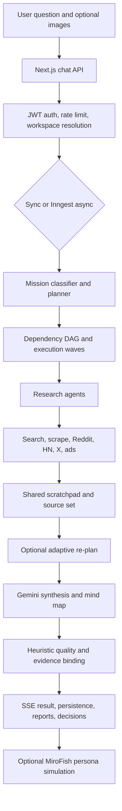
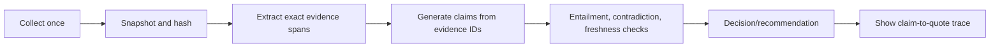
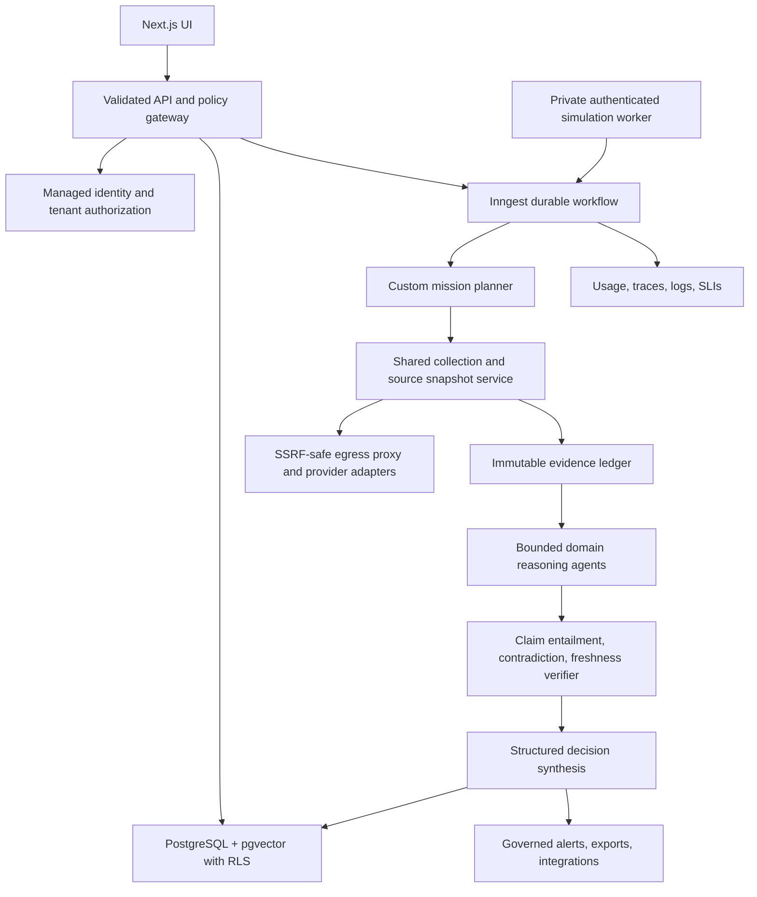

# Veracity Full Technical, Security, Agentic-Workflow, and Product Audit

**Audit date:** 2026-08-01  
**Repository:** `Veracity`  
**Perspective:** AI-agent systems architect, application-security reviewer, software engineer, and product/enterprise-readiness reviewer  
**Decision:** **No-go for public or enterprise production use in the current state.** It is suitable for a controlled local demonstration with sensitive/unfinished capabilities disabled.

---

## 1. Executive verdict

Veracity is a substantial, working **AI-assisted market and competitive research prototype**. It is not an empty UI or a simple prompt wrapper. It has a real mission planner, domain-specific research agents, parallel execution waves, search and scraping tools, synthesis, structured outputs, evidence metadata, reports, session memory, scheduled research jobs, watchlists, alerting, decision artifacts, and an optional multi-agent simulation service.

However, the repository is **not complete as a secure enterprise product**. Several features described as complete are partial, simulated, disabled by default, operationally unverified, or unsafe. Four issues are release blockers:

1. The SAML implementation can authenticate an unverified, attacker-supplied identity if enabled.
2. Research agents can be induced to request internal/private URLs, creating SSRF exposure.
3. The Python MiroFish service is unauthenticated, broadly CORS-enabled, publicly bindable, and vulnerable to path traversal through caller-controlled identifiers.
4. Some AI execution fallbacks manufacture apparently factual market signals when the model call fails.

The strongest product idea is not “another enterprise competitive-intelligence suite.” The strongest wedge is an **evidence-first decision-research workspace for product and go-to-market teams**, with transparent research plans, uncertainty, source-level evidence, and reusable decision artifacts. Reaching that position requires replacing cosmetic grounding with auditable claim evidence, hardening tenancy and authentication, choosing one durable orchestration model, and developing continuous monitored intelligence workflows.

### Evidence-based maturity scorecard

These scores are a repository-review judgment, not an external certification.

| Area | Score | Assessment |
|---|---:|---|
| Product breadth | 6/10 | Broad research, output, monitoring, and execution concepts are present |
| Core application architecture | 5/10 | Sensible modules, but orchestration, persistence, and migrations are inconsistent |
| Agent/research quality | 4/10 | Real multi-agent execution, but evidence verification and failure behavior are weak |
| Security | 2/10 | Multiple critical authentication, SSRF, and auxiliary-service issues |
| Enterprise readiness | 2/10 | SSO, tenancy, governance, connectors, auditability, and reliability are incomplete |
| Operations/observability | 3/10 | Some telemetry interfaces exist, but deployment and actual exporters are incomplete |
| Test/release confidence | 4/10 | 305 unit/integration-style tests passed, but lint fails and a clean locked build was not established |

### Release recommendation

| Target | Decision | Required constraints |
|---|---|---|
| Local developer demo | Conditional go | Test data only; SAML off; MiroFish loopback-only or off; do not expose to the internet |
| Internal pilot | No-go today | First fix all P0 and high-risk P1 findings; add tenant isolation and security tests |
| Public SaaS | No-go | Requires security hardening, durable jobs, migrations, observability, quotas, and incident controls |
| Enterprise deployment | No-go | Requires real enterprise identity, RLS/tenant controls, audit logs, data governance, SLAs, and validated integrations |

---

## 2. Scope, method, and limitations

The review covered the repository's source, tests, SQL, configuration, scripts, documentation, dependency manifests, CI definitions, and important generated workflow paths. The repository inventory contained approximately:

- 85,986 total lines across code, tests, SQL, JSON, and documentation.
- 51,098 lines of executable-oriented TypeScript/TSX, JavaScript, SQL, Python, shell, and tests.
- 317 TypeScript/TSX files, 17 SQL files, one Python service, and two shell scripts.
- 48 API route files, 149 library modules, 60 React components, 37 Vitest files, and three application page components.
- Roughly 853 function-like definitions from static scanning.

The review combined repository-wide searches with deep tracing of the critical paths: authentication, chat, mission classification, orchestration, research agents, external tools, synthesis, evidence binding, session persistence, async jobs, workspaces, SAML/OAuth, alerts, watchlists, the Python simulation service, database setup, and CI/tests.

Validation performed:

- Vitest: **36 files passed, one skipped; 305 tests passed, one skipped**.
- ESLint: **45 findings: three errors and 42 warnings**.
- Production build: application compilation completed with warnings, then type validation failed because the locally installed dependency tree lacked the `phoenix` ambient type definition.
- Exact install: `npm ci` failed locally with npm's “Exit handler never called” error under the available Node/npm environment. A fallback package installation was therefore not a clean proof of the lockfile.
- Dependency vulnerability audit: not completed because registry metadata access was unavailable; this report does not claim the dependency graph is vulnerability-free.
- No live provider-key benchmark, production database test, penetration test, or load test was run.

The phrase “all code” should be interpreted as repository-wide inventory and static analysis plus deep inspection of execution-critical code. It is not a formal line-by-line proof, third-party penetration test, or certification.

---

## 3. What the product does

### Primary user journey

1. A user signs up or signs in and opens the dashboard.
2. The user submits a market, competitor, trend, customer, pricing, or strategic question; the UI can also attach images.
3. The server classifies the mission and chooses relevant research domains.
4. It creates a deterministic dependency graph, groups work into execution waves, and runs agents in parallel where dependencies permit.
5. Agents gather web/search/community/advertising/company information through configured providers and fallback scrapers.
6. The orchestrator can adapt the plan based on early evidence.
7. A Gemini model synthesizes findings into structured intelligence, a mind map, recommendations, evidence metadata, and optional execution outputs.
8. Results are streamed to the UI and may be saved into sessions, folders, workspaces, watchlists, decisions, alerts, or exported documents.
9. With asynchronous mode enabled, Inngest stores job progress and the browser polls or streams status.
10. With MiroFish enabled, an auxiliary Python service can generate personas and simulated interviews/forecast artifacts.

### Agent topology

The system has a custom mission planner and domain agents rather than one autonomous general agent. Domains include competitor, market, trend, sentiment/customer, advertising, and related strategic research. A scratchpad shares observations between execution waves, and a synthesis stage creates the final structured answer.



### Features that are genuinely implemented

- JWT email/password authentication and Google OAuth entry points.
- Chat-oriented research UI with progress visualization.
- Deterministic/adaptive agent selection and wave-parallel execution.
- Multiple external search/scraping adapters with fail-soft behavior.
- Structured result types, output-quality checks, abstention concepts, and source metadata.
- PostgreSQL sessions, messages, memory, embeddings, folders, workspaces, jobs, watchlists, alerts, feedback, and decision-oriented tables.
- Sync streaming and optional queued asynchronous execution.
- PDF/DOCX export and chart/mind-map presentation.
- Feature flags and readiness endpoints.
- Unit and integration-style tests around many pure workflow utilities.

### Features that are partial, misleading, or unsafe

| Claimed/capability area | Actual state |
|---|---|
| Enterprise SAML SSO | Route exists but protocol validation is absent; unsafe if enabled |
| Multi-tenant RLS | SQL artifacts exist, but the application uses direct `pg`; normal runtime queries do not obtain Supabase RLS protection |
| Image understanding | Image helper exists, but the Gemini request path is text-only; model receives metadata, not pixels |
| Grounded claims | Source association is largely token/title/URL overlap rather than content entailment or exact quotation |
| Durable LangGraph workflow | A thin, flag-controlled loop exists without a checkpointer, interrupts, durable business state, or tool nodes |
| Durable Inngest execution | The entire orchestration is one large step with custom retry logic and `retries: 0` |
| Production MiroFish | Auxiliary Flask development service lacks authentication, tenant isolation, and safe filesystem handling |
| Real per-request usage/cost metrics | Usage is process-global; some UI call counts are estimates and async reports can be zero |
| Sentry/OpenTelemetry observability | Interfaces/imports exist, but no complete initialization/exporter path was found |
| Production deployment | No Dockerfile, Compose file, IaC, deployment manifest, health dependency graph, or rollback definition |

---

## 4. Technology stack and why it is used

| Layer | Technology | Role | Assessment |
|---|---|---|---|
| Web framework | Next.js 15 App Router | Pages, API routes, middleware, streaming | Appropriate, but major versions in related Next packages are inconsistent |
| UI | React 19, TypeScript, Tailwind CSS 4 | Interactive research dashboard | Modern stack; several very large components need decomposition |
| Charts/visuals | Recharts, Spline packages | Results and animated presentation | Useful, but remote Spline loading expands CSP/supply-chain exposure |
| Validation | Zod | Selected request and result schemas | Good choice, but applied to only a minority of request bodies |
| Database | PostgreSQL through `pg` | Users, jobs, sessions, workspaces, intelligence | Appropriate; custom SQL needs stronger migration and tenant discipline |
| Vector search | pgvector, 768-dimensional embeddings | Semantic session/memory retrieval | Reasonable for this scale; lifecycle and evaluation are incomplete |
| LLM | Google Gemini REST API | Classification, agents, synthesis, embeddings | Central provider; retry/time-budget behavior needs work |
| Agent graph | Custom executor plus optional LangGraph JS | Plans and runs dependency waves | Custom executor does most real work; current LangGraph layer adds little |
| Async workflow | Inngest | Background jobs and schedules | Appropriate, but current one-step design discards much of its durability value |
| Search | SerpAPI | General web/news/search results | Practically important for reliable live research |
| Crawling | Firecrawl, direct fetch, Scrape.do | Page extraction and fallback scraping | Useful redundancy, but SSRF and timeout controls are inadequate |
| Social/community | Reddit public JSON, HN Algolia, Apify X | Community and social signals | Mixed reliability and data rights; some documented credentials are unused |
| Advertising | Firecrawl/public Meta page approach | Ad intelligence | Fragile and not equivalent to an authenticated official ads-data integration |
| Auth | `jose`, bcrypt, custom cookies | Local account sessions | Adequate prototype base; incomplete identity lifecycle and enterprise controls |
| Rate limiting | Upstash | Distributed production throttling | Good managed option; local in-memory fallback is not horizontally consistent |
| Telemetry | PostHog, Sentry SDK, OTel API | Analytics/error/tracing intentions | Partial wiring; not production observability yet |
| Export | `docx`, React PDF | Reports and board packs | Useful product differentiator |
| Simulation | Python, Flask, OpenAI-compatible client pointed at Gemini | Optional persona/interview simulation | Needs to become an authenticated private worker, not a public Flask service |

### Dependency hygiene observations

- The package remains named `ai-studio-applet`, suggesting template/product metadata was not finalized.
- No Node version is pinned through `.nvmrc`, `.node-version`, Volta, or `engines`.
- The README's Node 18+ statement is stale for the current dependency set. Pin Node 22 LTS, or explicitly validate a supported Node 20.19+/24 environment.
- `next` is on major 15 while `eslint-config-next` and bundle-analyzer packages are on major 16. Align framework tooling to a single supported major.
- The E2E files import `@playwright/test`, but it is not a direct installed dependency and there is no E2E npm script or CI job.
- Static usage scanning found apparently unused direct dependencies including `@google/genai`, `@hookform/resolvers`, `@supabase/ssr`, `@supabase/supabase-js`, `agent-browser`, `class-variance-authority`, and `proxy-agent`. Confirm with a dependency analyzer before removal because build-time and indirect imports can evade simple scans.
- The lockfile references both npmjs and a registry mirror. Standardize the registry and regenerate the lockfile in a clean, pinned environment for supply-chain reproducibility.
- The Python requirement versions are ranges rather than an exact lock.
- The README mentions an MIT license but no `LICENSE` or `COPYING` file was found. Add the actual license before distribution.

---

## 5. Completion assessment

The internal phase document contains **206 checked and 92 unchecked items**. That is useful planning history, not proof of product completeness. It also contradicts itself: its header indicates later phases complete while status sections describe an “advanced prototype / early product” and retain statements such as “No Inngest queue yet,” even though an Inngest implementation now exists.

### Practical completeness matrix

| Capability | Status | Production gap |
|---|---|---|
| Local authentication | Functional prototype | Password lifecycle, verification, MFA, lockout, session revocation |
| Google OAuth | Partial | State/nonce/PKCE and verified-email validation |
| SAML | Unsafe placeholder | Replace completely with a standards-compliant integration |
| Research planning | Functional | Evaluation, budget controls, predictable failure policy |
| Domain agents | Functional prototype | Source quality, deduplication, provider contracts, deterministic testing |
| Agent adaptation | Partial | Durable state and reproducible decision logs |
| Synthesis | Functional | Stronger schemas, evidence entailment, contradiction detection |
| Image input | Nonfunctional as analysis | Send validated image bytes/URLs to model multimodal parts |
| Session history | Functional for owner | Workspace sharing and server-side lifecycle semantics |
| Workspace tenancy | Partial | Fail-closed membership and database-enforced isolation |
| Async jobs | Functional prototype | Step-level durability, cancellation, atomic logs, server-created ownership |
| Watchlists/alerts | Partial | Reliable schedules, delivery audit, dedupe, backoff, admin controls |
| Decisions/timelines/feedback | Partial | Coherent product flow, authorization, governance, analytics validation |
| Exports | Implemented | Visual regression tests and large-data limits |
| Monitoring/telemetry | Partial | Initialized exporters, correlation IDs, SLIs, alerting, privacy controls |
| Deployment | Incomplete | Images/manifests, migration job, secrets, backups, rollback, runbooks |
| Enterprise governance | Incomplete | Retention, deletion, export, audit, legal basis, residency, DLP |

**Honest product label:** advanced prototype with a meaningful core, not a completed enterprise platform.

---

## 6. How to run it

### 6.1 Minimum services

The minimum useful local configuration is:

1. Node.js 22 LTS and npm.
2. PostgreSQL 16 with the `pgcrypto` and `vector` extensions.
3. A Gemini API key.
4. A strong application authentication secret.

Docker itself is **not required** if PostgreSQL is installed locally. The repository currently provides no Dockerfile or Compose configuration.

### 6.2 Start PostgreSQL with pgvector in Docker

Use a dedicated local password and a named volume:

```bash
docker run --name veracity-postgres \
  -e POSTGRES_USER=veracity \
  -e POSTGRES_PASSWORD='<local-strong-password>' \
  -e POSTGRES_DB=veracity \
  -p 5432:5432 \
  -v veracity_pgdata:/var/lib/postgresql/data \
  -d pgvector/pgvector:pg16
```

Then set:

```dotenv
DATABASE_URL=postgresql://veracity:<local-strong-password>@localhost:5432/veracity
AUTH_SECRET=<at-least-32-random-bytes>
GEMINI_API_KEY=<google-ai-key>
```

Initialize the schema:

```bash
psql "$DATABASE_URL" -f db/schema.sql
```

Review `npm run db:setup` before using it. The script assumes a local `postgres` user, attempts database creation with error masking, and is less deterministic than applying the schema to an explicit URL.

### 6.3 Start the application

```bash
npm ci
npm run dev
```

Open `http://localhost:3000`.

Before relying on this flow, first pin Node/npm and regenerate/verify the lockfile in CI. The audit machine could not establish a clean `npm ci`, so the repository needs a known-good build environment documented by the maintainers.

### 6.4 Optional asynchronous jobs

For local asynchronous workflows, run an Inngest development server and configure development mode:

```bash
npx inngest-cli@latest dev
```

Set `INNGEST_DEV=1` and `NEXT_PUBLIC_FF_ASYNC_SWEEP=1` for local development. Production requires real event and signing keys; readiness should fail when production async mode is enabled without them.

### 6.5 Optional MiroFish service

Do not expose the current service outside the local machine. For controlled development only:

```bash
python3 -m venv mirofish-service/.venv
mirofish-service/.venv/bin/pip install -r mirofish-service/requirements.txt
npm run mirofish
```

The service loads `GEMINI_API_KEY` or `LLM_API_KEY` from `mirofish-service/.env` and then the repository `.env`; optional overrides are `LLM_BASE_URL`, `LLM_MODEL_NAME`, `DATA_DIR`, and `PORT`. It should bind to loopback and remain behind the application until the security findings in this report are fixed.

### 6.6 Containers/services actually needed

| Component | Required? | Recommended form |
|---|---|---|
| PostgreSQL + pgvector | Yes | Local `pgvector/pgvector:pg16` or a managed production service |
| Next.js application container | Optional | No image currently supplied; create a multi-stage non-root image |
| Inngest | Optional for sync; required for async/schedules | CLI locally; managed Inngest or reviewed self-hosting in production |
| Upstash Redis | Required for distributed production rate limits | Managed HTTP service; no local Redis container is required by current code |
| MiroFish Python worker | Optional | Private authenticated worker after hardening; not public Flask dev server |
| Reverse proxy | Production-dependent | Managed ingress or Nginx/Envoy with TLS and request-size limits |

---

## 7. Environment variables and API keys

### Minimum required

| Variable | Why | Required when |
|---|---|---|
| `DATABASE_URL` | Main PostgreSQL connection | Always |
| `AUTH_SECRET` | Signs application JWT sessions | Always; use a high-entropy secret and rotation plan |
| `GEMINI_API_KEY` | Classification, research, synthesis, embeddings | For useful AI behavior |
| `GEMINI_API_KEY_FALLBACK` | Optional provider-key failover | Optional; use a separately governed key and cap retries |

### Research providers

| Variable/service | Use | Status/advice |
|---|---|---|
| `SERPAPI_KEY` | General web/news/search | Strongly recommended for consistent live research |
| `FIRECRAWL_API_KEY` | Page extraction/crawling | Optional but important for robust content retrieval |
| `SCRAPEDO_TOKEN` | Scraping fallback | Optional; ensure tokens never enter application logs |
| `APIFY_API_TOKEN` | X/Twitter research | Optional; also review platform terms and data-retention policy |
| Reddit credentials in example env | Reddit research | Currently unused; implementation calls public JSON |
| `META_ADS_TOKEN` | Intended ads access | Currently unused by the inspected ads tool path |

### Authentication and enterprise

| Variable/service | Use | Status/advice |
|---|---|---|
| `GOOGLE_CLIENT_ID`, `GOOGLE_CLIENT_SECRET`, `NEXT_PUBLIC_APP_URL` | Google sign-in | Optional; do not enable in production until state/nonce/PKCE/email validation is corrected |
| Workspace SAML configuration and `SAML_DEMO_MODE` | Enterprise SSO/demo | **Do not configure or enable current implementation** |
| Workspace/admin flags | Enterprise UI/features | Review server/client flag semantics before enabling |

### Jobs, limits, delivery, and telemetry

| Variable/service | Use | Status/advice |
|---|---|---|
| `INNGEST_EVENT_KEY`, `INNGEST_SIGNING_KEY`, `INNGEST_DEV` | Background jobs and schedules | Signing/event keys are required for production async/scheduled workflows; dev flag is local only |
| `UPSTASH_REDIS_REST_URL`, `UPSTASH_REDIS_REST_TOKEN` | Distributed rate limiting | Required for multi-instance production consistency |
| `SLACK_ALERT_WEBHOOK_URL` | Slack alert delivery | Optional; add destination allowlists and delivery audit |
| `RESEND_API_KEY`, `ALERT_FROM_EMAIL` | Email alerts | Optional; verify sender/domain and bounce handling |
| `NEXT_PUBLIC_POSTHOG_KEY`, `NEXT_PUBLIC_POSTHOG_HOST` | Product analytics | Optional; define consent, PII filtering, and retention |
| `SENTRY_DSN`, `NEXT_PUBLIC_SENTRY_DSN` | Error capture | Optional, but SDK initialization must be completed first |
| `MIROFISH_BASE_URL`, `MIROFISH_SIMULATIONS` and live variants | Optional simulation routing | Local/private only until the Python service is hardened |

### Configuration defects

- Some feature flags default to **on in code** while `.env.example` presents them as `0`/off.
- Client code uses dynamic `process.env[name]`. Next.js documents that dynamic environment-variable lookup is not inlined into browser bundles, so client and server can observe different defaults.
- The central configuration validator covers only a subset of consumed variables.
- Several example keys imply integrations that are not actually used.
- No environment-tier matrix defines local/test/staging/production defaults.
- Secrets and external-service readiness are not validated as one deploy-time contract.

---

## 8. Prioritized findings

### Severity definitions

- **P0 / Critical:** exploitable security failure, fabricated intelligence, or immediate release blocker.
- **P1 / High:** serious correctness, isolation, reliability, or cost risk that should be fixed before a pilot.
- **P2 / Medium:** material engineering/product debt that should be scheduled.
- **P3 / Low:** hygiene, maintainability, or polish.

### 8.1 P0 release blockers

#### V-001 — SAML accepts an unverified identity

**Evidence:** `app/api/auth/saml/login/route.ts` emits a placeholder `SAMLRequest`. `lib/sso/saml-policy.ts` extracts `NameID`/email using regular expressions from caller-provided text. The ACS path does not verify an XML signature, trusted IdP certificate, issuer, audience, recipient/destination, `InResponseTo`, assertion time window, or replay. It then finds/creates a user and ensures workspace membership.

**Impact:** If the SAML feature is enabled, an attacker may be able to forge an allowed-domain email and gain workspace access. The demo HTML path also interpolates a workspace query value without safe encoding.

**Fix:** Remove or hard-disable these routes immediately. Replace them with a maintained SAML/OIDC enterprise identity provider or standards library. Enforce signed assertions, metadata/certificate pinning, issuer/audience/destination/time/replay checks, state correlation, strict workspace mapping, and automated attack tests. Follow the [OWASP SAML Security Cheat Sheet](https://cheatsheetseries.owasp.org/cheatsheets/SAML_Security_Cheat_Sheet.html).

#### V-002 — Server-side request forgery in research URL fetching

**Evidence:** User/model-influenced product and competitor URLs flow into direct fetch and crawling tools. Initial URL checks do not comprehensively reject localhost, private, link-local, metadata, IPv6, alternative IP encodings, DNS rebinding, or redirect targets. Fetches follow redirects.

**Impact:** A crafted prompt or model output could make the server contact internal services, cloud metadata, management endpoints, or private network hosts. Passing the URL to a third-party crawler can also disclose private endpoints.

**Fix:** Centralize outbound URL policy: parse and normalize, resolve DNS, reject all non-public addresses for every record, restrict protocols/ports, revalidate every redirect, cap redirects/bytes/time, and use a controlled egress proxy. Prefer allowlists for high-risk extraction. See [OWASP SSRF Prevention](https://cheatsheetseries.owasp.org/cheatsheets/Server_Side_Request_Forgery_Prevention_Cheat_Sheet.html).

#### V-003 — MiroFish service exposes unauthenticated quota and filesystem access

**Evidence:** `mirofish-service/server.py` uses broad `CORS(app)`, binds for network access, exposes routes without authentication, and constructs project/simulation directories from caller-controlled identifiers. IDs can contain traversal segments. It uses daemon threads, in-memory job state, unbounded request-driven work, and a Flask development server.

**Impact:** An external caller could consume model quota, enumerate/create projects, cross tenants, or write/read outside the intended data directory. Public exposure also creates denial-of-service and data-leak risks.

**Fix:** Disable or bind to loopback now. Rebuild it as a private worker behind authenticated application calls. Use generated server-side IDs, resolve and verify filesystem paths remain below a fixed root, impose body/job quotas, persist state transactionally, use a production server, restrict CORS, and isolate every workspace. Never expose port 5001 directly.

#### V-004 — Fallback agents fabricate market evidence

**Evidence:** `lib/agents/execution/ab-variant-agent.ts` returns canned “grounded signals” after an LLM failure, including claims about selling time, competitor behavior, advertising changes, and community frustration. `content-agent.ts` also manufactures audience/pain/success-metric assumptions. The Python simulation service creates generic personas and interview answers after provider failure.

**Impact:** Users can receive fictional signals labeled like observed research. This is the highest product-trust risk and can directly cause bad business decisions.

**Fix:** On provider failure, return a typed unavailable/insufficient-evidence result. Never populate a source, quote, observation, persona response, or market fact that was not obtained. Clearly separate hypotheses/templates from evidence. Add tests that force every provider failure and assert no factual field is synthesized.

### 8.2 P1 high-priority findings

#### V-005 — Feature flags can disagree between browser and server

Dynamic `process.env[name]` access is used in client-imported feature-flag code. Next.js only replaces statically referenced public variables in browser bundles; [its environment-variable guidance](https://nextjs.org/docs/pages/guides/environment-variables) explicitly warns that dynamic lookup is not inlined. Consequently, browser code can fall back to hardcoded defaults while the server reads deployed values. Several enterprise features default on in code despite being off in `.env.example`.

**Fix:** Define a statically enumerated public config object, validate it once, serialize safe values from the server, and make risky features default off everywhere.

#### V-006 — Tenancy is application-convention-based and can fail open

The application connects through a shared direct `pg` pool. The RLS-oriented Supabase SQL does not automatically protect those calls, and the main schema does not establish an end-to-end RLS policy for the runtime connection. The chat route catches some workspace-resolution failures and continues without a workspace stamp.

**Impact:** A missed predicate or migration failure can become cross-tenant access. Failure behavior is not safe.

**Fix:** Fail closed on workspace resolution; set a transaction-local tenant context and enforce PostgreSQL RLS with a non-owner application role, or use a rigorously tested query access layer. Add cross-tenant tests for every route. PostgreSQL's [row-security documentation](https://www.postgresql.org/docs/17/ddl-rowsecurity.html) notes that enabled tables default-deny when no applicable policy exists, while owners normally bypass policies.

#### V-007 — Workspace session sharing is internally inconsistent

Session lists can be workspace-scoped, but detail/message routes are owner-filtered. Members may discover a workspace session but cannot load its conversation. Feedback insertion also does not consistently verify session ownership/membership.

**Fix:** Define one authorization model—private, workspace-readable, or explicitly shared—and implement it through common authorization functions plus database constraints/tests.

#### V-008 — Google OAuth lacks standard request correlation and identity checks

The OAuth path does not robustly implement state validation, PKCE, nonce, or verified-email enforcement.

**Impact:** Login CSRF/code injection/account-confusion risk and acceptance of an inadequately verified identity.

**Fix:** Use a maintained auth framework. At minimum implement strong single-use state, PKCE, OIDC nonce, exact redirect URI validation, verified-email checks, token issuer/audience checks, and secure error handling. Google documents state validation in its [web-server OAuth flow](https://developers.google.com/identity/protocols/oauth2/web-server); also follow the [OWASP OAuth guidance](https://cheatsheetseries.owasp.org/cheatsheets/OAuth2_Cheat_Sheet.html).

#### V-009 — Many API inputs are unbounded or only manually parsed

Repository scanning found far more raw body/parameter reads than schema-validation sites. Chat history, metadata, arrays, prompts, and base64 images can be very large. Image MIME/type/dimensions are not validated end-to-end.

**Impact:** Memory pressure, model-cost abuse, database bloat, long requests, and parser failures.

**Fix:** Apply Zod at every route boundary; set reverse-proxy and application body limits; restrict counts/string lengths; validate decoded image magic bytes, dimensions, and total pixels; cap history and metadata; return typed 4xx responses.

#### V-010 — Attached images are not actually passed to Gemini

An inline image-parts helper exists, but the inspected Gemini request path builds text-only content. Classification explicitly treats images as metadata, and synthesis asks the model to reference image content it has not seen.

**Impact:** Hallucinated visual analysis and misleading user expectations.

**Fix:** Either remove image-analysis language and label attachments as metadata, or send validated inline data/file references through a multimodal request. Gemini's [image-understanding documentation](https://ai.google.dev/gemini-api/docs/image-understanding) shows the required content-part patterns.

#### V-011 — Async progress callbacks are not awaited

The workflow callback type returns `void`, but the Inngest caller supplies asynchronous database updates. Agent execution invokes the callback without awaiting it.

**Impact:** Progress writes can race, fail silently, or be lost, and callback rejections can become unhandled.

**Fix:** Type callbacks as `Promise<void> | void`, await them, and define whether progress persistence failure should retry or only emit telemetry.

#### V-012 — Concurrent job log updates lose data

Job logs use a read-modify-write JSON pattern. Parallel agents can read the same value and overwrite each other's appended entries.

**Fix:** Store logs as append-only rows/events, or use an atomic PostgreSQL JSONB append under one statement with size limits. Sequence each event and stream from the event table.

#### V-013 — New async queries can become orphaned from sessions

The browser sends a new query before a new session exists, then creates/persists the session after the result arrives. An async job can therefore start with no session ID, and closing the tab can lose normal association/persistence.

**Fix:** Create the session and user message transactionally on the server before enqueueing; return `sessionId` and `jobId` immediately; make completion independently persist the assistant result.

#### V-014 — Model retries have no strict end-to-end deadline

Gemini retries use long exponential waits and no consistently propagated `AbortSignal`. Multiple model/key fallbacks can amplify the request duration beyond route budgets. The main Firecrawl request also lacks a strict timeout.

**Fix:** Establish one request deadline, derive smaller per-stage budgets, pass abort signals into every network call, cap attempts by remaining time, and return partial/abstained results when the budget expires.

#### V-015 — Process-global usage accounting crosses requests and tenants

`lib/gemini-usage.ts` maintains mutable process totals. A request can observe calls/tokens from other users handled by the same worker. Fixed price assumptions also do not necessarily match fallback models. Some front-end counts are estimates; async mode can report zeros.

**Fix:** Capture provider usage in a request/job-scoped ledger keyed by workspace/user/job/model, using returned token metadata. Persist immutable usage events and calculate cost from versioned pricing configuration.

#### V-016 — Inngest is used as one giant step

The function sets native retries to zero and places orchestration in a single `step.run`, then sleeps and re-emits work through custom database retry logic.

**Impact:** Individual tool/model calls are not independently checkpointed; cancellation is slow; failure repeats too much work; custom logic competes with the workflow engine.

**Fix:** Split classification, each wave/agent, synthesis, persistence, and notification into deterministic Inngest steps. Use native retry policies and `step.sleep`. Inngest's official guidance explains that [steps are retried and memoized independently](https://www.inngest.com/docs/learn/inngest-steps), with configurable [error handling/retries](https://www.inngest.com/docs/guides/error-handling) and cancellation occurring between steps as described in its [cancellation documentation](https://www.inngest.com/docs/features/inngest-functions/cancellation).

#### V-017 — Prompt injection defenses are insufficient

User content, search snippets, scraped pages, and memory are interpolated into prompts. The system does not consistently mark retrieved content as untrusted data, detect instruction-like content, or prevent it from controlling tool choices/output policy.

**Fix:** Separate system policy from data using structured content; quote and label untrusted material; constrain tool arguments with schemas and server policy; never let model text determine authorization; add a prompt-injection test corpus and source-sanitization stage.

#### V-018 — “Grounding” does not prove claims

Evidence binding primarily compares words in generated claims with source titles/URLs. Domain tiers label some publications “trusted” without verifying the specific claim. Search snippets can be treated as evidence, and citations are often associated after synthesis.

**Impact:** Plausible citations may not substantiate the sentence. Contradictory sources and stale pages are not adequately represented.

**Fix:** Build a source ledger containing fetched snapshot hash, timestamp, content fragment, exact character offsets/quote, publisher, retrieval method, and rights metadata. Generate claims from evidence IDs, then run an entailment/contradiction verifier. Display “unsupported” rather than attaching a semantically adjacent link.

#### V-019 — Fire-and-forget persistence is unreliable in serverless runtimes

Knowledge-graph and memory ingestion are launched through unawaited asynchronous work after a response. Serverless workers may terminate before completion and failures are swallowed.

**Fix:** Put ingestion into the durable job/event pipeline, make it idempotent, and record success/failure status.

### 8.3 P2/P3 engineering and operational findings

| ID | Finding | Consequence | Recommended action |
|---|---|---|---|
| V-020 | Runtime routes perform `CREATE TABLE`/`ALTER TABLE` | Request latency, locks, runtime DDL privilege, race conditions | Move all DDL to versioned deploy migrations |
| V-021 | Two migration families (`db/` and `supabase/`) lack one state/checksum tool | Drift and uncertain deployment order | Adopt one migration framework and baseline existing environments |
| V-022 | Main schema order and optional enterprise columns are inconsistent | Fresh installs and feature activation are fragile | Create a linear migration history plus tested backfills |
| V-023 | PostgreSQL pool has a fixed small max and limited timeout policy | Hanging queries or exhausted instances | Configure connect/statement/idle timeouts and instrument pool wait time |
| V-024 | CSP contains `unsafe-eval`, `unsafe-inline`, remote script trust, and broad network origins | XSS/supply-chain blast radius | Nonces/hashes, local assets, tight `connect-src`, `object-src 'none'`, `base-uri`, `frame-ancestors` |
| V-025 | Login/signup lack dedicated throttling; passwords allow six characters | Credential stuffing and weak accounts | IP/account throttles, stronger passwords, email verification, MFA, lockout/recovery |
| V-026 | JWT is a long-lived symmetric token without revocation identifiers | Stolen sessions remain useful and rotation is difficult | Short access sessions, refresh/session store, `jti`, issuer/audience, rotation and revoke-all |
| V-027 | CSRF relies primarily on SameSite and partial Origin checking | Missing-Origin requests can bypass the check | Strict allowed origins, Fetch Metadata, CSRF tokens for mutations |
| V-028 | Direct scraper lacks response content-type/size limits and robust extraction | Cost/DoS and low-quality content | Streaming byte caps, allowlisted content types, parser service, robots/legal policy |
| V-029 | Reddit/Meta example credentials do not match implementation | Operator confusion and false integration expectations | Remove unused variables or implement/document the real provider |
| V-030 | HN fallback is a Reddit community labeled as HN fallback | Source identity becomes ambiguous | Preserve provider and publisher provenance accurately |
| V-031 | Sentry/OTel code lacks a complete initialization/export path | “Observed” failures may never reach a backend | Add instrumentation entrypoints, exporter tests, trace correlation and release tags |
| V-032 | Analytics stores/prints event properties without a governance contract | Possible PII leakage and compliance gaps | Event schema, consent, redaction, retention, data-subject deletion |
| V-033 | Large components/hooks mix state, transport, and rendering | Regression risk and render overhead | Split by domain, isolate orchestration state, memoize measured hotspots |
| V-034 | Lint currently fails with impure render/ref/dependency errors | CI failure and possible stale/render behavior | Fix errors, remove build lint bypass, make zero lint errors a release gate |
| V-035 | A hook dependency omission can retain an old target folder | Results may save to stale folder state | Correct dependency/callback ownership and add a folder-switch test |
| V-036 | Tests write tracked benchmark Markdown/JSON during ordinary runs | Dirty worktrees and non-reproducible tests | Write to temp/artifact directories only under an explicit update flag |
| V-037 | Live benchmark is skipped and parity tests use stubs | No evidence of real provider quality or latency | Add golden offline corpus and scheduled live canary with budget limits |
| V-038 | No working Playwright command/CI coverage | Auth/UI regressions escape | Add direct dependency, config, scripts, fixtures, and CI browser matrix |
| V-039 | No load, chaos, migration, SSRF, SAML, or cross-tenant test suite | Highest risks are untested | Add security and operational test gates before pilots |
| V-040 | Hardcoded VPS IP remains in `scripts/vps-setup.sh` | Configuration drift and contradicted security claim | Parameterize host, remove public port exposure, delete stale upstream bootstrap |
| V-041 | Script writes secrets and deploys an upstream service over plaintext HTTP | Credential and transport risk | Use secret manager, TLS/private network, immutable image, reviewed source revision |
| V-042 | No container/IaC/backup/restore/rollback definitions | Deployment cannot be reproduced or recovered confidently | Add app/worker images, migrations job, environment manifests, backup restore drill |
| V-043 | No software license file despite README claim | Legal/distribution ambiguity | Add the intended license and third-party notice process |

---

## 9. Fake claims, gimmicks, and hardcoded-value ledger

This section distinguishes normal prototype placeholders from statements that can mislead users or operators.

| Claim or behavior | Audit conclusion | Required correction |
|---|---|---|
| “Enterprise SAML SSO complete” | False and unsafe: protocol validation is absent | Mark unavailable; replace implementation |
| “Multi-tenant RLS” | Misleading for the actual direct-`pg` runtime | Document application predicates honestly or enforce real RLS |
| “Image analysis” | Model receives metadata, not inspected image content | Implement multimodal content or remove the claim |
| “Grounded evidence” | Often lexical source association, not proof | Exact excerpts/snapshots plus claim verifier |
| Live model/tool/cost metrics | Some values are estimated, global, or zero in async mode | Request-scoped provider telemetry |
| “Sentry/OpenTelemetry landed” | SDK/API surfaces exist without a verified exporter pipeline | Complete initialization and send a test event/span in CI/staging |
| MiroFish “live, no synthetic fallback” | Python backend synthesizes generic personas/replies on failure | Fail explicitly; label any deliberate simulation as synthetic |
| Security scan says no hardcoded VPS IP | Scan is narrow; setup script still contains `168.144.36.78` | Expand repository scan and parameterize/delete the script |
| Current phase status | Tracker sections contradict later backlog/status sections | Replace with one generated capability/status matrix |
| “Real-time intelligence” | Freshness depends on keys, snippets, provider availability, caches, and schedules | Show source retrieval time and freshness SLA per signal |
| “Enterprise ready” implication | Identity, tenancy, governance, reliability, and auditability are incomplete | Use “prototype/private beta” until gates are met |
| Hardcoded model pricing | May not match active/fallback model prices | Versioned price catalog keyed by exact model and date |
| Canned execution “signals” | Fabricated factual content on LLM failure | Typed unavailable result; never fake evidence |

Hardcoded values are not automatically bad. Model defaults, small UI constants, and bounded retry counts are normal if centralized and documented. The dangerous hardcoding here is values that imply evidence, pricing accuracy, production infrastructure, or security state.

---

## 10. Agentic workflow and LangGraph assessment

### Is LangGraph present?

**Yes, but only as a thin optional layer.** `lib/agents/workflow/langgraph-executor.ts` creates a graph whose meaningful state is essentially the current wave index while most real mutable execution state lives in a closure. It compiles without a checkpointer and does not use durable business-state channels, tool nodes, interrupts/human approval, subgraphs, time travel, or resume semantics. The feature is disabled by default.

LangGraph's documented strengths include durable execution, persistence/checkpoints, human-in-the-loop interrupts, memory, and fault recovery. See the official [LangGraph overview](https://docs.langchain.com/oss/javascript/langgraph/overview) and [persistence documentation](https://docs.langchain.com/oss/javascript/langgraph/persistence). The current wrapper uses almost none of those benefits.

### Recommendation: do not run two orchestration frameworks without clear ownership

For the next production milestone:

1. Keep the custom mission planner and DAG because it expresses the product's domain logic clearly.
2. Make **Inngest the durability and retry layer**, with one idempotent step per planner/wave/agent/synthesis/persistence operation.
3. Remove the current LangGraph wrapper and direct dependencies until a concrete requirement appears for graph-native interrupts, branching resume, or long-lived human approval.

If LangGraph is later selected, it should own typed research state and checkpoint it to a production store. Inngest should schedule/invoke the graph, not duplicate graph-level retry/state logic. A single state machine must be authoritative.

### What the agent design does well

- Domain-specific agents reduce prompt scope.
- The mission planner avoids always running every agent.
- Dependency waves allow useful parallelism.
- Adaptive re-planning is a sound product idea.
- Structured outputs and output-quality/abstention concepts are better than free-form text alone.
- Source lists and provenance types create a base for stronger evidence.
- The scratchpad provides an understandable collaboration abstraction.
- Sync and async modes are separated behind similar orchestration.

### What it lacks as an enterprise agent system

| Missing capability | Why it matters |
|---|---|
| Durable typed state for every decision/tool result | Resume, replay, incident diagnosis, and reproducibility |
| Idempotency keys per external action | Prevent duplicate costs and notifications during retries |
| Tool argument policy enforcement | Model output must not bypass SSRF/authorization/cost controls |
| Evidence-first generation | Claims should be derived from evidence IDs, not cited afterward |
| Contradiction and freshness handling | Competitive signals frequently conflict or expire |
| Human approval interrupts | Needed before sensitive exports, alerts, account actions, or expensive runs |
| Per-agent budgets/deadlines | Controls latency and runaway cost |
| Explicit failure taxonomy | Distinguish no data, provider failure, policy block, timeout, and low confidence |
| Evaluation traces | Compare prompt/model/provider changes against a stable corpus |
| Tenant-scoped durable memory | Prevent leakage and support retention/deletion requirements |
| Content trust boundary | Retrieved pages are untrusted input, not instructions |
| Capability permissions | Agents need scoped access, not a global set of tools/secrets |

### Scratchpad concurrency issue

Wave execution shallow-copies the scratchpad object, leaving nested arrays shared. Current central result recording reduces immediate damage, but the contract is unsafe if an agent mutates nested state. Make agent inputs immutable and merge returned deltas centrally through a deterministic reducer.

---

## 11. Evidence architecture that should replace current grounding

Create four immutable record types:

1. **Source snapshot:** canonical URL, retrieval timestamp, method, publisher, hash, content type, accessible text, freshness, and legal/rights metadata.
2. **Evidence span:** source ID, exact offset/quote, surrounding context, extraction method, and language.
3. **Claim:** normalized statement, scope, date, entity IDs, confidence, and supporting/contradicting evidence-span IDs.
4. **Decision artifact:** recommendation, assumptions, claim IDs, uncertainty, owner, expiry/review date, and outcome feedback.

The generation process becomes:



This is materially stronger than assigning a URL because its title shares keywords with a generated sentence.

---

## 12. Latency, performance, and cost improvements

### Current critical path

The slow path can include classification, plan generation, multiple search/scrape calls per agent, several parallel waves, adaptation, synthesis, mind map generation, output checks, embedding, persistence, and optional execution/simulation. Retry chains have long sleeps and insufficient global deadline propagation. Different agents can independently retrieve overlapping sources.

### Highest-return improvements

1. **Create the session/job first.** Persist input and return IDs before research begins.
2. **Use a shared evidence collection stage.** Normalize queries, fetch each source once, cache the snapshot, and let agents reason over a common evidence pack rather than repeatedly searching/scraping.
3. **Enforce an end-to-end budget.** Pass one abortable deadline through every agent, fetch, retry, model call, and database query.
4. **Bound concurrency.** Use per-provider and per-workspace queues, not unbounded `Promise.all`; respect quotas and backpressure.
5. **Make retries selective.** Retry only transient statuses with jitter and remaining-budget checks. Do not rotate through every model/key combination after deterministic validation failures.
6. **Route by difficulty.** Keep deterministic Tier 0 for greetings/meta operations; use a cheap pinned model for classification/extraction and a stronger model only for evidence-heavy synthesis.
7. **Eliminate redundant generation.** Build the mind map deterministically from the final structured result where possible; lazily generate execution artifacts only when the user opens them.
8. **Move embeddings/indexing off the response path.** Batch and persist them through a durable job.
9. **Use native Inngest checkpoints.** Retrying one failed agent should not repeat completed searches and synthesis prerequisites.
10. **Replace 400 ms database polling.** Use a durable events table with SSE notifications, PostgreSQL `LISTEN/NOTIFY`, or a managed event stream; retain cursor-based replay.
11. **Add real request-scoped telemetry.** Measure p50/p95/p99 per stage, provider, tenant, and research tier.
12. **Remove request-time DDL.** It adds latency and can lock tables.
13. **Tune PostgreSQL from evidence.** Add slow-query logging, `EXPLAIN (ANALYZE, BUFFERS)` for hot queries, correct compound indexes, pool wait metrics, and transaction/statement timeouts.
14. **Split large UI modules.** Measure with React Profiler, then isolate streaming updates so an entire results dashboard does not rerender for every progress tick.

### Suggested service objectives—not current measured performance

| Workflow | Initial target |
|---|---:|
| Tier 0 deterministic response p95 | < 2 seconds |
| Focused single-domain research p95 | < 15 seconds |
| Normal multi-domain research p95 | < 45 seconds |
| Deep research p95 | < 90 seconds with background completion |
| Cancellation acknowledgement | < 2 seconds |
| Job completion durability | 99.9% after accepted enqueue |
| Supported-claim evidence coverage | > 95% on an evaluated corpus |
| Cross-tenant access tests | 100% deny |

These are targets to validate with a representative workload, not claims about the current repository.

---

## 13. Testing, CI, and release engineering

### What passed

The existing Vitest suite is meaningful around utility behavior, schemas, orchestration helpers, feature gating, and selected API logic: 305 tests passed. This is a strong base for a prototype.

### What blocks release confidence

- Three current ESLint errors mean the CI lint job should fail.
- `next.config` skips lint during builds, hiding those failures from local production compilation.
- The normal test suite mutates tracked benchmark-result files.
- The live benchmark is skipped unless special real-provider flags/keys are present.
- E2E imports a missing direct Playwright dependency and has no npm/CI command.
- The password-visibility E2E test checks presence but does not actually exercise the toggle.
- No clean lockfile install and complete production build were established in this audit environment.
- No migration-up/down, fresh-database, tenant-isolation, SSRF, SAML forgery, OAuth state, request-limit, provider-timeout, cancellation, load, restore, or chaos tests were found.

### Required CI gates

1. Pinned Node/npm in a clean container.
2. `npm ci` with one registry and lockfile integrity.
3. Typecheck, ESLint with zero errors, unit tests, and a production build.
4. Fresh PostgreSQL + pgvector migration and schema-contract test.
5. Playwright auth/research/session/workspace flows.
6. Security regression tests for every P0/P1 boundary.
7. Dependency/SBOM/secret/license scanning.
8. Offline golden evaluation on every prompt/model change.
9. Budgeted scheduled live provider canary, clearly separated from deterministic CI.
10. Container scan, staging smoke test, migration dry-run, and rollback verification.

---

## 14. Enterprise competitor comparison

The table uses vendor documentation and therefore describes vendor-stated capabilities, not independently verified performance. Product features and packaging can change; validate them during procurement.

| Product | Primary strength | Content/data advantage | Workflow advantage | Relative position of Veracity |
|---|---|---|---|---|
| [Klue](https://klue.com/competitive-intelligence-software) | Competitive enablement | Competitive signals plus curated profiles | Battlecards, digests, Slack/Teams/Salesforce delivery; [win/loss workflows](https://klue.com/win-loss) | Veracity is more conversational/experimental; far behind in enablement distribution, curation, and CRM workflow |
| [Crayon](https://www.crayon.co/product/enable-old) | Competitive intelligence and enablement | Continuous competitive tracking | Battlecards, notifications, Slack/Teams/email feedback | Veracity has richer visible agent planning; lacks mature continuous collection and battlecard operations |
| [Semrush Kompyte](https://www.semrush.com/kb/1260-kompyte) | Automated competitor monitoring for GTM | Public-web competitive changes | Dashboards, reports, workflows, company profiles | Veracity offers broader ad-hoc research; lacks reliable change detection and workflow maturity |
| [Contify](https://www.contify.com/platform/) | Market and competitive intelligence | Broad web plus internal/custom sources | Dashboards, battlecards, alerts/newsletters, collaboration delivery | Veracity lacks source ingestion scale, internal-source integration, and analyst-grade curation |
| [AlphaSense](https://www.alpha-sense.com/platform/) | Enterprise market/financial intelligence | Premium/proprietary content plus internal knowledge | Exact-snippet research, monitoring, office exports, governed enterprise search | Veracity cannot compete on licensed corpus, financial depth, governance, or citation auditability |
| [Feedly Market Intelligence](https://feedly.com/market-intelligence) | Curated continuous information monitoring | User-controlled sources and AI feeds | Newsletters, API/Slack delivery and [source-controlled Ask AI](https://feedly.com/new-features/posts/new-feedly-ask-ai-from-information-overload-to-actionable-insights) | Veracity has stronger decision-artifact ambition; weaker source control and monitoring reliability |
| [CB Insights](https://www.cbinsights.com/what-we-offer/platform/) | Company/market intelligence data | Proprietary company and market datasets | Search, analytics, visualizations, collaboration, API/data feeds | Veracity is a flexible reasoning layer but has no comparable proprietary data moat |

### Competitive interpretation

Veracity should not claim parity with these enterprise platforms. Their defensibility is usually not the chat interface; it is the content corpus, long-running collection system, data normalization, analyst curation, workflow distribution, enterprise integrations, governance, and customer-support operation.

Veracity's differentiators could become:

- A transparent mission DAG that users can inspect and edit.
- Decision-centric output with assumptions, uncertainty, expiry, and outcome learning.
- Evidence traceability down to exact source spans.
- Fast, customizable research for teams underserved by expensive enterprise suites.
- A composable open architecture with user-controlled models/providers/data stores.
- Safe simulations explicitly labeled as scenarios, never presented as observed market truth.

### Recommended market wedge

Build **“evidence-first decision intelligence for product and GTM teams”**:

- User creates a monitored decision question, not merely a competitor list.
- The system maintains a source-controlled evidence ledger.
- New evidence updates claims and alerts the decision owner.
- Every recommendation exposes supporting and contradicting excerpts.
- Teams record the chosen action and later outcome, creating a decision-quality feedback loop.

That is more differentiated than replicating generic battlecards and more defensible than “many AI agents.”

---

## 15. Recommended 30/60/90-day plan

### Days 0–7: stop-ship remediation

1. Delete/hard-disable SAML routes in all environments.
2. Disable network access to MiroFish; bind loopback or turn it off.
3. Add centralized SSRF-safe outbound fetching and redirect validation.
4. Remove every fabricated fallback; use explicit unavailable/insufficient-evidence results.
5. Fix static feature-flag exposure and make unfinished features default off.
6. Apply strict request schemas and size limits to every route.
7. Fix OAuth state/PKCE/nonce/verified-email handling or temporarily remove OAuth.
8. Make workspace resolution fail closed and patch feedback/session authorization.
9. Fix the three lint errors and enforce lint/typecheck/build in CI.
10. Rotate any real secrets ever used with the public VPS setup path and retire that script.

### Days 8–30: trustworthy foundation

1. Adopt one migration tool and remove runtime DDL.
2. Create sessions/jobs/messages server-side before enqueue.
3. Refactor Inngest into idempotent steps with native retry/cancellation.
4. Replace global usage counters with job/request-scoped immutable events.
5. Implement deadline/abort propagation, bounded concurrency, and provider circuit breakers.
6. Add tenant RLS or a rigorously tested tenant data-access layer using a non-owner DB role.
7. Build SSRF, tenant, auth, request-limit, and provider-failure test suites.
8. Pin Node/npm/Python dependencies and establish a clean reproducible build.
9. Finish Sentry/OTel initialization and define service-level indicators.
10. Create Docker images, staging config, a migration job, backup policy, and rollback runbook.

### Days 31–60: evidence and product quality

1. Implement source snapshots, exact evidence spans, claim records, contradictions, and freshness.
2. Build an offline evaluation set of at least 100 representative questions with human-scored evidence and usefulness criteria.
3. Implement real multimodal inputs or remove image capabilities.
4. Create monitored collections with reliable change detection and deduplicated alerts.
5. Add user-approved internal sources and initial connectors (for example document repositories, Slack/Teams, CRM, or call intelligence) through governed ingestion.
6. Convert recommendations into reusable decision records, owners, review dates, and outcomes.
7. Build battlecards/newsletters only as views over the evidence ledger, not separate generated truth.

### Days 61–90: enterprise pilot readiness

1. Integrate a mature identity/enterprise SSO provider; do not hand-roll SAML.
2. Add roles, SCIM if required, audit export, retention/deletion, encryption/key policy, and admin controls.
3. Validate backup restoration, disaster recovery, rate/cost quotas, and incident response.
4. Publish supported-source/data-handling documentation and an AI limitations statement.
5. Run external application-security testing after fixes.
6. Establish p95 latency, completion, evidence coverage, cost, and alert-delivery objectives.
7. Pilot with a small set of teams and compare decision usefulness—not just answer fluency—against their existing process.

---

## 16. Product backlog: keep, remove, build

### Keep and strengthen

- Mission classification and adaptive domain selection.
- Visible DAG/wave progress.
- Structured intelligence and decision outputs.
- Fail-soft provider adapters, after replacing misleading fallback content.
- PostgreSQL/pgvector as a pragmatic initial storage platform.
- Async jobs and schedules, after durable-step refactoring.
- Export and shareable decision artifacts.
- Quality/abstention mechanisms, upgraded to evidence-aware rules.

### Remove or pause

- Current SAML implementation.
- Thin LangGraph wrapper until it has a unique requirement.
- Publicly reachable MiroFish deployment and stale VPS bootstrap.
- Fake execution/persona/interview fallbacks.
- Unused dependencies and unused environment variables.
- Claims of RLS, image analysis, production observability, or enterprise readiness that are not true in the runtime.
- Remote animated assets that require weak CSP unless they deliver measurable user value.

### Build next

- Source/evidence/claim ledger.
- Strict tenant-aware data-access contract and RLS tests.
- Human approval and policy checkpoints.
- Internal-source connectors and change monitoring.
- Durable event stream and request-scoped cost telemetry.
- Evaluation platform with golden cases, regressions, red-team prompts, and live canaries.
- Admin, audit, retention, deletion, quotas, and incident tooling.
- Production deployment/restore/rollback assets.

---

## 17. Suggested target architecture



Important boundaries:

- Only the egress layer can fetch arbitrary external content.
- Agents receive immutable evidence, scoped tools, a deadline, and a budget.
- Identity and tenant authorization happen before data lookup or job creation.
- Every durable action is idempotent and audit logged.
- Simulations are a separate, explicitly synthetic artifact type.
- The final answer contains claim IDs, not post-hoc decorative URLs.

---

## 18. Concrete definition of “enterprise-ready” for this repository

Do not call the system enterprise-ready until all of the following are true:

- No open critical/high security findings from an external test.
- Mature SSO/OIDC/SAML integration and automated tenant-isolation tests.
- Database-enforced or equivalently proven tenant boundaries.
- Reproducible builds, signed images/SBOM, dependency and secret scanning.
- Versioned migrations with staging dry runs and rollback/forward-fix procedure.
- Backup restoration has been exercised.
- All jobs are durable/idempotent with defined retries, deadlines, and cancellation.
- Request/user/workspace quotas and cost controls are enforced.
- Source, claim, and evidence auditability is measurable.
- Data retention, deletion, export, logging, subprocessors, and privacy policies exist.
- Observability produces actionable alerts and correlates a user request through every provider and job.
- Availability, latency, completion, and evidence-quality objectives have measured baselines.
- The evaluation corpus shows acceptable factual support and no fabricated fallbacks.
- A user can distinguish observed fact, model inference, recommendation, hypothesis, and synthetic scenario.

---

## 19. Final answers to the original questions

**What is it?**  
A multi-agent, Gemini-powered market/competitive research and decision-support application with a Next.js UI, PostgreSQL memory/workspaces, web and social research tools, structured synthesis, async jobs, watchlists/alerts, exports, and an optional persona-simulation service.

**Is it complete?**  
No. It is a broad advanced prototype. The core demo works, but security, evidence integrity, enterprise identity, tenancy, operations, deployment, and evaluation are incomplete.

**What is required to run the core?**  
Node, npm, PostgreSQL with pgvector, `DATABASE_URL`, a strong `AUTH_SECRET`, and `GEMINI_API_KEY`.

**Which API keys are needed?**  
Gemini is the core key. SerpAPI is strongly recommended for useful research; Firecrawl, Scrape.do, Apify, Inngest, Upstash, Google OAuth, delivery, and telemetry keys are feature-dependent. Some documented Reddit/Meta credentials currently do nothing.

**Which Docker containers are needed?**  
Only PostgreSQL+pgvector is practically required for a containerized local setup. The repository supplies no Docker/Compose assets. The app, worker, and Inngest can be containerized later; the current MiroFish service should not be publicly deployed.

**Are there critical bugs?**  
Yes: unsafe SAML, SSRF, MiroFish authentication/path traversal, and fabricated evidence fallbacks are P0 blockers. Tenant isolation, OAuth, input limits, async persistence, global usage accounting, timeouts, and evidence quality are also high priority.

**Is LangGraph there?**  
Yes, but it is a thin optional wrapper and does not provide meaningful durability. The recommended near-term architecture is the custom planner plus properly stepped Inngest; remove LangGraph until graph-native persistence/HITL is genuinely needed.

**How should the product improve?**  
First make it safe and honest. Then build exact evidence provenance, durable jobs, governed continuous monitoring, internal connectors, and decision/outcome workflows. Compete on auditable evidence and decision quality, not agent count or generic AI claims.

---

## 20. Referenced official guidance and product sources

### Engineering/security

- [Next.js environment variables](https://nextjs.org/docs/pages/guides/environment-variables)
- [LangGraph overview](https://docs.langchain.com/oss/javascript/langgraph/overview)
- [LangGraph persistence](https://docs.langchain.com/oss/javascript/langgraph/persistence)
- [Inngest steps](https://www.inngest.com/docs/learn/inngest-steps)
- [Inngest error handling and retries](https://www.inngest.com/docs/guides/error-handling)
- [Inngest cancellation](https://www.inngest.com/docs/features/inngest-functions/cancellation)
- [OWASP SSRF Prevention Cheat Sheet](https://cheatsheetseries.owasp.org/cheatsheets/Server_Side_Request_Forgery_Prevention_Cheat_Sheet.html)
- [OWASP SAML Security Cheat Sheet](https://cheatsheetseries.owasp.org/cheatsheets/SAML_Security_Cheat_Sheet.html)
- [OWASP OAuth 2.0 Cheat Sheet](https://cheatsheetseries.owasp.org/cheatsheets/OAuth2_Cheat_Sheet.html)
- [Google OAuth 2.0 web-server flow](https://developers.google.com/identity/protocols/oauth2/web-server)
- [OpenID Connect Core](https://openid.net/specs/openid-connect-core-1_0.html)
- [PostgreSQL row security](https://www.postgresql.org/docs/17/ddl-rowsecurity.html)
- [Gemini image understanding](https://ai.google.dev/gemini-api/docs/image-understanding)
- [Gemini model documentation](https://ai.google.dev/gemini-api/docs/models)

### Comparable products

- [Klue competitive intelligence](https://klue.com/competitive-intelligence-software)
- [Klue win/loss](https://klue.com/win-loss)
- [Klue Salesforce workflow](https://klue.com/salesforce)
- [Crayon enablement](https://www.crayon.co/product/enable-old)
- [Semrush Kompyte knowledge base](https://www.semrush.com/kb/1260-kompyte)
- [Contify platform](https://www.contify.com/platform/)
- [AlphaSense platform](https://www.alpha-sense.com/platform/)
- [AlphaSense market intelligence](https://www.alpha-sense.com/solutions/market-intelligence-platform/)
- [Feedly market intelligence](https://feedly.com/market-intelligence)
- [Feedly AI feeds guide](https://docs.feedly.com/article/699-guide-to-ai-feeds-market-intel)
- [CB Insights platform](https://www.cbinsights.com/what-we-offer/platform/)

---

## 21. Audit artifacts and reproducibility notes

- Existing documentation reviewed includes `README.md`, `CLAUDE.md`, environment examples, CI workflows, phase roadmaps, ADRs, SQL/migrations, and service documentation.
- The repository was left without audit-created modifications to tracked benchmark results; the ordinary test side effect was reverted.
- The audit intentionally did not enable unsafe SAML or publicly expose the Python service.
- No real user data or paid provider workload was required for the static findings.
- Re-run lint, tests, a clean install/build, migrations, and the new security suites after remediation; a static audit cannot validate runtime fixes.

**Bottom line:** Veracity contains a credible research-product foundation and a lot of useful engineering work. Its next milestone should be a smaller, safer, evidence-verifiable private beta—not more surface-area checkboxes. Trustworthy provenance, tenant safety, durable execution, and honest failure behavior will create more enterprise value than adding another agent or dashboard.
