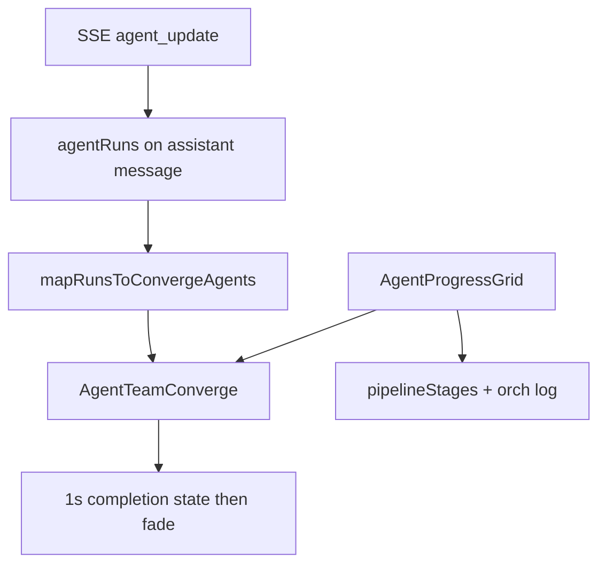

# Agent Team Converge Animation

## Goal

Show agents working in real time with side-by-side team cards, equalizer waveforms, and inter-agent messaging from [`c:\Users\PMIHIR\Downloads\agent-team-converge.jsx`](c:\Users\PMIHIR\Downloads\agent-team-converge.jsx), wired to live SSE `agentRuns` — not the demo’s fake cycling agents.

**Default placement:** Replace the progress bar + compact agent chips inside [`components/ui/AgentProgressGrid.tsx`](components/ui/AgentProgressGrid.tsx). Keep the robot/query header, pipeline stage pills, and orchestration log so Phase 2C visibility stays intact.



## Implementation

### 1. Add typed component

Create [`components/ui/AgentTeamConverge.tsx`](components/ui/AgentTeamConverge.tsx) (`'use client'`):

- Port Waveform, StatusIcon, AgentCard, Bubble, BubbleLane, AgentTeamConverge from the download
- Extended TypeScript shape:

```ts
type ConvergeAgent = {
  id: string;
  name: string;
  task: string;
  status: 'queued' | 'running' | 'done' | 'failed' | 'blocked';
  colorFg: string;
  startedAt?: number;
  /** 0–100 rough progress while running; omit when unknown */
  progressPct?: number;
  /** e.g. "24 sources", "531 vectors", "high confidence" */
  progressLabel?: string;
  /** Upstream agent short name when blocked/waiting */
  waitingOn?: string;
  /** Shown briefly after done */
  completionSummary?: { headline: string; stats: string[] };
  /** Per-card waveform variance */
  motionSeed: number;
};
```

- **No demo mode** in production UI — require `agents` prop always
- Move keyframes into [`app/globals.css`](app/globals.css) (not inline `<style>`)

### 2. Restyle for Veracity (hard constraint)

Do **not** keep the demo’s `#10121A` flat dark panel / Inter stack / bare hex walls.

- Outer shell: `results-panel` / `veracity-card` / `neu-extruded`
- Text: `font-mono` for labels/timers; theme tokens via `useTheme()`
- Per-agent accent from [`lib/domain-meta.tsx`](lib/domain-meta.tsx) `domainAccent`
- Active cards: soft accent border + neu treatment; inactive: muted opacity
- Bubbles / dependency labels: accent-tinted neu pills on `var(--border)` dashed lane

### 3. Map live agent runs → converge agents

Helper in [`lib/agent-progress.ts`](lib/agent-progress.ts):

```ts
mapRunsToConvergeAgents({
  domains: Domain[],
  getRunForDomain,
  getOutputForDomain?,
  orchestrationLines?: string[],
  isDark: boolean,
}): ConvergeAgent[]
```

Status mapping:
- `pending` / missing → `queued`
- `running` → `running`
- `completed` → `done`
- `failed` → `failed`
- Upstream incomplete while this agent is pending → `blocked` + `waitingOn`

Show selected / visible domains only (`visibleTabDomains`).

Use `AgentRun.startedAt` when present; else stamp once on first `running` via a ref.

### 4. Wire into AgentProgressGrid

In [`components/ui/AgentProgressGrid.tsx`](components/ui/AgentProgressGrid.tsx):

- Build `convergeAgents` from domains + runs + outputs + orch lines
- Replace progress-bar + compact chips with `<AgentTeamConverge agents={…} />`
- Keep: robot, query label, images, pipeline pills, orch log
- Keep `React.memo`
- Hold grid visible ~1s after `isLoading` flips false for the completion beat (local `showComplete` / fade state)

### 5. Bubble messages + real dependencies

**Decorative lane (keep, but secondary):** domain-flavored bubble text for active pairs (Market→Competitive, etc.).

**Meaningful dependency cues (primary):**

- Derive a simple research-stage order from pipeline / domain fan-out:
  - Research swarm agents run in parallel (no hard wait among the six)
  - Execution / synthesis depend on research terminal → show `Waiting for Research` / `Blocked` on those cards
- Under the card row (or beside bubble lane), render a compact vertical/horizontal dep strip when `waitingOn` is set:

```
Market  →  Competitive  →  Win/Loss
              Waiting for Market
```

- Prefer explicit “Waiting for X” / “Blocked” labels over only cycling chat bubbles when a dependency exists

### 6. Per-agent progress / transparency (high value)

While `running`, card body shows more than “running”:

- Mini neu progress bar + `progressPct` when estimable
- Else `progressLabel` from heuristics:
  - Parse orch log / live metrics for source counts (`"24 sources"`)
  - Tool-ish phases: `"Searching"`, `"Embedding"`, `"Scraping"`, `"Synthesizing"`
  - On near-complete / done with output: confidence from `AgentOutput` (`high` / `medium` / `low`)
- Rough progress estimate when counts unavailable: time-since-start soft curve capped at ~85% until `completed` (never fake 100% early)

### 7. Organic waveforms (avoid synchronized animation)

Per agent, derive from `motionSeed` (hash of agent id):

- Different `animation-duration` (e.g. 0.85s–1.45s)
- Different phase / delay per bar (existing seed pattern, amplified)
- Slight amplitude range via CSS custom props `--wf-min` / `--wf-max`
- Failed/queued: paused; reduced-motion: static bar heights

### 8. Completion summaries per agent

When status flips to `done`:

- Briefly show `✓ Research complete` (domain-specific headline) plus 1–2 stats from output when available (`12 findings`, `3 competitors`, source count)
- Hold ~1.5–2s on the card (or until all agents finish), then settle to compact “complete” chip
- Source stats from `getOutputForDomain` facts/sources length when present; else generic “Complete”

### 9. Reduced motion

In [`app/globals.css`](app/globals.css):

```css
@media (prefers-reduced-motion: reduce) {
  .wf-bar, .spin-slow, .agent-bubble, .agent-converge-fade {
    animation: none !important;
    transition: opacity 0.2s ease, background 0.2s ease !important;
  }
}
```

Still update status text, progress %, and dependency labels — only decorative motion is toned down.

### 10. Animate only meaningful status transitions

- Track previous status per agent id in a ref
- Apply enter/highlight CSS classes only on:
  - `queued → running`
  - `running → done`
  - `running → failed`
  - `queued → blocked` / `blocked → running`
- Ignore SSE re-emits that keep the same status (no re-pulse / layout flash)
- Progress bar width can still update smoothly without card re-entrance animation

### 11. Smooth layout when agents toggle

- Card row: CSS `flex` + `transition` on width/opacity; wrap each card in a container with `min-width` and `transition: flex-basis, opacity, transform`
- Prefer keeping a stable order (domain order in `ALL_DOMAINS`) and fading toggled-off agents out rather than abruptly unmounting mid-frame when possible
- If agent is deselected mid-run, fade out over ~200–300ms then remove from layout

### 12. End-of-run completion beat (must-have)

Instead of instantly hiding when `isLoading` becomes false:

1. Detect “all selected agents terminal” (`done` / `failed`)
2. Swap team row for a compact completion panel (~1s):

```
✓ All selected agents completed
Research ✓  Market ✓  Competitive ✓  Win/Loss ✓
```

3. Fade entire `AgentProgressGrid` out (~300ms), then unmount

Implementation: local state in `AgentProgressGrid` / `AgentTeamConverge`:

- `phase: 'running' | 'complete' | 'exiting'`
- On `isLoading` false → `complete` → timeout 1000ms → `exiting` → timeout 300ms → hide

Respect reduced motion: shorter or zero fade, but still show the 1s checklist briefly.

## Out of scope

- Changing orchestrator / SSE protocol (progress remains heuristic from existing logs/metrics/outputs)
- Auth or dashboard redesign beyond this loading island
- Full DAG orchestrator view (Phase 3B) — only lightweight dep cues here

## Verification

- Start a query → converge cards for selected agents with varied waveforms
- Running cards show progress bar and/or source/phase labels
- Blocked/waiting agents show “Waiting for X” when deps apply
- Same-status SSE updates do not re-trigger card entrance animation
- Agent toggle mid-run fades cards smoothly
- Agent done flash shows brief summary when output exists
- `prefers-reduced-motion: reduce` stops waveform/bubble/spin motion; status still updates
- Light and dark use neu tokens
- On run end: 1s “All selected agents completed” checklist, then fade — not an abrupt disappear
- Pipeline pills + orch log remain visible during the running phase
