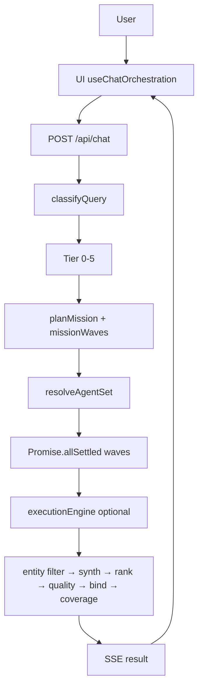

# Current Architecture

**Evidence date:** 2026-07-28  
**Code root:** `Veracity/`

## Stack truth

| Layer | Implementation | Evidence |
|-------|----------------|----------|
| LLM | Google Gemini via `@google/genai` | `lib/agents/gemini.ts` |
| Orchestration | Custom TypeScript | `lib/agents/orchestrator.ts` (~1,078 LOC) |
| Agents | 6 research + Stage-2 execution | `lib/agents/*.ts`, `lib/agents/execution/*` |
| Tools | SerpAPI, Firecrawl, Reddit, HN, Apify, … | `lib/tools/*` |
| Async | Inngest research sweep | `lib/inngest/functions/research-sweep.ts` |
| Frontend | Next.js 15 + SSE | `app/api/chat/route.ts`, `hooks/useChatOrchestration.ts` |
| LangGraph / LangChain | **Absent** | `package.json`; decision register in phase plan |

## Lifecycle

## Critical accuracy order

Must not reorder:

1. `applyEntitySourceFilterToOutputs`
2. Synthesize + mind map
3. `filterAndRankSources`
4. `applyOutputQualityGate`
5. `bindEvidenceToSources`
6. `computeEvidenceCoverage`

## Primary entry points

| Concern | File |
|---------|------|
| Sync/async gateway | `app/api/chat/route.ts` |
| Pipeline | `lib/agents/orchestrator.ts` → `orchestrate()` |
| Mission DAG | `lib/agents/mission-planner.ts` |
| Agent selection | `lib/agents/adaptive-selection.ts` |
| Quality | `lib/agents/output-quality.ts` |
| Evidence | `lib/agents/bind-evidence.ts`, `lib/tools/source-validator.ts` |
| Client stream | `lib/chat-stream.ts`, `hooks/useChatOrchestration.ts` |

## Known Gen-2 gap

Mission waves encode soft dependencies (e.g. win-loss after competitive), and a scratchpad is mutated with `productFacts`, but domain agents do **not** read prior-wave outputs. Collaboration is sequencing-only until Phase 0 resolves this (wire sharing or remove stub).
