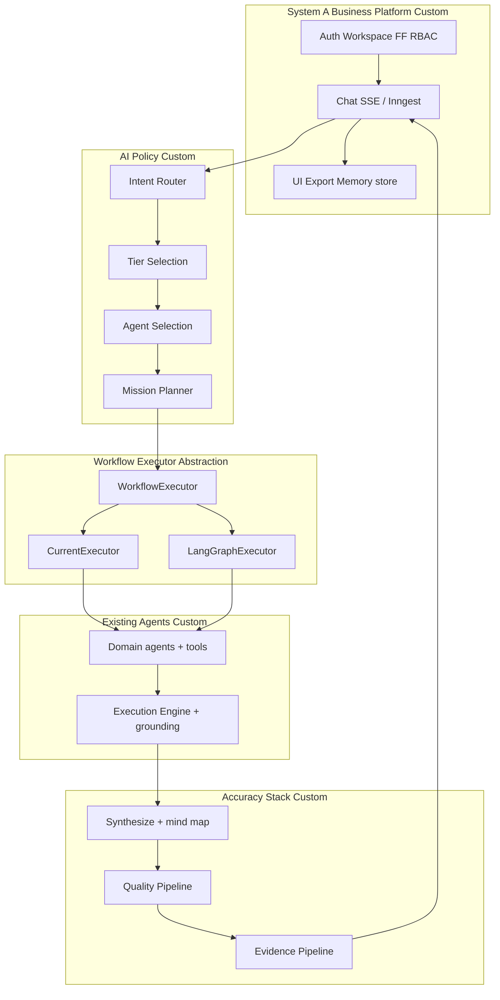

# Hybrid Architecture Design

## Target topology

## Layer responsibilities

1. **Platform** — auth, tenancy, SSE/job, flags, memory injection, UI.
2. **Policy** — classify, tier, select agents, define mission DAG (custom TS).
3. **Executor** — run waves only; `CurrentExecutor` default; `LangGraphExecutor` optional.
4. **Agents** — unchanged `AgentConfig.run` contracts.
5. **Accuracy stack** — fixed post-order pure functions; never reimplemented as prompts alone.

## Design invariants

- LangGraph is an **implementation detail**, not the architecture.
- Mission Planner is the single DAG source of truth.
- Post-pipeline order is identical for every executor.
- Feature flag selects executor; application code does not branch on LangGraph types.
