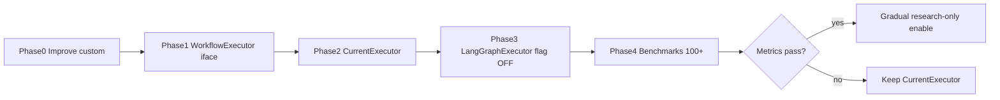

# Migration Roadmap

## Overview

| Phase | Work | Deployable | Reversible | Success |
|-------|------|------------|------------|---------|
| **0** | Split orchestrator; prompts; scratchpad wire/remove; `orchestrate` tests; docs; ADRs | Yes | N/A | Behaviour identical; tests green |
| **1** | `WorkflowExecutor` interface | Yes | Yes | Compiles; unused by default path until wired |
| **2** | `CurrentExecutor` = extracted wave loop | Yes | Yes | Parity with pre-extract baseline |
| **3** | `LangGraphExecutor` flag default OFF | Yes | Flag off | Fixture parity |
| **4** | ≥100-query benchmark report | Yes | Flag off | Report published |
| **5** | Enable research-only iff gates pass | Yes | Flag off | Success metrics |

## Rejected

- Medium/Large moves of quality, evidence, agents, or platform into LangGraph.
- Replacing quality gate with LLM self-check.
- Migrating “because the plan expected LangGraph.”

## Current branch progress

- **Branch:** `feature/langgraph-hybrid-architecture`
- **Docs + ADRs:** landed under `docs/architecture/` and `docs/adr/0002`–`0007`
- **Phase 0/1/2 (partial):**
  - `WorkflowExecutor` + `CurrentExecutor` extracted to `lib/agents/workflow/`
  - `orchestrate()` uses `getWorkflowExecutor()` for research waves
  - Prior-wave findings injected into later agents’ `priorContext` (ADR-0006)
  - Feature flag `NEXT_PUBLIC_FF_LANGGRAPH_EXECUTOR` default **OFF**
  - Tests: `__tests__/workflow-executor.test.ts`
- **LangGraph npm dependency:** **not** added (Phase 3+)
- **Still open in Phase 0:** further split of `orchestrator.ts` (classify/synthesize/mind-map modules); prompt extraction; fuller `orchestrate()` env-backed integration tests
