# Phase 3 + 3B Full Implementation

Scope locked: **all of TASK-3B.1–3B.8**, remaining Phase 3 **DOCX**, open **3Q UI** (meter + trail), plus demo **Evidence Coverage Radar**. PDF/composer/branding and backend quality gate stay as-is; we attach and surface what the gate already computes.

**Defaults (no open choices):**
- Feature flags via [`lib/feature-flags.ts`](lib/feature-flags.ts) reading `NEXT_PUBLIC_FF_*` (default **on** in `.env.example` for demo; easy to flip off).
- Claim↔URL binding is a **deterministic post-synthesis linker** (no synthesizer prompt rewrite) so FE/AI conflict rule is respected.
- Persist quality + evidence on existing `chat_messages.metadata` JSON — **no** new `evidence_links` table.
- Neumorphic design tokens only (`veracity-card` / `neu-*` / theme CSS vars).
- Coverage Radar is a **horizontal domain bar chart** (not a circular spider chart) for instant demo readability.

```mermaid
flowchart LR
  subgraph wave0 [Wave0 Schema]
    Flags[feature-flags]
    Types[quality + sourceUrls + evidenceCoverage]
  end
  subgraph wave1 [Wave1 Backend]
    Bind[bindEvidenceToSources]
    Gate[attach quality report]
    Coverage[computeEvidenceCoverage]
    Trust[T1/T2/T3 tiers]
  end
  subgraph wave2 [Wave2 Core UI]
    Trail[EvidenceTrail]
    Meter[EvidenceStrengthMeter]
    Radar[EvidenceCoverageRadar]
    Badges[Trust badges]
  end
  subgraph wave3 [Wave3 Process UI]
    Timeline[ThinkingTimeline]
    OrchView[LiveOrchestratorView]
    Graph[CollabGraph + MissionDAG]
  end
  subgraph wave4 [Wave4 Demo Modes]
    Board[BoardMode]
    Canvas[StrategyCanvas + Battlefield]
    Docx[DOCX export]
  end
  wave0 --> wave1 --> wave2 --> wave3 --> wave4
```



---

## Wave 0 — Flags + schema

1. Add [`lib/feature-flags.ts`](lib/feature-flags.ts):
   - `ff_evidence_trail`, `ff_orchestrator_view`, `ff_board_mode`, `ff_async_sweep` (stub; unused until Phase 4).
2. Document keys in [`.env.example`](.env.example).
3. Extend types in [`lib/agents/types.ts`](lib/agents/types.ts):
   - `Recommendation.sourceUrls?: string[]`
   - `OrchestratorOutput.quality?: OutputQualityReport`
   - `EvidenceCoverageAxis`: `{ id; label; score: number /*0–1*/; sourceCount: number; agentIds: string[] }`
   - `OrchestratorOutput.evidenceCoverage?: EvidenceCoverageAxis[]`
   - Expand `OutputQualityReport` in [`lib/agents/output-quality.ts`](lib/agents/output-quality.ts) with explicit breakdown fields used by the meter: `toolHealth`, `entityMatch`, `agentAvg`, `qualityGate` (0–1), plus existing `evidenceScore` / flags.
4. Mirror onto [`types/chat-ui.ts`](types/chat-ui.ts) / message metadata serialization paths used by [`lib/conversations.ts`](lib/conversations.ts) and session loaders so reloads keep quality + `sourceUrls` + `evidenceCoverage`.

---

## Wave 1 — Backend (publish metadata before FE)

1. **Attach quality to return value** in [`lib/agents/orchestrator.ts`](lib/agents/orchestrator.ts) Step 7–return: include `quality: guarded.quality` on `OrchestratorOutput` (today it is discarded after mutating answer/recs).
2. **Claim binder** — new [`lib/agents/bind-evidence.ts`](lib/agents/bind-evidence.ts): for each recommendation, map `evidence[]` strings to best-matching `AgentSource.url`s (token overlap with title/url + entity terms); set `sourceUrls` (cap 3). Call after quality gate, before return.
3. **Evidence Coverage Radar scores** — new [`lib/agents/evidence-coverage.ts`](lib/agents/evidence-coverage.ts):
   - Fixed demo axes (labels match judge-facing language): **Market**, **Competition**, **Customers**, **Technology**, **Pricing**.
   - Map research domains → axes: `market-trends`→Market; `competitive`+`adjacent`→Competition; `win-loss`→Customers; `positioning`→Technology (messaging/product narrative); `pricing`→Pricing. Failed/deselected agents contribute `0`.
   - Per-axis `score` = blend of (normalized source count, agent `confidenceScore`, entity-match ratio on that agent’s sources). Cap/normalize to 0–1.
   - Attach `evidenceCoverage` on orchestrator return next to `quality`.
4. **Trust tiers** — extend [`lib/tools/source-validator.ts`](lib/tools/source-validator.ts):
   - `T1` = current `TRUSTED_DOMAINS` (press/analyst/review)
   - `T2` = primary product/competitor domains + GitHub/HN/Reddit threads
   - `T3` = everything else that passes URL hygiene
   - Export `getSourceTrustTier(url)` + keep `trusted` boolean as `tier === 'T1'`.
5. Unit tests: binder + coverage scorer + tier helper + quality fields on orchestrator return shape (extend existing `__tests__/output-quality.test.ts`).

---

## Wave 2 — Evidence Trail + Strength Meter + Coverage Radar + Trust badges (3B.1, 3B.2, 3B.5)

Host surface: [`components/ui/IntelligenceResults.tsx`](components/ui/IntelligenceResults.tsx).

1. **`EvidenceStrengthMeter`** — Decision hero: bar + four labeled components from `orchestratorOutput.quality` (tool-health · entity-match · agent-avg · quality-gate). Ungated or always-on once quality exists (plan acceptance: user sees *why* medium/low).
2. **`EvidenceCoverageRadar`** — Decision hero (below or beside Strength Meter): five labeled horizontal bars, e.g.

   ```
   Market       █████████
   Competition  ██████
   Customers    ████████
   Technology   ████
   Pricing      ███████
   ```

   - Fill width = `score`; mono axis labels; weak axes use amber semantic tint, strong use emerald/accent (design-system semantic colors only).
   - Tooltip / caption: `{sourceCount} sources · agents: …` so judges see *which* lane is thin.
   - Always-on when `evidenceCoverage` is present (core explainability, not flag-gated).
3. **`EvidenceTrail`** — expandable per recommendation when `ff_evidence_trail`: list `sourceUrls` as clickable links (resolve titles from `sources[]`); fallback to text `evidence` if no URLs.
4. **Sources list** — trust pill `T1`/`T2`/`T3` via `getSourceTrustTier`.
5. **PDF** — update [`lib/export/build-report-data.ts`](lib/export/build-report-data.ts) + [`components/export/ExecutivePdfDocument.tsx`](components/export/ExecutivePdfDocument.tsx) to include per-rec evidence links (`Link`) **and** a Coverage Radar section (text bars or simple filled rectangles).
6. Acceptance: every top rec with binder success shows ≥1 clickable source when flag on; Decision card shows all five coverage axes.

---

## Wave 3 — Thinking Timeline + Orchestrator View + Mission DAG (3B.3, 3B.4)

Reuse live stream already on `ChatMessage.orchestrationLog` + `agentRuns` ([`hooks/useChatOrchestration.ts`](hooks/useChatOrchestration.ts), converge grid).

1. **`ThinkingTimeline`** — chronological list from `orchestrationLog` + agent status transitions (pending→running→completed/failed).
2. **`LiveOrchestratorView`** — simple DAG: Classify → Research agents (parallel nodes) → Synth → Quality gate → Done; node state from `agentRuns` + log heuristics. Gate with `ff_orchestrator_view`.
3. **`AgentCollaborationGraph` / Mission DAG lite** — nodes = selected agents + product/competitor context label; edges = shared context / research→execution dependency; ordered mission steps derived from which domains ran (no new classifier prompt).
4. Mount under [`components/ui/AgentProgressGrid.tsx`](components/ui/AgentProgressGrid.tsx) / Dashboard workspace (beside or below converge), not a new route (single-page rule).

---

## Wave 4 — Board Mode + Strategy Canvas (3B.6, 3B.7)

1. **`ExecutiveBoardMode`** — fullscreen overlay (`ff_board_mode`): slides Decision → **Coverage Radar** → Recs → Matrix/Map → Sources; keyboard ←/→ / Esc; Presenter-friendly typography; entry control on Decision hero next to export. Coverage slide is a dedicated large-type radar for the 30-second “where are we thin?” beat.
2. **`StrategyCanvas`** — one-screen pillars (product vs competitor) synthesized from top recs + competitive artifact data; optionally annotate pillars with the matching coverage axis score.
3. **Competitive Battlefield** — enhance [`components/artifacts/CompetitiveMatrix.tsx`](components/artifacts/CompetitiveMatrix.tsx) (or sibling) with hover panel showing linked evidence/source URLs when available.

---

## Wave 5 — Adaptive selection polish + DOCX (3B.8 + Phase 3 DOCX)

1. **3B.8** — sidebar toggles already exist ([`SessionSidebar.tsx`](components/ui/SessionSidebar.tsx) / `selectedAgents`). Add:
   - Persist selection per `sessionId` in `localStorage` (`veracity:selectedAgents:{id}`).
   - Reflect deselected agents as skipped/grey in Live Orchestrator View (and as `0` on Coverage Radar axes they own).
2. **DOCX** — add `docx` dependency; [`lib/export/build-docx-report.ts`](lib/export/build-docx-report.ts) mirroring PDF sections (decision, **coverage radar**, recs + evidence links, sources); extend [`ExportReportButton.tsx`](components/export/ExportReportButton.tsx) with PDF | DOCX actions + analytics `export_docx_*`.

---

## Docs / exit criteria

Update checkboxes in [`docs/phase_by_phase_improvement_plan.md`](docs/phase_by_phase_improvement_plan.md) § Phase 3 / 3Q / 3B when each wave lands. Add a Phase 3B note for Evidence Coverage Radar under explainability UI.

**Phase 3B exit checks:**
- Top recs show ≥1 clickable source (flag on)
- Decision card explains confidence via meter breakdown
- Evidence Coverage Radar shows all five axes (Market / Competition / Customers / Technology / Pricing) with visibly different bar lengths when evidence is uneven
- Judges see timeline + DAG beyond chip bar while a query runs
- Board Mode can drive a 5-minute demo without leaving fullscreen (including Coverage Radar slide)
- DOCX downloads with same core content as PDF (including coverage section)
- `tsc` / existing quality tests green

**Out of scope this pass:** `ff_async_sweep` behavior (Phase 4), separate `evidence_links` table, synthesizer prompt rewrites, circular/spider radar chart libraries.
