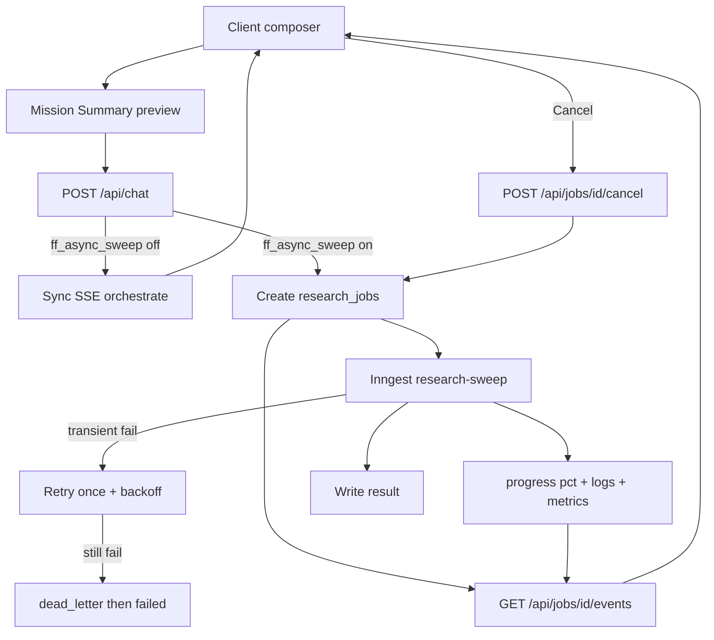

# Phase 4 — AI Systems Orchestration & Queue Scale

Scope: **TASK-4.1–4.4** as specified in [`docs/phase_by_phase_improvement_plan.md`](docs/phase_by_phase_improvement_plan.md), plus production-hardening: **retry / DLQ**, **idempotency**, **cancel**, **progress %**, **Mission Summary**, **replay metadata**, **scenario diffs**, **queue metrics**.

**Locked defaults**
- **Inngest Cloud** (Vercel-compatible), not a custom worker fleet.
- **`ff_async_sweep` default OFF** until QA green; sync SSE path remains the rollback.
- Progress transport: **job row + SSE poll bridge** (same chunk types as today + progress/cancel events) so [`hooks/useChatOrchestration.ts`](hooks/useChatOrchestration.ts) / [`lib/chat-stream.ts`](lib/chat-stream.ts) stay mostly unchanged.
- No new vector DB; jobs live in Postgres beside `chat_sessions`.
- Adaptive selection: **intersect UI toggles ∩ classifier `domains[]`** (floor ≥3 research agents) on primary sweeps; full UI override via “Force full sweep” (default off).
- **Retries:** exactly **1 automatic retry** on transient failures with exponential backoff (1s → 4s), then `dead_letter` → user-visible `failed`.
- **Idempotency:** every job has `execution_id`; Inngest step + DB claim prevent duplicate orchestrate runs.
- **Cancel:** user can cancel a queued/running job; worker checks cancel flag between mission waves.



---

## Wave 0 — Foundation (schema, config, flags)

1. **Config** — extend [`lib/config.ts`](lib/config.ts) with optional `INNGEST_EVENT_KEY`, `INNGEST_SIGNING_KEY`; document in [`.env.example`](.env.example).
2. **Deps** — add `inngest` package.
3. **Migration** — `supabase/migrations/00X_research_jobs.sql`:

```sql
create table research_jobs (
  id uuid primary key default gen_random_uuid(),
  execution_id text not null unique, -- idempotency key (jobId + attempt or ulid)
  user_id uuid not null,
  session_id uuid references chat_sessions(id) on delete cascade,
  status text not null,
  -- queued | running | retrying | dead_letter | failed | completed | cancelled
  attempt int not null default 0,
  max_attempts int not null default 2, -- initial + 1 retry
  cancel_requested boolean not null default false,
  request jsonb not null,
  mission_summary jsonb,          -- pre-exec plan preview
  progress jsonb default '{}',    -- { pct, completedSteps, totalSteps, stage }
  orchestration_log jsonb default '[]',
  metrics jsonb default '{}',     -- queueWaitMs, executionMs, agentRuntimeMs, retries
  result jsonb,
  error text,
  queued_at timestamptz default now(),
  started_at timestamptz,
  finished_at timestamptz,
  created_at timestamptz default now(),
  updated_at timestamptz default now()
);
create index research_jobs_user_status_idx on research_jobs(user_id, status);
```

4. Confirm [`lib/feature-flags.ts`](lib/feature-flags.ts) `asyncSweep` exists; wire it (today unused).

---

## Wave 1 — TASK-4.1 Inngest async queue (resilient)

**Goal:** Sweeps >120s complete with **zero HTTP 504**; retry + cancel + progress %; flag rollback to sync.

1. **Inngest client + function** — [`lib/inngest/client.ts`](lib/inngest/client.ts), [`lib/inngest/functions/research-sweep.ts`](lib/inngest/functions/research-sweep.ts):
   - Event `research/sweep.requested` with `{ jobId, executionId, userId, sessionId, …payload }`
   - **Idempotent claim:** `UPDATE research_jobs SET status='running', started_at=now(), execution_id=$1 WHERE id=$2 AND status IN ('queued','retrying') AND (execution_id IS NULL OR execution_id=$1)` — if 0 rows, exit (duplicate delivery)
   - Run `orchestrate()` with progress callbacks; between mission waves check `cancel_requested` → set `cancelled` and stop
   - On transient tool/network errors: set `retrying`, `attempt++`, backoff sleep, re-enqueue **once**; if `attempt >= max_attempts` → `dead_letter` then `failed` with error
   - Persist `metrics.queueWaitMs`, `executionMs`, `agentRuntimeMs`, `retries`
2. **Serve route** — [`app/api/inngest/route.ts`](app/api/inngest/route.ts).
3. **Chat branch** — [`app/api/chat/route.ts`](app/api/chat/route.ts):
   - Flag/keys off → existing sync SSE
   - Else: insert job (`execution_id` = ulid), optionally attach `mission_summary`, `inngest.send`, return `{ mode: 'async', jobId }`
4. **Cancel** — [`app/api/jobs/[id]/cancel/route.ts`](app/api/jobs/[id]/cancel/route.ts): auth + `cancel_requested=true`; if still `queued`, flip to `cancelled` immediately
5. **Job SSE** — [`app/api/jobs/[id]/events/route.ts`](app/api/jobs/[id]/events/route.ts):
   - Emit existing chunks plus `{ type: 'progress', pct, label }` and `{ type: 'cancelled' }`
6. **Progress estimation** — `pct = completedMissionSteps / totalMissionSteps` (agents completed / planned); show in AgentProgressGrid / converge header (e.g. `62% · 3/5 steps`)
7. **Client** — async mode opens job SSE; **Cancel Job** button while `queued|running|retrying`
8. **Acceptance:** long sweep finishes; one transient failure auto-retries; cancel stops further waves; flag off restores sync.

---

## Wave 2 — TASK-4.2 Planners + Mission Summary (pre-exec)

**Goal:** Users see **what will run** before work begins; Stage-2 only when needed; shared scratchpad.

1. **Mission Planner** — [`lib/agents/mission-planner.ts`](lib/agents/mission-planner.ts):
   - Ordered `MissionStep[]` with `dependsOn[]`, rationales
   - Deterministic deps: competitive before win-loss/positioning; market early; adjacent after competitive
2. **Mission Summary (strong demo beat)** — [`lib/agents/mission-summary.ts`](lib/agents/mission-summary.ts) + UI [`components/ui/MissionSummaryCard.tsx`](components/ui/MissionSummaryCard.tsx):

   ```
   Mission Plan
   ✓ Analyze competitors
   ✓ Research market
   ✓ Compare positioning
   ✓ Generate recommendations

   Estimated · 4 agents · ~58s · ~$0.03
   [Start sweep]  [Edit agents]
   ```

   - Estimates from heuristic: `~12s/agent` research + known cost model (`LIVE_COST_PER_AGENT` / orchestrator EST)
   - **Async path:** classify + plan + summary can run in a fast sync prelude (or lightweight `/api/chat/plan` POST), then user confirms → enqueue
   - **Sync path:** show summary as first orchestration log + card while agents start (non-blocking)
   - Persist `mission_summary` on job + on final `OrchestratorOutput.missionPlan`
3. **Orchestrator** — wave-aware `Promise.allSettled` per dependency level; honor cancel between waves when async.
4. **Scratchpad** — extend `AgentContext` with shared facts; merge after each wave into next agents + Execution Engine.
5. **Execution Planner** — [`lib/agents/execution-planner.ts`](lib/agents/execution-planner.ts) centralizes Stage-2 gate; log when deferred.
6. **DAG UI** — feed real `missionPlan` into [`AgentCollaborationGraph.tsx`](components/ui/AgentCollaborationGraph.tsx).

---

## Wave 3 — TASK-4.3 Adaptive cost-aware selection

**Goal:** Minimum viable agent set on primary queries; measurable cost drop.

1. [`lib/agents/adaptive-selection.ts`](lib/agents/adaptive-selection.ts) — `resolveAgentSet({ uiSelected, classifierDomains, forceFullSweep })`
2. Wire for **all** modes (not only targeted follow-ups)
3. Mission Summary uses the resolved set for estimate counts
4. Usage panel: “Agents saved vs full sweep”; sidebar “Auto (cost-aware)” + Force full sweep toggle
5. Acceptance: narrow competitive query ≤4 research agents by default

---

## Wave 4 — TASK-4.4 Replay + Scenario Compare (with diffs)

**Goal:** Replay with context; compare with **what changed**, not just two columns.

1. **Persist** `orchestrationLog`, `missionPlan`, `quality`, `evidenceCoverage`, job `metrics` into message metadata; hydrate on load.
2. **Research Replay** — [`components/ui/ResearchReplay.tsx`](components/ui/ResearchReplay.tsx):
   - Play/pause timeline
   - **Replay metadata header:** timestamp, elapsed time, agent count, quality/evidence score, evidence/source count
3. **Scenario Compare** — [`components/ui/ScenarioCompare.tsx`](components/ui/ScenarioCompare.tsx):
   - Side-by-side decision / coverage / top recs / cost
   - **Scenario diff strip** (deterministic):
     - Recommendation changed (title set diff)
     - Confidence increased/decreased
     - Evidence increased/decreased (source counts / coverage avg)
     - Cost decreased/increased
     - Latency delta
4. **What-If lite** — “Compare with full sweep” → second run `forceFullSweep: true` → open compare + diffs.

---

## Wave 5 — Queue metrics + QA + docs

1. **Queue metrics** in [`ApiUsagePanel`](components/ApiUsagePanel.tsx) (internal/ops section):
   - Queue wait time, execution duration, agent runtime, retries, cancel count, dead-letter count (session + last job)
2. Unit tests: adaptive-selection, mission-planner, mission-summary estimates, execution gate, idempotent claim, retry/cancel state machine, scenario-diff helpers
3. Manual: sync; Inngest dev; retry injection; cancel mid-run; flag rollback
4. Mark Phase 4 checkboxes in [`docs/phase_by_phase_improvement_plan.md`](docs/phase_by_phase_improvement_plan.md)

**Phase 4 exit checks**
- Long sweep under `ff_async_sweep` completes without 504
- Transient failure auto-retries once; second failure → dead_letter/failed
- Duplicate Inngest delivery does not double-run orchestrate
- Cancel Job stops further waves and frees UI
- Progress % tracks completed mission steps
- Mission Summary shown before (async) or at start of (sync) execution with agent/time/cost estimates
- Flag off → identical sync SSE behavior
- Cost-aware selection reduces agent count on narrow queries
- Replay shows timestamp / elapsed / agents / quality / evidence counts
- Scenario compare highlights recommendation / confidence / evidence / cost deltas
- Queue metrics visible in usage panel

**Out of scope:** Phase 5 enterprise SSO, multi-region workers, infinite retries, rewriting synthesizer prompts for planners (deterministic planners only).
