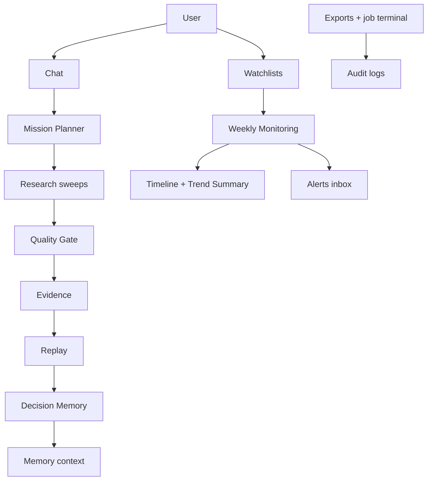

# Phase 5 — Continuous Platform

Scope: checklist items in [`docs/phase_by_phase_improvement_plan.md`](docs/phase_by_phase_improvement_plan.md) §0 Phase 5 (lines 371–379), plus hardening: **deterministic severity**, **alert dedupe**, **timeline clustering**, **decision outcomes/confidence**, **monitoring health**, **inbox filters**, **decision explanations**, **Competitive Trend Summary**.

**Locked defaults**
- **Reuse Phase 4 Inngest + `research_jobs`** — weekly monitoring enqueues `research/sweep.requested`; no second worker stack.
- **Alert delivery = in-app inbox only** (email/Slack deferred to Phase 6/connectors).
- **Feature flags default OFF**: `NEXT_PUBLIC_FF_AUDIT_LOGS`, `NEXT_PUBLIC_FF_WATCHLISTS`, `NEXT_PUBLIC_FF_ALERTS`, `NEXT_PUBLIC_FF_DECISION_MEMORY`, `NEXT_PUBLIC_FF_COMPETITIVE_TIMELINE`, `NEXT_PUBLIC_FF_FEEDBACK_LEARNING`.
- **Single-page product** — Watchlists / Alerts / Timeline / Decisions / Health live as drawers or a Monitor surface inside existing dashboard chrome; no new App Router pages.
- **Design system** — `.veracity-card`, `font-mono` labels, semantic pills; no bare hex.
- Sync `db/schema.sql` whenever adding Supabase migrations (fix Phase 4 drift for `research_jobs` in the same PR wave).



---

## Wave 0 — Schema, flags, schema sync

1. Extend [`lib/feature-flags.ts`](lib/feature-flags.ts) + [`.env.example`](.env.example) with the six flags above (all `envFlag(..., false)`).
2. Migration `supabase/migrations/007_continuous_platform.sql` (+ mirror into [`db/schema.sql`](db/schema.sql)):

| Table | Purpose |
|-------|---------|
| `audit_logs` | `user_id`, `action`, `resource_type`, `resource_id`, `metadata jsonb`, `created_at` — indexes `(user_id, created_at desc)` |
| `watchlists` | `user_id`, `name`, `product`, `enabled`, `last_sweep_at`, `next_sweep_at`, `health_status` (`healthy`/`degraded`/`stale`/`paused`), timestamps |
| `watchlist_items` | `watchlist_id`, `competitor`, `competitor_url?`, `enabled` |
| `alert_events` | `user_id`, `watchlist_id`, `job_id?`, `product`, `competitor`, `title`, `summary`, `severity` (`high`/`medium`/`low`), `diff jsonb`, `dedupe_key` **unique per user**, `read_at`, `created_at` |
| `competitive_events` | `user_id`, `product`, `competitor`, `event_date`, `title`, `summary`, `category` (pricing/launch/feature/hiring/docs/sentiment/other), `source_urls jsonb`, `job_id?`, `confidence`, `cluster_key` (ISO week + competitor + category bucket) |
| `decision_memory` | `user_id`, `session_id?`, `title`, `rationale`, `decision`, **`reason`** (short “Accepted because…”), `outcome` (`pending`/`validated`/`invalidated`/`adopted_after_reject`), **`confidence`** 0–1, `outcome_note?`, `source_recommendation_key?`, `evidence_urls jsonb`, timestamps |

3. Unique index: `alert_events (user_id, dedupe_key)` — prevents duplicate inbox spam.
4. RLS (Supabase): `auth.uid() = user_id`; items via watchlist ownership. Local: JWT + [`lib/db.ts`](lib/db.ts).

---

## Wave 1 — Audit logs (thin, high leverage)

**Goal:** Every export and terminal sweep is durable and queryable.

1. [`lib/audit.ts`](lib/audit.ts) — `writeAuditLog(...)` no-ops when `ff_audit_logs` off.
2. Wire writers: export success/fail ([`ExportReportButton.tsx`](components/export/ExportReportButton.tsx) via `POST /api/audit`); job terminal states in [`lib/research-jobs.ts`](lib/research-jobs.ts).
3. `GET /api/audit?limit=` in Usage panel ops strip.

**Exit:** Export PDF → audit row; completed job → audit row with `jobId`.

---

## Wave 2 — Strategic Watchlists + Market Monitoring + health

**Goal:** User tracks competitors; Monday cron runs bounded sweeps; system health is visible.

1. Watchlist CRUD APIs + seed from `user_memory.competitors` / `products`.
2. UI: Watchlists panel (sidebar / Monitor) gated by `ff_watchlists`.
3. Inngest [`lib/inngest/functions/competitive-alerts.ts`](lib/inngest/functions/competitive-alerts.ts):
   - Cron `0 9 * * 1` + event `monitoring/run.requested` (“Run now”).
   - Cap **3 items / user / week**; enqueue via existing `createResearchJob` + `research/sweep.requested`.
4. **Monitoring health (E)** — after each run (or cron tick), update watchlist:
   - `last_sweep_at`, `next_sweep_at` (next Monday 09:00 UTC), `health_status`:
     - `healthy` — last success &lt; 8 days
     - `degraded` — last run failed / partial
     - `stale` — no success &gt; 8 days
     - `paused` — watchlist disabled
5. UI strip on Monitor / Watchlists: **Last sweep · Next sweep · Status** (mono labels).

**Exit:** CRUD + manual run + health strip shows last/next/status.

---

## Wave 3 — Alerts (severity, dedupe, filters) + Timeline (cluster) + Trend Summary

**Goal:** Consistent, non-spammy alerts; readable timeline; executive trend overview.

### A. Deterministic alert severity

[`lib/monitoring/severity.ts`](lib/monitoring/severity.ts) — map event category / signal type → severity **before** LLM prose:

| Signal | Severity |
|--------|----------|
| Major pricing change | `high` |
| Official product launch | `high` |
| Funding / acquisition | `high` |
| New feature / packaging | `medium` |
| Hiring spike / layoffs | `medium` |
| New Reddit / HN thread | `low` |
| Minor docs / changelog | `low` |

LLM may propose category; **severity is always derived from category rules** (unit-tested). Store on `alert_events.severity`.

### B. Alert deduplication

`dedupe_key = hash(userId, competitor, product, normalizedTitle, isoWeek)`  
On insert: `ON CONFLICT (user_id, dedupe_key) DO UPDATE` metadata only (or skip) — never create duplicate inbox rows for the same competitor/product/title/week.

### F. Inbox filters

`GET /api/alerts?unread=1&severity=high&competitor=`  
UI: filter chips — **Unread · High · Competitor** — on Alerts drawer (`ff_alerts`).

### C. Timeline clustering

[`lib/monitoring/cluster-events.ts`](lib/monitoring/cluster-events.ts) — group `competitive_events` by `cluster_key` ≈ `(isoWeek, competitor, categoryFamily)` when ≥2 related events in the same week; UI shows one **weekly cluster** card expanding to child events.

[`components/ui/CompetitiveTimeline.tsx`](components/ui/CompetitiveTimeline.tsx) — clustered view default; flat toggle optional.

### Competitive Trend Summary (required add)

[`lib/monitoring/trend-summary.ts`](lib/monitoring/trend-summary.ts) + UI card:

```
Last 30 days · Competitor A
• Increased pricing
• Released AI feature
• Added integrations
• Reduced hiring

Overall trend · Aggressive expansion
```

- Aggregate last 30d events per competitor (counts by category).
- Deterministic headline from category histogram (e.g. launch+feature+pricing → “Aggressive expansion”; pricing-only → “Monetization push”; hiring down → “Efficiency / consolidation”).
- Optional one-line LLM polish **only if** flag on and histogram non-empty; headline must still match histogram rules.
- Surface above Timeline on Monitor / Intelligence when `ff_competitive_timeline`.

**Exit:** Duplicate weekly run does not duplicate alerts; severity matches fixtures; timeline clusters by week; Trend Summary renders for competitors with ≥2 events in 30d.

---

## Wave 4 — Decision Memory (explanations + outcomes) + Feedback learning

**Goal:** Durable decisions with rationale; confidence evolves with outcomes; ratings improve future context.

### G. Decision explanations

Store `reason` short sentence at write time, e.g. “Accepted because pricing recommendation matched sales strategy.”  
UI: required optional textarea (default stub from rec rationale first sentence) on accept/reject in [`IntelligenceResults`](components/ui/IntelligenceResults.tsx) / feedback helpers.

### D. Decision confidence over time

- Initial `confidence` from rec confidence (`high`→0.85, `medium`→0.65, `low`→0.4).
- `POST /api/decisions/[id]/outcome` with `validated` | `invalidated` | `adopted_after_reject` + note:
  - `validated` → confidence ↑ (cap 1.0)
  - `invalidated` → confidence ↓
  - `adopted_after_reject` → flag “interesting historical insight”; keep original decision, raise `outcome` visibility in MemoryDrawer
- Inject last N decisions **with reason + outcome** into [`buildMemoryContext`](lib/memory.ts).

### Feedback learning hardening (`ff_feedback_learning`)

Cross-session downvotes/accepted actions into orchestrator preamble; Usage soft metrics (thumbs / refine rate).

**Exit:** Accept with reason → Decision Memory; mark validated → confidence rises; new session memory includes reasons/outcomes.

---

## Wave 5 — Tests, QA, docs

1. Unit tests: severity matrix, dedupe_key stability, cluster_key grouping, trend headline histogram, decision confidence transitions, audit/cron no-op when flags off, health status rules.
2. Manual QA: flag-off unchanged demo; watchlist → Run now → alert (no dupes) → clustered timeline → trend summary; health strip; decision reason + outcome.
3. Mark Phase 5 checkboxes + exit ✅ in docs; add checklist bullets for severity/dedupe/cluster/trend/health/filters/reasons if desired.

**Phase 5 exit checks**
- Weekly/manual monitoring via existing job claim/idempotency
- Audit rows for export + job terminal states
- Watchlists + cost cap + **monitoring health** visible
- Alerts: **deterministic severity**, **dedupe**, **inbox filters**
- Timeline: **weekly clusters** + **Competitive Trend Summary**
- Decision Memory: **reason**, **outcome/confidence over time**, recallable in memory
- Feedback learning injects cross-session signal when flagged
- All Phase 5 flags default off

**Out of scope:** email/Slack, multi-tenant RLS/SAML (Phase 6), full Knowledge Graph (Phase 7), Organization Intelligence Dashboard.

---

## Long-term architecture (post–Phase 5)

Coherent product progression (already reflected in the diagram above):

`User → Chat → Mission Planner → Research → Quality Gate → Evidence → Replay → Decision Memory → Watchlists → Weekly Monitoring → Timeline → Alerts`

Phase 5 closes the loop from one-shot intelligence into continuous monitoring without breaking the single-page chat product.

---

## Suggested implementation order

| Wave | Focus | Depends on |
|------|--------|------------|
| 0 | Schema/flags (incl. dedupe_key, reason, health cols) | — |
| 1 | Audit | Wave 0 |
| 2 | Watchlists + cron + health | Wave 0, Phase 4 |
| 3 | Severity, dedupe, filters, cluster, trend summary | Wave 2 |
| 4 | Decisions (reason/outcome) + feedback learning | Wave 0 |
| 5 | QA/docs | 1–4 |

Waves 1 and 4 parallel after Wave 0. Wave 3 after Wave 2.
