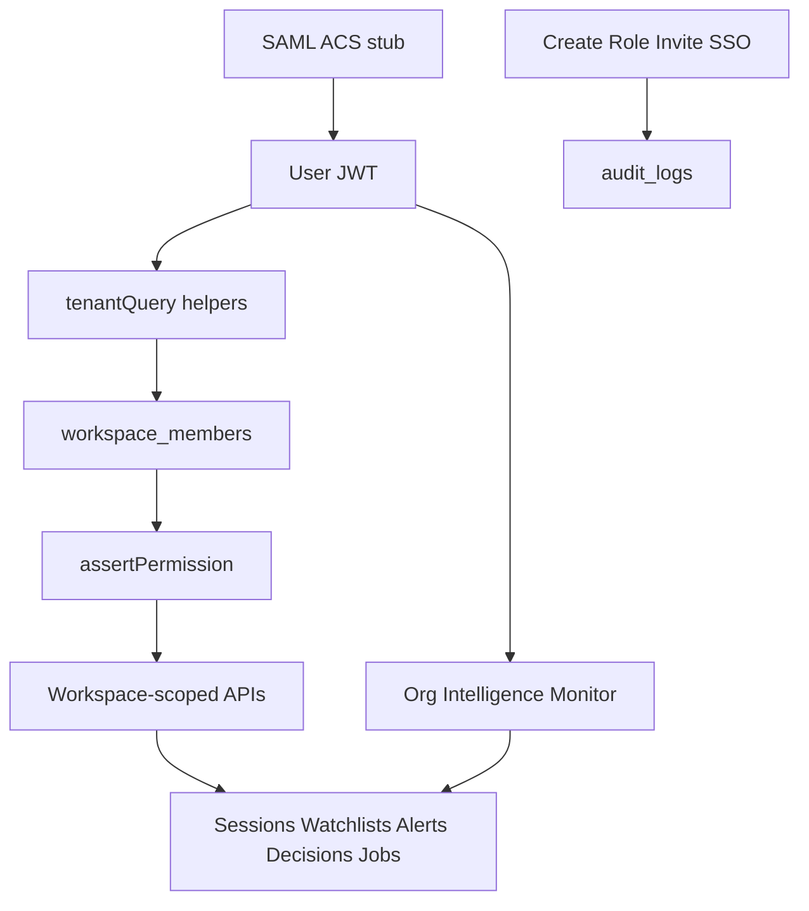

# Phase 6 — Enterprise

Scope: checklist in [`docs/phase_by_phase_improvement_plan.md`](docs/phase_by_phase_improvement_plan.md) §0 Phase 6 (lines 387–393) + §19. Unlocks **M4 Enterprise-Ready** (RBAC/SSO baseline).

**Locked defaults (from you)**
- **1A** — Include Organization Intelligence as an in-page Monitor surface (flag default OFF); no new App Router pages.
- **2A** — Keep local JWT cookie auth ([`lib/auth.ts`](lib/auth.ts) / [`lib/auth-session.ts`](lib/auth-session.ts)); add workspace SSO config + SAML ACS/callback architecture behind a flag (demo-safe without paid IdP). No Clerk/WorkOS/Supabase Auth migration.
- **Flags default OFF**: `NEXT_PUBLIC_FF_WORKSPACES`, `NEXT_PUBLIC_FF_RBAC`, `NEXT_PUBLIC_FF_SAML_SSO`, `NEXT_PUBLIC_FF_ORG_INTELLIGENCE`.
- **Single-page product** — Workspace switcher, Members/RBAC, SSO admin, Org Intelligence live as drawers/tabs inside existing chrome ([`app/page.tsx`](app/page.tsx), [`DashboardHeader`](components/ui/DashboardHeader.tsx), [`SessionSidebar`](components/ui/SessionSidebar.tsx)).
- **Runtime tenancy** — continue `pg`; **all** workspace-mode reads/writes go through a single tenant helper layer (never mix ad-hoc `user_id` vs `workspace_id` filters). Mirror policies into Supabase migrations ([`db/schema.sql`](db/schema.sql) + `supabase/migrations/008_enterprise.sql`).
- Reuse Phase 5 audit ([`lib/audit.ts`](lib/audit.ts)) for admin events when `ff_audit_logs` is on.

**Hardening locks (this iteration)**
1. **Tenant enforcement** — one helper layer owns scoping; no dual query styles.
2. **Invite lifecycle** — `pending` | `accepted` | `expired` | `revoked`.
3. **Permission helpers** — routes call `assertPermission(...)` only; no scattered role compares.
4. **Audit completeness** — workspace create, role changes, invite accept, SSO config changes.
5. **Workspace metadata** — optional `logo_url`, `timezone`, `industry` on `workspaces`.
6. **Org metrics** — job success/fail/avg runtime, active watchlists, decision acceptance rate.
7. **Isolation regression** — mandatory check for every post–Phase 6 feature that touches data APIs.

---

## Wave 0 — Schema, flags, personal workspace backfill

1. Extend [`lib/feature-flags.ts`](lib/feature-flags.ts) + [`.env.example`](.env.example) with the four flags above (`envFlag(..., false)`).
2. Migration `008_enterprise.sql` (+ mirror [`db/schema.sql`](db/schema.sql)):

| Table | Purpose |
|-------|---------|
| `workspaces` | `id`, `name`, `slug` unique, `created_by`, optional **`logo_url`**, **`timezone`**, **`industry`**, timestamps |
| `workspace_members` | `workspace_id`, `user_id`, `role` (`owner`/`admin`/`member`/`viewer`), unique `(workspace_id, user_id)` |
| `workspace_invites` | email, role, token, expires_at, invited_by, **`status`** (`pending`/`accepted`/`expired`/`revoked`), `accepted_at?`, `revoked_at?` |
| `workspace_sso_configs` | `workspace_id` unique, `enabled`, `idp_entity_id`, `idp_sso_url`, `idp_x509_cert`, `sp_entity_id`, `acs_path`, `allowed_email_domains text[]`, `metadata jsonb` |

3. Add nullable `workspace_id` to tenant data tables, then backfill + NOT NULL:
   - `chat_sessions`, `user_memory`, `recommendation_feedback`, `recommendation_actions`, `variant_results`, `research_jobs`, `audit_logs`, `watchlists`, `alert_events`, `competitive_events`, `decision_memory`
4. **Backfill rule**: for each existing `users` row, create a personal workspace (`"{email} workspace"`), insert `owner` membership, set `workspace_id` on all that user’s rows. Metadata columns remain null until set in UI.
5. Indexes: `(workspace_id, created_at desc)` on hot tables; keep `user_id` for **attribution only** (creator/actor), not tenancy.
6. Supabase RLS: membership-based (`EXISTS workspace_members WHERE user_id = auth.uid()`). Local runtime enforces via tenant helpers below.

---

## Wave 1 — Workspaces + single tenant helper layer

**Goal:** Active workspace on every request; **every** DB access path in workspace mode uses the same scoping helper.

### Tenant enforcement (mandatory)

1. [`lib/tenant.ts`](lib/tenant.ts) (or extend [`lib/workspace.ts`](lib/workspace.ts)) is the **only** place that builds workspace-scoped SQL predicates:
   - `withWorkspaceScope(workspaceId)` → always `AND workspace_id = $n`
   - `tenantQuery(sql, params, ctx)` / list helpers used by sessions, memory, watchlists, alerts, timeline, decisions, jobs, audit, org intel
2. **Forbidden when `ff_workspaces` on:** route-level `WHERE user_id = $1` as the tenancy filter. `user_id` may still appear for “created_by / actor” columns, never as the isolation key.
3. When `ff_workspaces` **off**: helpers fall back to today’s `user_id`-only filters so the demo is unchanged — still via the helper, not ad-hoc SQL in routes.
4. Grep/checklist in Wave 5: no raw `user_id`-only tenancy outside the helper.

### Workspace product surface

5. Active workspace: cookie `veracity_workspace` (uuid) or header `x-workspace-id`; default = personal/first membership.
6. CRUD: `GET/POST /api/workspaces`, `GET/PATCH /api/workspaces/[id]` (PATCH may set name + metadata: logo/timezone/industry).
7. Invites API with lifecycle transitions (see Wave 2).
8. UI: workspace switcher in header/sidebar (mono labels, `.veracity-card` panels).
9. **Audit:** `workspace.created` on create (when audit flag on).

**Exit:** Flag on → second workspace isolated via helper-scoped queries; flag off → unchanged single-user demo; no mixed filter styles in new code.

---

## Wave 2 — RBAC + invite lifecycle + centralized permissions

**Goal:** Role matrix enforced only through `assertPermission`; invites have a durable lifecycle.

| Role | Read intel / alerts / timeline | Create sessions / run sweeps | Manage watchlists | Invite / change roles | SSO / workspace settings |
|------|-------------------------------|------------------------------|-------------------|-----------------------|--------------------------|
| `viewer` | yes | no | no | no | no |
| `member` | yes | yes | yes | no | no |
| `admin` | yes | yes | yes | yes | yes |
| `owner` | yes | yes | yes | yes | yes (+ transfer/delete workspace) |

### Permission helpers (mandatory)

1. [`lib/rbac.ts`](lib/rbac.ts) — define permission keys (e.g. `session.write`, `sweep.run`, `watchlist.manage`, `member.invite`, `member.role_change`, `sso.configure`, `workspace.delete`).
2. **`assertPermission(ctx, permission)`** is the **only** gate used in route handlers / libs. No inline `if (role === 'admin')` or `roleAtLeast` scattered in handlers (those stay private inside `rbac.ts`).
3. Wire every mutating route through `assertPermission` (chat, jobs, watchlists, alerts mark-read, decisions, invites, SSO, workspace PATCH).

### Invitation lifecycle

4. `workspace_invites.status`:
   - `pending` — created, token valid, not expired
   - `accepted` — member row created; `accepted_at` set
   - `expired` — past `expires_at` (lazy mark on read/accept attempt, or cron)
   - `revoked` — admin cancelled; `revoked_at` set
5. Accept route rejects non-`pending` and expired tokens; revoke is admin+.
6. Members UI: list members + pending invites; change role; revoke invite; cannot remove/demote last owner.

### Audit completeness (admin events)

When `ff_audit_logs` on, write via [`lib/audit.ts`](lib/audit.ts):

| Action | When |
|--------|------|
| `workspace.created` | Wave 1 create |
| `workspace.member.role_changed` | role update |
| `workspace.invite.accepted` | successful accept |
| `workspace.invite.revoked` | revoke |
| `workspace.sso.config_updated` | SSO enable/disable or IdP field change (Wave 3) |

**Exit:** Viewer denied mutate via `assertPermission`; invite pending→accepted/revoked/expired works; role change + invite accept produce audit rows.

---

## Wave 3 — SAML SSO (architecture + demo ACS)

**Goal:** Enterprise SSO path without migrating identity providers.

1. Admin UI (admin+, `assertPermission('sso.configure')`): enable SSO, paste IdP entity ID / SSO URL / X509 cert; show SP Entity ID + ACS URL `https://{host}/api/auth/saml/acs`.
2. [`lib/sso/saml.ts`](lib/sso/saml.ts) — parse/validate assertion (`samlify` or equivalent), map NameID/email → user.
3. Routes:
   - `GET /api/auth/saml/login?workspace=` — redirect to IdP (or demo mock when `SAML_DEMO_MODE=1`)
   - `POST /api/auth/saml/acs` — validate → `findOrCreateSsoUser` → set JWT + workspace cookie → ensure membership
4. `SAML_DEMO_MODE=1`: mock IdP posts fixture assertion so ACS + provisioning can be QA’d without a real IdP.
5. Domain binding: `allowed_email_domains` — reject emails outside domains.
6. **Audit:** every successful SSO config write → `workspace.sso.config_updated`.
7. When `ff_saml_sso` off: routes 404/no-op; Google + password unchanged.

**Exit:** Demo ACS provisions user into workspace as `member`; SSO config changes audited; flag-off leaves `/auth` alone.

---

## Wave 4 — Organization Intelligence Monitor

**Goal:** Org-level rollup for the **active workspace** only (tenant helper scoped — no cross-workspace leak).

1. `GET /api/org/intelligence` — aggregates (flag-gated), all via tenant helpers:
   - Watchlist health counts + **active watchlists** count
   - Unread alerts by severity
   - Last 30d competitive trend headlines
   - Recent decisions + outcomes
   - **Operational metrics:** successful research jobs, failed jobs, average runtime, decision acceptance rate (`accepted` / total decision actions)
   - Audit strip (if audit on)
2. Optional display of workspace metadata (industry / timezone) in the panel header when set.
3. UI: [`components/ui/OrgIntelligencePanel.tsx`](components/ui/OrgIntelligencePanel.tsx) — header tab or Monitor drawer; `.veracity-card` sections; `font-mono` labels; semantic severity pills.
4. RBAC: `assertPermission` read-level (viewer+); empty states when Phase 5 flags off.

**Exit:** Seeded workspace shows health + alerts + trends + decisions + ops metrics; flag-off hides tab.

---

## Wave 5 — Tests, QA, docs, isolation regression

1. Unit tests: role/`assertPermission` matrix, invite lifecycle transitions, tenant helper always applies `workspace_id` when flag on, SSO email-domain gate, demo ACS provisioning, org metric shapes, flag-off no-ops, audit action names for admin events.
2. Manual QA: personal backfill; second workspace isolation; viewer denied mutate; invite pending→accept/revoke/expire; demo SAML; Org panel metrics; all Phase 6 flags default off.
3. **Mandatory workspace isolation regression (post–Phase 6):**
   - Document in `docs/phase_by_phase_improvement_plan.md` (and/or a short `docs/workspace_isolation_checklist.md`): every new feature that reads/writes tenant data must (a) go through tenant helpers, (b) include a cross-workspace negative test (user A cannot read workspace B), (c) pass `assertPermission` for mutations.
   - Add a Vitest suite (or extend Phase 6 tests) that fails if a listed API module queries tenant tables without `workspace_id` when `ff_workspaces` is simulated on — treat as permanent regression gate for Phase 7+.
4. Mark Phase 6 checkboxes + exit ✅ in docs; refresh §19.

**Phase 6 exit checks**
- Workspaces + metadata + membership backfill; **all** workspace-mode queries scoped via tenant helper (no mixed `user_id` tenancy)
- Invite lifecycle: pending / accepted / expired / revoked
- RBAC only via `assertPermission`
- Audit rows for workspace create, role change, invite accept, SSO config change
- SAML config + ACS + demo mode; JWT session preserved
- Org Intelligence with operational metrics for active workspace
- Isolation regression checklist documented + tested
- All Phase 6 flags default off

**Out of scope:** WorkOS/Clerk/Auth0 migration, email/Slack connectors, multi-route admin console, Phase 7 Knowledge Graph, billing/seat limits, cross-workspace holding company, sending invite emails (token link in UI is enough for MVP).

---

## Suggested implementation order

| Wave | Focus | Depends on |
|------|--------|------------|
| 0 | Schema / flags / metadata / invite status / backfill | Phase 5 tables |
| 1 | Tenant helper layer + workspaces UI + create audit | Wave 0 |
| 2 | `assertPermission` + invite lifecycle + admin audits | Wave 1 |
| 3 | SAML ACS + config UI + SSO audit | Wave 1–2 |
| 4 | Org Intelligence + ops metrics | Wave 1 + Phase 5 data |
| 5 | Tests / isolation regression gate / docs | 1–4 |

Waves 3 and 4 can proceed in parallel after Wave 2.
