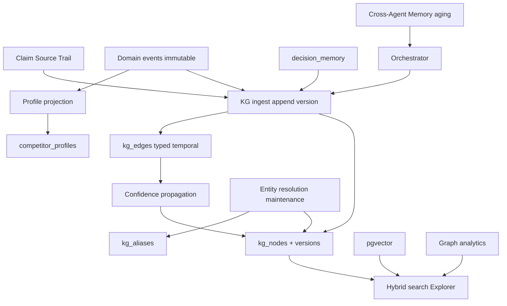

# Phase 7 — Knowledge Platform

Scope: checklist in [`docs/phase_by_phase_improvement_plan.md`](docs/phase_by_phase_improvement_plan.md) §0 Phase 7 (lines 402–409) + §18. Builds on Phase 3B evidence trails, Phase 5 competitive events / Decision Memory, Phase 6 workspace tenancy, and pgvector recall.

**Locked defaults (from you)**
- **1B** — **Defer Public REST API** to **Phase 8** after the graph model stabilizes. Do not expose `GET /graph` publicly in Phase 7.
- **2A** — Store the graph in **Postgres** (`kg_nodes` / `kg_edges` / versions / aliases / domain events), scoped by `workspace_id` via [`lib/tenant.ts`](lib/tenant.ts) and [`docs/workspace_isolation_checklist.md`](docs/workspace_isolation_checklist.md). No Neo4j.
- **Flags default OFF**: `NEXT_PUBLIC_FF_EVIDENCE_GRAPH`, `NEXT_PUBLIC_FF_COMPETITOR_PROFILES`, `NEXT_PUBLIC_FF_KG_EXPLORER`, `NEXT_PUBLIC_FF_CROSS_AGENT_MEMORY`, `NEXT_PUBLIC_FF_KG_MAINTENANCE`, `NEXT_PUBLIC_FF_KG_ANALYTICS`.
- **Single-page product** — Explorer / profiles / analytics as drawers/overlays in [`app/page.tsx`](app/page.tsx) / [`DashboardHeader`](components/ui/DashboardHeader.tsx); no new App Router pages.
- Design system: `.veracity-card`, `font-mono` labels, semantic pills; no bare hex.

**Hardening locks (this iteration)**
1. **Graph versioning** — never overwrite; append node revisions.
2. **Confidence propagation** — node confidence derived from supporting edges/sources (not arbitrary only).
3. **Temporal graph** — `valid_from` / `valid_until` for as-of reconstruction.
4. **Typed relationships** — rich `rel` vocabulary beyond supports/about/mentions.
5. **Provenance** — `created_by`, agent, job, session, timestamp, model version on writes.
6. **Event sourcing for profiles** — immutable events → projected `competitor_profiles`.
7. **Explorer hybrid search** — keyword + embedding + neighborhood.
8. **Memory aging** — TTL from confidence (high → long, low → expire).
9. **Graph analytics** — widgets (most referenced, most trusted, emerging, volatile, central).
10. **Knowledge Graph maintenance** — merge duplicates, normalize, alias resolve, repair edges, archive stale (biggest missing piece).

---

## Wave 0 — Schema, flags, tenancy

1. Extend [`lib/feature-flags.ts`](lib/feature-flags.ts) + [`.env.example`](.env.example) with the six flags above (`envFlag(..., false)`).
2. Migration `supabase/migrations/009_knowledge_platform.sql` (+ mirror [`db/schema.sql`](db/schema.sql)):

| Table | Purpose |
|-------|---------|
| `kg_nodes` | Canonical entity: `workspace_id`, `kind`, `label`, `key` (normalized), `props jsonb`, **`confidence`** (computed cache), **`valid_from`**, **`valid_until`**, **`archived_at`**, provenance cols, unique `(workspace_id, kind, key)` where not archived |
| `kg_node_versions` | **Append-only revisions**: `node_id`, `version`, `label`, `props`, `confidence_snapshot`, provenance, `created_at` — never UPDATE in place |
| `kg_edges` | `from_node_id`, `to_node_id`, **`rel`** (typed enum below), `weight`/`trust`, **`valid_from`/`valid_until`**, provenance, unique active `(workspace_id, from, to, rel)` |
| `kg_aliases` | Entity resolution: `workspace_id`, `alias_key`, `canonical_node_id`, `source` (`ingest`/`manual`/`resolver`) |
| `kg_domain_events` | **Immutable** profile/graph events: `workspace_id`, `aggregate_type` (`competitor`/`product`/…), `aggregate_key`, `event_type`, `payload jsonb`, provenance, `occurred_at` |
| `competitor_profiles` | **Projection only** rebuilt from `kg_domain_events` (+ linked nodes); not the source of truth |
| `agent_memory_entries` | Cross-agent memory: scope/key/value, `confidence`, **`expires_at`** (aging), provenance |

**Provenance columns** (nodes, versions, edges, domain events, memory): `created_by` (user), `source_agent`, `job_id`, `session_id`, `model_version`, `created_at`.

**Typed `rel` vocabulary (CHECK / app enum):**  
`supports`, `about`, `derived_from`, `mentions`, `decides`, `timed_as`, `acquired`, `owns`, `competes_with`, `replaces`, `depends_on`, `launched`, `targets`, `uses`, `invested_in`, `partner_of`, `same_as` (alias merge).

3. Indexes: workspace+kind, edge endpoints+rel, temporal (`valid_from`/`valid_until`), aliases, domain_events `(aggregate_type, aggregate_key, occurred_at)`, memory `expires_at`.
4. RLS + runtime `withTenantScope` (Phase 6 rules).

---

## Wave 1 — Evidence Graph core (versioned ingest, confidence, temporal, provenance)

**Goal:** First-class queryable temporal graph; trails become durable versioned nodes/edges.

1. [`lib/kg/types.ts`](lib/kg/types.ts), [`lib/kg/store.ts`](lib/kg/store.ts):
   - `appendNodeVersion` / `upsertCanonical` — **never overwrite** prior props; bump version row.
   - `upsertEdge` with typed `rel` + temporal window.
   - `getNeighborhood`, `getAsOf(workspaceId, at: Date)` filtering `valid_from/valid_until`.
2. [`lib/kg/confidence.ts`](lib/kg/confidence.ts) — **propagate confidence**:
   - Claim confidence from supporting `supports` edges (source trust × count, capped).
   - Recompute on ingest; store on node as cache; version snapshot keeps prior value.
3. [`lib/kg/ingest.ts`](lib/kg/ingest.ts) — ingest with full provenance from chat/job/session/agent/model:
   - Claims → versioned `claim` nodes; URLs → `source`; `supports` / `about` / richer rels when classifier hints exist.
   - `competitive_events` → domain events + `event`/`competitor` nodes.
   - `decision_memory` → `decision` nodes + `decides` edges.
4. Hook after chat result persist + monitoring process (flag on).
5. APIs: `GET /api/kg/nodes`, `GET /api/kg/neighborhood`, `GET /api/kg/as-of?at=ISO` — tenant-scoped.

**Exit:** Ingest twice with changed claim text → two versions; confidence rises with more trusted sources; as-of returns February state when windows set.

---

## Wave 2 — Event-sourced competitor profiles + historical timeline

**Goal:** Profiles are projections; events remain immutable.

1. Write path: ingest/monitoring emits **`kg_domain_events` only** (never “edit profile” as SoT).
2. [`lib/kg/profiles.ts`](lib/kg/profiles.ts) — `projectCompetitorProfile(workspaceId, key)` rebuilds `competitor_profiles` from events + graph (summary, first/last seen, trend headline via [`trend-summary`](lib/monitoring/trend-summary.ts)).
3. `GET /api/competitors`, `GET /api/competitors/[key]?asOf=` — projection + timeline + optional historical reconstruction.
4. UI: [`CompetitorProfileCard`](components/ui/CompetitorProfileCard.tsx) + timeline (reuse clustering patterns).

**Exit:** Replaying events rebuilds the same profile; timeline + as-of work; flag-off hides UI.

---

## Wave 3 — KG Explorer (hybrid search) + analytics widgets

**Goal:** Browse + search without leaving the chat page.

1. [`components/ui/KnowledgeGraphExplorer.tsx`](components/ui/KnowledgeGraphExplorer.tsx) — drawer: kind filters, neighborhood view, node detail (versions, provenance, confidence).
2. **Hybrid search** [`lib/kg/search.ts`](lib/kg/search.ts) + `GET /api/kg/search?q=`:
   - Keyword on `label`/`key`/`props`
   - Embedding similarity (reuse [`lib/embeddings.ts`](lib/embeddings.ts) / `chat_embeddings` or `kg_node` embedding column if added in 009)
   - Expand top hits via graph neighborhood; merge/rank
3. **Analytics** (flag `ff_kg_analytics`): [`lib/kg/analytics.ts`](lib/kg/analytics.ts) + strip in Explorer / Org panel:
   - Most referenced competitors
   - Most trusted evidence (high confidence sources)
   - Emerging companies (new nodes in window)
   - Frequently changing products (high version churn)
   - Central entities (degree / edge weight)
4. Dynamic import; header entry when explorer flag on.

**Exit:** Hybrid query returns keyword+semantic+neighbor hits; analytics widgets render for seeded graph.

---

## Wave 4 — Cross-Agent Memory with aging

**Goal:** Shared scratchpad that does not accumulate forever.

1. [`lib/kg/agent-memory.ts`](lib/kg/agent-memory.ts) — get/put/list; on put set **`expires_at` from confidence**:
   - high (≥0.8) → long TTL (e.g. 30d)
   - medium → medium TTL (e.g. 7d)
   - low → short TTL (e.g. 24–48h)
2. Lazy purge / optional cron tick: delete or ignore expired rows.
3. Orchestrator wiring when `ff_cross_agent_memory` on; Memory drawer strip; preamble inject with Phase 5 learning when both enabled.

**Exit:** Low-confidence fact expires; high-confidence persists; Agent B reads Agent A’s live facts only.

---

## Wave 5 — Knowledge Graph maintenance (entity resolution)

**Goal:** Prevent alias sprawl (`OpenAI` / `Open AI` / `OpenAI Inc.`).

1. [`lib/kg/maintenance.ts`](lib/kg/maintenance.ts) pipeline (flag `ff_kg_maintenance`):
   - **Normalize** keys (lowercase, strip Inc/LLC punctuation)
   - **Resolve aliases** → write `kg_aliases` + `same_as` edges
   - **Merge duplicates** — re-point edges to canonical; archive losers (`archived_at`); keep versions
   - **Repair edges** — drop self-loops / broken FKs; collapse duplicate rels
   - **Archive stale** — nodes with `valid_until` past + no recent edges
2. `POST /api/kg/maintenance/run` (admin+/owner via `assertPermission`) — bounded batch; audit log when audit flag on.
3. Unit tests: alias cluster merges to one canonical; edge counts preserved on canonical.

**Exit:** Three alias variants become one canonical node with aliases; Explorer shows one competitor.

---

## Wave 6 — Tests, QA, docs

1. Tests: versioning (no overwrite), confidence propagation fixtures, temporal as-of, typed rel enum, provenance fields present, profile projection from events, hybrid search ranking smoke, memory TTL aging, maintenance merge, tenant isolation, flag-off no-ops.
2. Manual QA: ingest → versions → Explorer hybrid search → profile projection → analytics → memory aging → maintenance merge; isolation checklist for all new APIs.
3. Docs: mark Phase 7 shipped items ✅; **Public REST API → Phase 8 / postponed** explicitly; refresh §18; decision register: Postgres versioned temporal graph; REST after stabilize.

**Phase 7 exit checks (shipped scope)**
- Versioned Evidence Graph + typed temporal edges + provenance
- Confidence propagation on claims/sources
- Event-sourced competitor profiles + historical / as-of timeline
- KG Explorer with hybrid search + analytics widgets
- Cross-Agent Memory with confidence-based aging
- Graph maintenance (normalize / alias / merge / repair / archive)
- Workspace tenancy; flags default off
- Public REST API **deferred to Phase 8** (documented)

**Out of scope:** Public REST API / API keys (Phase 8), Neo4j, multi-route KG app, full OpenAPI, Agent Marketplace, email connectors.

---

## Suggested implementation order

| Wave | Focus | Depends on |
|------|--------|------------|
| 0 | Schema / flags / versions / aliases / events | Phase 5–6 |
| 1 | Versioned ingest + confidence + temporal APIs | Wave 0 |
| 2 | Event-sourced profiles + as-of timeline | Wave 1 |
| 3 | Hybrid Explorer + analytics | Wave 1 |
| 4 | Memory aging | Wave 0 |
| 5 | Entity resolution maintenance | Wave 1 |
| 6 | Tests / docs | 1–5 |

Waves 2–5 can proceed in parallel after Wave 1 (Wave 4 only needs Wave 0).
