# Veracity AI — Definitive Product Engineering & Competition Master Plan

> **Document Version:** 2.0.1 (Execution polish — 2026-07-23)  
> **Authoritative Reviewing Body:** Engineering Leadership Board  
> *(CTO · Chief AI Architect · Chief Product Officer · Principal Backend / Frontend / UX / DevOps / Security / Database / Cloud Engineers · Senior AI Research Engineer · Technical Program Manager · Competition Judge)*  
> **Single Source of Truth:** This file — `docs/phase_by_phase_improvement_plan.md` (repo root: `Veracity/`)  
> **Codebase Scope:** `/Users/oneionei/MyProjects/Veracity/Veracity`  
> **Policy:** Living execution plan. Mark `[x]` only when work exists in the codebase. Never delete completed checklists.  
> **V1 Backup:** `doc/phase_by_phase_improvement_plan.v1.backup.md`

### Version history

| Version | Date | Summary |
|---------|------|---------|
| 1.x | 2026-07-21 | Original Implementation & Verification Master Plan (backup retained) |
| 2.0 | 2026-07-23 | Competition + implementation-review rewrite; Phase 3B/3Q added |
| 2.0.1 | 2026-07-23 | Focus dashboard, ownership, onboarding, readiness, risk register, maintenance rules |

**Versioning rule:** checkbox-only updates → patch (`2.0.x`); new Must-Have tasks or milestone changes → minor (`2.1`).

---

## Table of Contents

0. [Phase Completion Tracker (Living Checklist)](#0-phase-completion-tracker-living-checklist)
0C. [Current Focus (Now / Next / Later)](#0c-current-focus-now--next--later)
0A. [Project Overview](#0a-project-overview)
0B. [Current Implementation Status](#0b-current-implementation-status)
0D. [Developer Onboarding (15 min)](#0d-developer-onboarding-15-min)
1. [Executive Summary](#1-executive-summary)
2. [Product Vision](#2-product-vision)
3. [Product Strategy](#3-product-strategy)
4. [Competitive Analysis](#4-competitive-analysis)
5. [Engineering Principles & Governance](#5-engineering-principles--governance)
6. [Architecture Review (Current · Next · Future)](#6-architecture-review-current--next--future)
7. [AI Architecture & Evolution](#7-ai-architecture--evolution)
8. [Infrastructure Architecture](#8-infrastructure-architecture)
9. [Phase-by-Phase Implementation Plan Overview](#9-phase-by-phase-implementation-plan-overview)
10. [Detailed Step-by-Step Task Specifications](#10-detailed-step-by-step-task-specifications)
11. [System Dependency Graph](#11-system-dependency-graph)
12. [Gantt Timeline](#12-gantt-timeline)
13. [Technical Debt Backlog](#13-technical-debt-backlog)
14. [Product Feature Backlog](#14-product-feature-backlog)
15. [Competition Roadmap & Wow Features](#15-competition-roadmap--wow-features)
16. [Competition Winning Strategy](#16-competition-winning-strategy)
17. [Demo Roadmap](#17-demo-roadmap)
18. [Knowledge Platform Roadmap](#18-knowledge-platform-roadmap)
19. [Enterprise Roadmap](#19-enterprise-roadmap)
20. [Optional Future Platform](#20-optional-future-platform)
21. [DevOps Roadmap](#21-devops-roadmap)
22. [Security Roadmap](#22-security-roadmap)
23. [Observability Roadmap](#23-observability-roadmap)
24. [Performance Roadmap](#24-performance-roadmap)
25. [UX Roadmap](#25-ux-roadmap)
26. [Product Analytics Roadmap](#26-product-analytics-roadmap)
27. [Reliability Engineering Roadmap](#27-reliability-engineering-roadmap)
28. [Cost Optimization Roadmap](#28-cost-optimization-roadmap)
29. [Release Strategy](#29-release-strategy)
30. [Testing Strategy](#30-testing-strategy)
31. [Verification Checklists](#31-verification-checklists)
32. [Deployment Strategy](#32-deployment-strategy)
33. [Rollback Strategy](#33-rollback-strategy)
34. [Definition of Ready](#34-definition-of-ready)
35. [Definition of Done](#35-definition-of-done)
36. [Phase Exit Criteria](#36-phase-exit-criteria)
37. [Success KPIs](#37-success-kpis)
38. [Risks and Trade-offs](#38-risks-and-trade-offs)
39. [Features to Remove](#39-features-to-remove)
40. [Features to Postpone](#40-features-to-postpone)
41. [Future Research Topics](#41-future-research-topics)
42. [CTO Final Recommendations (V2)](#42-cto-final-recommendations-v2)

---

## 0. Phase Completion Tracker (Living Checklist)

> **How to use:** Mark `[x]` only when the step is complete in the codebase. Unfinished work stays `[ ]`. This section is the team’s progress tracker. Parallel lanes (FE / BE / AI / DB / DevOps / QA / UX) are noted under each open phase.

### Progress summary

| Phase | Name | Status |
|-------|------|--------|
| Phase 0 | Engineering Foundation & Governance | ✅ Complete (2026-07-21) |
| Phase 1 | Security Hardening & Critical Fixes | ✅ Complete (2026-07-21) |
| Phase 1B | Developer Experience (DevEx) & CI/CD | ✅ Complete (2026-07-21) |
| Phase 2 | Architecture & Component Refactoring | 🟡 In progress |
| Phase 2B | Observability | 🟡 In progress |
| Phase 2C | Performance | 🟡 In progress |
| Phase 3 | UX & High-Value Product Features | 🟡 In progress |
| Phase 3B | Competition Explainability & Orchestration UX | ⬜ Not started *(V2)* |
| Phase 3Q | Output Quality & Anti-Hallucination Gates | 🟡 Mostly complete (2026-07-23) |
| Phase 4 | AI Systems Orchestration & Queue Scale | ⬜ Not started |
| Phase 5 | Continuous Platform | ⬜ Not started |
| Phase 6 | Enterprise | ⬜ Not started |
| Phase 7 | Knowledge Platform | ⬜ Not started |

---

## 0C. Current Focus (Now / Next / Later)

> Update **Now** every Monday. Task IDs link to checkboxes in §0. Feature definitions live in §15 — do not re-specify them here.

| Horizon | Focus | Task IDs | Primary lane |
|---------|--------|----------|--------------|
| **Now** | Thin `page.tsx` + mount/remove agent picker; pgvector recall QA | TASK-2.1, TASK-2.2 | FE · DB · QA |
| **Now** | Evidence Strength Meter (close 3Q UI gap) | TASK-3Q.1 (UI meter) | FE · AI |
| **Next** | Evidence Trail · Thinking Timeline · Live Orchestrator · Board Mode | TASK-3B.1, 3B.2, 3B.3, 3B.6 | FE · BE · AI · UX |
| **Next** | Source trust badges · Adaptive agent UI · Strategy Canvas | TASK-3B.5, 3B.7, 3B.8 | FE · AI |
| **Later** | Inngest queue · Mission/Execution planners · Replay | TASK-4.1–4.4 | BE · AI · DevOps |
| **Later** | Continuous alerts · Enterprise · Knowledge Graph | Phase 5–7 | Platform |

### How to mark work complete
1. Land code on `main` via CI.  
2. Check the matching `[ ]` → `[x]` in §0.  
3. Move the row out of **Now** in this table.  
4. If blocked, note blocker in §38 risk register (Owner column).

### Team operating rhythm
- **Daily:** Update §0C Now; move §0 checkboxes when PRs merge.  
- **Weekly:** 30-min phase review — blockers, one TD item, demo dry-run if competition week.  
- **Grooming:** Change status only in §14 / §0; feature specs only in §15.  
- **Phase exit:** Sign §36 after Must-Have checklists in §0 are Done.

---

### Phase 0 — Engineering Foundation & Governance

#### TASK-0.1 — Repository Governance & ADRs
- [x] Create `docs/adr/` directory structure
- [x] Add `docs/adr/template.md`
- [x] Publish `docs/adr/0001-governance-and-standards.md`
- [x] Review ADR formatting / governance standards recorded
- [x] Phase completion tracker maintained in this document

#### TASK-0.2 — Centralized Environment Schema (`lib/config.ts`)
- [x] Ensure `zod` is a direct dependency
- [x] Create `lib/config.ts` with fail-fast Zod schema (no secret fallbacks)
- [x] Wire critical consumers (`auth-session`, `db`, `gemini`, `usage-info`)
- [x] Update `.env.example` to match required/optional schema
- [x] Unit tests: missing keys throw `ConfigError`
- [x] `npm test` passes
- [x] Phase 0 exit: TASK-0.1 + TASK-0.2 complete

**Phase 0 exit:** ✅ Complete — 2026-07-21

---

### Phase 1 — Security Hardening & Critical Fixes

#### TASK-1.1 — Security Hardening (JWT Secret, Key Headers, VPS Removal)
- [x] Remove remaining plaintext secret fallbacks (if any)
- [x] Pass Gemini API key via `x-goog-api-key` header (no `?key=` in URL)
- [x] Remove hardcoded VPS IPs (`168.144.36.78`) — env-only
- [x] Unit/integration coverage for auth secret rejection + header auth
- [x] Manual QA: confirm no API key in request URLs *(covered by unit tests asserting URL builders)*
- [x] Security scan passes *(source scan: no hardcoded secret fallback / VPS IP / `?key=` in app code)*

#### TASK-1.2 — Sliding-Window API Rate Limiting
- [x] Provision Upstash Redis + add env keys to `lib/config.ts` *(keys optional; set `UPSTASH_*` in prod to enforce)*
- [x] Install `@upstash/ratelimit`; guard `/api/chat` and `/api/refine`
- [x] Frontend handles HTTP 429
- [x] Tests: overflow returns 429 *(response builder + fail-open without Redis)*
- [ ] Manual QA: rate-limit warning in UI *(requires Upstash credentials in a running env)*

**Phase 1 exit:** ✅ Complete (code) — 2026-07-21 — set `UPSTASH_REDIS_REST_URL` + `UPSTASH_REDIS_REST_TOKEN` in production to enforce limits

---

### Phase 1B — Developer Experience (DevEx) & CI/CD

#### TASK-1B.1 — GitHub Actions CI & Pre-Commit Hooks
- [x] Add `.github/workflows/ci.yml` (`lint`, `tsc --noEmit`, `npm test`)
- [x] Configure `husky` + `lint-staged`
- [ ] Enable branch protection on main *(manual in GitHub Settings → Branches)*
- [x] Verify CI fails on lint/type errors *(local gates pass: lint 0 errors, typecheck, tests)*
- [ ] Draft PR smoke-test of workflow *(after push to GitHub)*

**Phase 1B exit:** ✅ Complete (local) — 2026-07-21 — enable GitHub branch protection + push to verify Actions

---

### Phase 2 — Architecture & Component Refactoring

#### TASK-2.1 — Decompose monolithic `app/page.tsx`
- [x] Extract shared types (`types/chat-ui.ts`) + domain meta (`lib/domain-meta.tsx`)
- [x] Extract leaf UI: `ConfidenceBadge`, `SidebarAgentRow`, `AgentCard` + `lib/chat-client.ts`
- [x] Extract `SessionSidebar` + `lib/agent-progress.ts` helpers
- [x] Extract `useChatStream` SSE hook
- [x] Extract `ChatPanel`, `AgentProgressGrid`, `MemoryDrawer`
- [x] Extract `DashboardHeader`, `ExpandedDomainPanel`, `IntelligenceResults`
- [ ] Reduce `page.tsx` to &lt;250 lines *(still hosts send/follow-up/session handlers)*
- [ ] Mount or remove unused agent UI (`SidebarAgentRow`, `AgentCard`) — wire `selectedAgents`
- [ ] Regression: SSE streaming, tabs, sessions without state loss
- [ ] Profile re-renders during active stream

**Parallel lanes:** FE (shell split) · QA (SSE regression) · UX (agent picker)

#### TASK-2.2 — Native PostgreSQL `pgvector` migration
- [x] Migration: ensure `vector` extension + HNSW index (`db/migrations/0002_pgvector.sql`, `supabase/migrations/005_pgvector_hnsw.sql`)
- [x] Rewrite `/api/recall` to use native `<=>` (remove JS cosine sort)
- [x] Update `/api/embed` + `db/schema.sql` to store `vector(768)`
- [ ] Benchmark: recall query latency &lt;20ms *(run after applying migration on local/prod DB)*
- [ ] Manual QA: semantic recall in chat UI

**Parallel lanes:** DB · BE · QA

**Phase 2 exit:** ⬜ Not complete — modules extracted; shell + agent-picker + recall QA remain

---

### Phase 2B — Observability *(roadmap)*
- [x] Structured JSON logger with correlation IDs (`lib/logger.ts`)
- [x] Gemini token / dollar cost tracking via `usageMetadata` (`lib/gemini-usage.ts`, wired in `lib/agents/gemini.ts`)
- [x] Exception + tool latency helpers (`captureException`, `withToolLatency`) — Sentry SDK optional later via DSN
- [x] `/api/chat` emits correlation id header + structured start/complete logs
- [ ] Wire `withToolLatency` into production tool call sites
- [ ] Optional Sentry DSN integration
- [ ] PostHog (or equivalent) product analytics — replace localStorage stub

**Phase 2B exit:** 🟡 Partial — core logger + Gemini usage live; APM + product analytics open

---

### Phase 2C — Performance / UX polish *(roadmap)*
- [x] Dynamic bundle splitting for heavy panels + artifact charts (`next/dynamic` on dashboard/auth + `ArtifactRenderer`)
- [x] Component memoization (`AgentProgressGrid`, `ArtifactRenderer`) + stabilized domain getters
- [x] Skeleton states during SSE start + lazy-load placeholders (`PanelSkeleton`)
- [ ] Measure bundle delta in CI/build
- [ ] Render orchestration log / pipeline stages already streamed to client

**Phase 2C exit:** 🟡 Partial — splitting + skeletons landed; pipeline visibility incomplete

---

### Phase 3 — UX & High-Value Product Features

#### TASK-3.1 — Executive PDF & DOCX Report Exporter
- [x] Install `@react-pdf/renderer`; build `ExecutivePdfDocument`
- [x] Export button; PDF includes summary, mind map, matrix, sources
- [x] Clickable source links in PDF (`Link` components)
- [x] Analytics: export click tracking (`lib/analytics.ts` local + console events)
- [ ] DOCX export (optional follow-up; PDF is primary deliverable)
- [ ] Presentation Mode / Executive Board Mode layouts *(see Phase 3B)*

#### TASK-3.2 — Unified composer (query + follow-up)
- [x] Remove duplicate “Ask a follow-up” bar; single bottom composer
- [x] Route composer to follow-up when session has results; New query for fresh chat

#### TASK-3.3 — Auth / brand dark-mode lockup
- [x] Theme-aware wordmark PNGs; auth uses robot + wordmark (no corrupted composite logo)

**Phase 3 exit:** 🟡 Partial — PDF + composer + branding live; DOCX + presentation modes open

---

### Phase 3Q — Output Quality & Anti-Hallucination Gates *(V2 — largely shipped 2026-07-23)*

- [x] Entity-aware source relevance (`lib/tools/source-relevance.ts`)
- [x] Post-synthesis quality gate (`lib/agents/output-quality.ts`)
- [x] Wire filter + gate into orchestrator (Steps 4–7)
- [x] Ban `"relevant competitors"` / `"top competitors"` placeholder searches
- [x] Anti-hallucination + plain-language rules in synthesizer prompt
- [x] Offline validation script `npm run test:quality` + unit tests
- [x] Fix Notion false-positive `person_homonym_noise` (LinkedIn company noise)
- [ ] Surface quality report in UI (Evidence Strength Meter — Phase 3B)
- [ ] Claim↔URL binding for facts/recommendations (Evidence Trail — Phase 3B)

**Phase 3Q exit:** 🟡 Code gate live; explainability UI still open

---

### Phase 3B — Competition Explainability & Orchestration UX *(V2 — Must Have)*

> Purpose: Convert engineering depth into judge-visible Decision Intelligence.

#### Parallel workstreams

| Lane | Tasks |
|------|--------|
| **Frontend** | Live Orchestrator View, Thinking Timeline, Evidence Trail UI, Confidence Breakdown |
| **Backend** | Persist quality report + claim↔source IDs on messages |
| **AI** | Mission Planner lite, Adaptive selection UI wiring, Reasoning summary stream |
| **Database** | Optional `evidence_links` table / metadata schema |
| **UX** | Executive Board Mode, Presentation Mode |
| **QA** | Demo scripts + quality regression suite |
| **DevOps** | Feature flags for competition surfaces |

**Conflict prevention:** FE does not change orchestrator prompts; AI does not restyle Board Mode; BE publishes metadata schema before FE binds Evidence Trail. Flags: `ff_board_mode`, `ff_orchestrator_view`, `ff_evidence_trail`, `ff_async_sweep` (see §29).

#### TASK-3B.1 — Claim-to-Source Traceability + Evidence Trail
- [ ] Bind `facts` / `Recommendation.evidence` to `sourceUrls[]`
- [ ] UI expandable Evidence Trail per recommendation
- [ ] PDF includes evidence links per recommendation
- [ ] Flag `ff_evidence_trail` gates UI
- [ ] Acceptance: every top recommendation shows ≥1 clickable source

#### TASK-3B.2 — Confidence Breakdown + Evidence Strength Meter
- [ ] Expose tool-health · entity-match · agent-avg · quality-gate components
- [ ] UI meter on Decision card
- [ ] Acceptance: user can see *why* confidence is medium/low

#### TASK-3B.3 — Interactive AI Thinking Timeline + Live Orchestrator View
- [ ] Render streamed `orchestration_log` + agent status as timeline
- [ ] Live Orchestrator View (DAG of classify → agents → synth → gate)
- [ ] Flag `ff_orchestrator_view` gates UI
- [ ] Acceptance: judges see agents work in real time beyond chip bar

#### TASK-3B.4 — Agent Collaboration Graph + Mission DAG (lite)
- [ ] Visual graph of agents + shared product/competitor context
- [ ] Mission Planner lite: ordered research steps from classifier domains
- [ ] Acceptance: graph updates as agents complete

#### TASK-3B.5 — Source Trust Score + Credibility Badges
- [ ] Extend `source-validator` tiers (T1/T2/T3) into UI badges
- [ ] Acceptance: Sources list shows trust tier

#### TASK-3B.6 — Executive Board Mode + Presentation Mode
- [ ] Full-screen Decision → Recs → Matrix → Map → Sources
- [ ] Keyboard/Presenter-friendly transitions
- [ ] Flag `ff_board_mode` gates UI
- [ ] Acceptance: 5-minute demo never leaves Board Mode

#### TASK-3B.7 — Strategy Canvas + Competitive Battlefield (viewport)
- [ ] Strategy Canvas summarizing pillars vs competitor
- [ ] Competitive Battlefield matrix with hover evidence
- [ ] Acceptance: one screen explains “why we win/lose”

#### TASK-3B.8 — Wire Adaptive Agent Selection UI
- [ ] Mount agent toggles (`selectedAgents`) in sidebar or header
- [ ] Persist per-session selection
- [ ] Acceptance: deselecting agents reduces fan-out visibly in Orchestrator View

**Phase 3B exit:** ⬜ Not complete — required for competition “wow” without fake demos

---

### Phase 4 — AI Systems Orchestration & Queue Scale

#### TASK-4.1 — Inngest asynchronous background queue
- [ ] Provision Inngest; add keys to `lib/config.ts`
- [ ] `/api/inngest` route + `research-sweep` background function
- [ ] Client listens for job progress (SSE/poll)
- [ ] Sweeps &gt;120s complete without HTTP 504
- [ ] Feature-flag rollback to sync handler verified

#### TASK-4.2 — Mission Planner + Execution Planner (full)
- [ ] Mission Planner decomposes goals into dependent research steps
- [ ] Execution Planner schedules Stage-2 only when artifacts requested
- [ ] Shared scratchpad between agents (structured intermediate state)

#### TASK-4.3 — Adaptive Agent Selection (cost-aware)
- [ ] Classifier + UI drive minimum viable agent set
- [ ] Measure ~API cost reduction on targeted queries

#### TASK-4.4 — Research Replay + Scenario Comparison
- [ ] Replay prior sweep timeline from stored logs/metadata
- [ ] Side-by-side scenario comparison (What If Simulator lite)

**Phase 4 exit:** ⬜ Not complete

**Parallel lanes:** BE (Inngest) · AI (planners) · FE (replay UI) · DevOps (flags) · QA

---

### Phase 5 — Continuous Platform *(roadmap)*
- [ ] Weekly competitive alerts cron
- [ ] Audit logs table for exports/sweeps
- [ ] Feedback learning loop hardening
- [ ] Strategic Watchlists + Market Monitoring
- [ ] Competitive Timeline viewport
- [ ] Decision Memory store (durable decisions + rationale)

**Phase 5 exit:** ⬜ Not complete

---

### Phase 6 — Enterprise *(roadmap)*
- [ ] Multi-tenant workspaces + RLS
- [ ] RBAC
- [ ] Enterprise SAML SSO
- [ ] Organization Intelligence Dashboard *(optional platform)*

**Phase 6 exit:** ⬜ Not complete

---

### Phase 7 — Knowledge Platform *(roadmap)*
- [ ] Evidence knowledge graph (first-class)
- [ ] Competitor profiles + historical timeline
- [ ] Knowledge Graph Explorer UI
- [ ] Cross-Agent Memory service
- [ ] Public REST API (if still prioritized)

**Phase 7 exit:** ⬜ Not complete

---

## 0A. Project Overview

### What Veracity AI is
Veracity AI is a **Growth Intelligence Platform**: a Next.js multi-agent system that turns a natural-language competitive/growth question into live-sourced research, structured artifacts, grounded recommendations, optional campaign execution assets, and an executive PDF — with session memory, semantic recall, and a feedback→refine loop.

### Target users
Product, growth, and GTM teams who need **decision-ready competitive intelligence**, not generic chat answers.

### Core architecture (current)
- **Client:** Next.js 15 App Router — pages `/auth`, `/` (Intelligence · API usage · Steal strategy tabs)
- **API:** SSE chat gateway + sessions/memory/embed/recall/feedback/refine/steal/auth
- **AI:** Custom orchestrator — classify → parallel research agents → optional execution → synthesize + mind map → quality gate
- **LLM:** Google Gemini (`lib/agents/gemini.ts`)
- **Tools:** SerpAPI, Firecrawl, Reddit, HN, Apify, MiroFish (optional)
- **Data:** PostgreSQL + pgvector; JWT auth (local users); Upstash Redis rate limit (optional)

### Current capabilities
Multi-agent research · SSE progress · domain artifacts · mind map · PDF export · follow-ups · memory · embeddings · feedback/refine · Steal strategy · usage metrics · output quality gate

### Current maturity
**Advanced prototype / early product** — competition-demo capable; not yet a continuous monitoring / enterprise knowledge platform.

### High-level user workflow
```
Auth → Dashboard → Query → Agent progress → Decision + Artifacts → PDF / Follow-up / Refine
```

### Current AI workflow
```
Auth → Rate limit → classifyQuery → parallel agents → (execution?) → entity filter
→ synthesize + mind map → URL hygiene → quality gate → SSE result → (MiroFish?)
```

### Current deployment architecture
Vercel-compatible Next.js serverless routes + PostgreSQL (`DATABASE_URL`) + optional Upstash + optional MiroFish Python service. No Inngest queue yet.

---

## 0B. Current Implementation Status

> Sourced from the 2026-07-23 Implementation Review. Do not assume unchecked items exist.

### Already Implemented
- [x] Email/password + Google OAuth + JWT cookie + middleware gate
- [x] Intelligence / API usage / Steal strategy tabs
- [x] Six research agents + synthesizer + mind map
- [x] Execution Engine + content / A/B / outreach sub-agents
- [x] Optional MiroFish + MiroFish Live (API flags)
- [x] SSE agent updates + results viewports + PDF export
- [x] Sessions / messages / user memory / embed / recall
- [x] Feedback APIs + refine loop
- [x] Unified composer (query + follow-up)
- [x] Rate limiting code path + CI + husky + config zod schema
- [x] Output quality gate + entity source relevance + quality tests

### Partially Implemented
- [ ] `page.tsx` fully thin shell (&lt;250 lines)
- [ ] Agent selection UI mounted (`selectedAgents` state exists; toggles unused)
- [ ] Orchestration log / pipeline rendered in progress UI
- [ ] Rate limit enforced in prod only when Upstash configured (fail-open otherwise)
- [ ] Client analytics (localStorage stub; PostHog not wired)
- [ ] Supabase migrations/RLS exist; runtime auth is local Postgres JWT shims
- [ ] `planQueries` used by market-trends only; patents / linkedin-ads / url-discovery unused by agents
- [ ] Quality gate without full claim↔URL Evidence Trail UI

### Planned (not implemented)
- [ ] Mission Planner / Execution Planner / Shared Scratchpad (full)
- [ ] Evidence Graph / Knowledge Graph Explorer
- [ ] Inngest async queue
- [ ] Continuous monitoring / watchlists / alerts cron
- [ ] Enterprise RBAC / SAML / multi-tenant workspaces
- [ ] Live Orchestrator View / Thinking Timeline (UI)
- [ ] Research Replay / What-If Simulator
- [ ] Decision Memory store / Organization Intelligence Dashboard

---

## 0D. Developer Onboarding (15 min)

Read in this order (do not skip):

1. `Veracity/README.md` — setup & scripts  
2. [§0A Project Overview](#0a-project-overview) — what we build  
3. [§0B Current Implementation Status](#0b-current-implementation-status) — what exists  
4. [§0C Current Focus](#0c-current-focus-now--next--later) — what to build today  
5. [§6.1 Current architecture](#61-current-as-implemented) — system shape  
6. `Veracity/docs/adr/0001-governance-and-standards.md` — standards  
7. `Veracity/.env.example` → copy `.env` → `npm install` → `npm run db:setup` → `npm run dev`  
8. `npm test` and `npm run test:quality`  

### Repository map (codebase root: `Veracity/`)

| Path | Owns |
|------|------|
| `app/` | Pages (`/`, `/auth`) + API routes |
| `components/ui/` | Dashboard chrome, chat, results |
| `components/artifacts/` | Charts, matrix, mind map, execution |
| `components/export/` | Executive PDF |
| `lib/agents/` | Orchestrator + domain agents + quality gate |
| `lib/tools/` | SerpAPI, Firecrawl, Reddit, HN, Apify, validators |
| `lib/` | Auth, DB, config, memory, rate-limit, logging |
| `db/` | `schema.sql` + migrations |
| `scripts/` | Quality validation, MiroFish bootstrap |
| `__tests__/` | Vitest suite |

### Coding standards (summary)

- TypeScript; prefer typed `AgentOutput` / `ToolResult` patterns already in repo.  
- No secret fallbacks; config via `lib/config.ts`.  
- Do not add new top-level pages without an ADR.  
- Quality/prompt changes require `npm run test:quality` (or unit coverage).  
- Ship → update §0 checkboxes in this file.  
- Full governance: ADR-0001.

---

## 1. Executive Summary

Veracity AI orchestrates **6 research agents** plus a **Stage-2 Execution Engine** (3 sub-agents), streams findings via **SSE**, and delivers decision-ready artifacts and **executive PDF** export on a Next.js 15 client.

### 1.1 Leadership Board Audit Verdict (V2 — updated 2026-07-23)

| Area | Verdict |
|------|---------|
| **Product core** | Sound: signal quality penalty, execution grounding, intent detection, quality gate |
| **Shipped since V1** | Security hardening, rate limit, CI, config schema, UI modularization (partial), pgvector native recall path, PDF export, unified composer, anti-hallucination quality gates |
| **Open production risks** | Sync orchestration vs 120s limits; claim↔URL trail missing; agent picker unmounted; rate limit fail-open without Redis; unused tool modules |
| **Competition posture** | Strong engineering demo today; **Phase 3B explainability UX** is the highest-leverage gap for judges |

### 1.2 V2 Mandate
1. Finish Phase 2 shell + agent picker.  
2. Ship Phase 3B explainability (Evidence Trail, Orchestrator View, Board Mode).  
3. Then Phase 4 queue + planners for scale.  
4. Keep Phases 5–7 / Optional Future clearly separated from competition Must-Haves.

---

## 2. Product Vision

To build the world's most trusted **Growth Intelligence Platform** — an autonomous system that continuously monitors market movements, analyzes competitive threats, synthesizes buyer signals, and generates ready-to-ship, evidence-backed strategy and outreach execution.

---

## 3. Product Strategy

Veracity AI does not compete on generic web search. It delivers a **Closed-Loop Intelligence-to-Execution Engine** that translates unstructured live web data into grounded, high-converting B2B go-to-market campaigns.

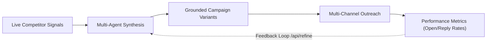

### Product change after each major phase (V2)

| Phase | Product changes | Users gain | AI improves | Demo improves |
|-------|-----------------|------------|-------------|---------------|
| 0–1B | Trustworthy foundation | Safer app | Stable config | Reliable live demo |
| 2 | Faster UI, recall | Snappier sessions | Cleaner shell | Less lag mid-stream |
| 3 | PDF + composer polish | Shareable briefs | Cleaner UX | Stakeholder handoff |
| 3Q | Quality gates | Fewer bad pivots | Entity grounding | Credible Notion/Lilian contrast |
| 3B | Explainability UX | Trust + clarity | Traceable claims | Judge “wow” |
| 4 | Async + planners | Long sweeps succeed | Adaptive cost | No timeout fails |
| 5 | Alerts + memory | Always-on intel | Learning loop | Retention story |
| 6–7 | Enterprise + KG | Org scale | Knowledge compound | Platform narrative |

---

## 4. Competitive Analysis

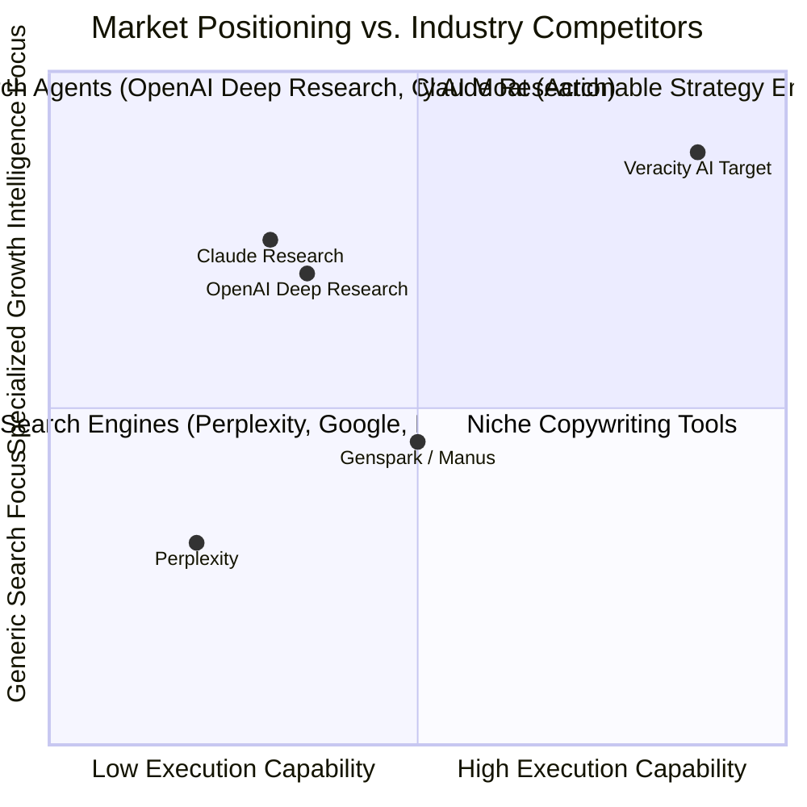

### Strategic Moat Drivers
1. **Intelligence-to-Execution Coupling** — research → grounded campaign variants.  
2. **Signal Quality Calibration** — `computeSignalQualityPenalty` + quality gate.  
3. **Continuous Campaign Refinement** — `/api/refine` + feedback tables.  
4. **Explainability (V2 target)** — claim↔source trail + orchestrator visibility.

---

## 5. Engineering Principles & Governance

1. **Zero Secret Fallbacks** — no plain-text default credentials.  
2. **Fail-Fast Boot Validation** — zod `lib/config.ts`.  
3. **Trunk-Based Development** — feature flags for unreleased surfaces.  
4. **ADRs** — `docs/adr/` for major design changes.  
5. **Checklist Discipline** — no merge without verification boxes.  
6. **Parallel Ownership** — FE / BE / AI / DB / DevOps / QA / UX lanes per phase.  
7. **Single Roadmap** — this document only; no parallel roadmaps.

### Authority map (anti-duplication)

| Content | Authoritative section | Other sections must |
|---------|----------------------|---------------------|
| Task checkboxes / progress | **§0** | Link task IDs only |
| Feature definitions (wow/specs) | **§15** | Status index only (§14) |
| Active execution detail | **§10** (Must-Have in flight) | Avoid re-copying acceptance text |
| Lane roadmaps (DevOps/Sec/UX…) | **§21–28** | One-line status + “see §0 / §15” |

### Ownership matrix (RACI)

| Workstream | Primary | Secondary | Consulted |
|------------|---------|-----------|-----------|
| Frontend / Board Mode / Orchestrator UI | FE Lead | UX | AI, QA |
| API routes / message metadata / flags | BE Lead | FE | DB, Security |
| Agents / prompts / quality gate | AI Lead | BE | FE, QA |
| Schema / pgvector / migrations | DB Lead | BE | DevOps |
| CI / preview / Inngest / Upstash | DevOps Lead | BE | All |
| Demo scripts / readiness | QA Lead | FE, UX | CPO |
| Product priority / §0C Now | CPO / TPM | CTO | All |

### Parallel development & merge-conflict rules

1. FE owns `components/**` and Board/Orchestrator UI.  
2. BE owns `app/api/**` and persistence/metadata contracts.  
3. AI owns `lib/agents/**` and synthesizer/quality prompts.  
4. DB owns `db/**` migrations (expand-contract only).  
5. No drive-by edits to `app/page.tsx` without TASK-2.1 owner.  
6. Competition surfaces ship behind flags (see §29).

### Branching & PR hygiene

- **Trunk:** `main` (protected when GitHub settings allow).  
- **Branches:** short-lived `feat/TASK-id-slug` or `fix/TASK-id-slug`.  
- **Merge:** squash preferred; CI green required.  
- **PR must include:** linked TASK id(s), test notes, §0 checkbox intent, UI screenshot if visual, feature-flag name if gated.

**Code review checklist**

- [ ] No secrets / no fallback credentials  
- [ ] Types sound; no unjustified `any`  
- [ ] Tests or quality script updated when behavior changes  
- [ ] No unused dead code left behind  
- [ ] ADR opened if architecture changed  
- [ ] §0 / §0C update planned in same or follow-up PR  

### Decision register (index)

| Date | Decision | Why | Revisit when |
|------|----------|-----|--------------|
| 2026-07 | Custom Gemini orchestrator (not LangGraph) | Fit + control | Scale requires different runtime |
| 2026-07 | Local JWT auth + Postgres | Simpler than live Supabase Auth | Enterprise SSO (Phase 6) |
| 2026-07-23 | Quality gate softens claims (not hard-block) | Demo honesty without empty UI | Evidence Trail ships |
| 2026-07-23 | Phase 3B before Inngest for competition | Judge-visible wow first | Sweeps hit timeouts in demos |
| — | Full Evidence Graph storage model | TBD | Phase 7 kickoff |

### Roadmap maintenance rules

1. §0 is the checklist source of truth.  
2. Never duplicate feature specs outside §15.  
3. Checkbox-only edits → patch version in Version history.  
4. New Must-Have → update §0 + §0C + §14 + §12 milestone.  
5. Do not create a second competing roadmap file; keep this document as the only execution plan.  

---

## 6. Architecture Review (Current · Next · Future)

### 6.1 Current (as implemented)

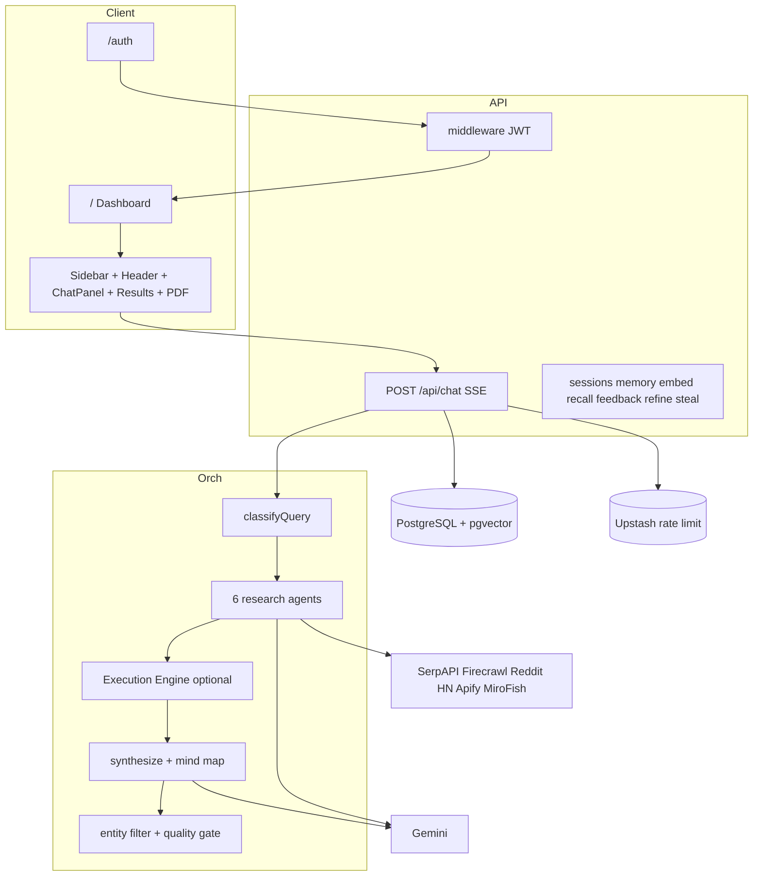

### 6.2 Next (Phase 3B–4)

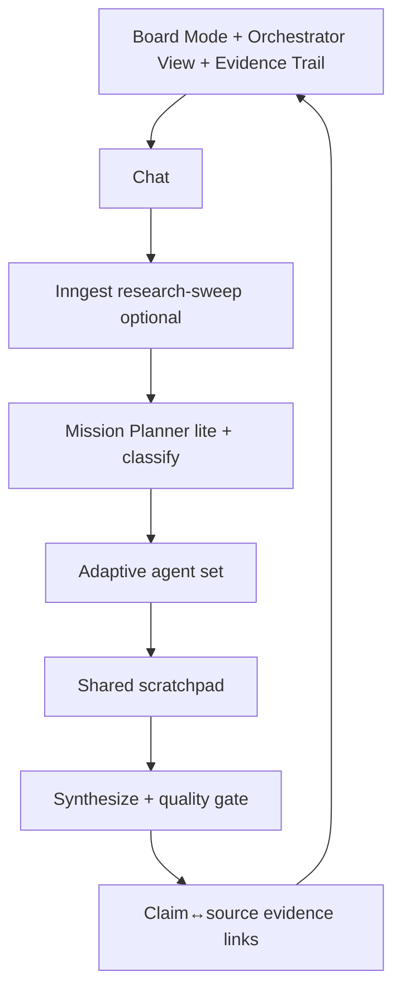

### 6.3 Future (Phase 5–7)

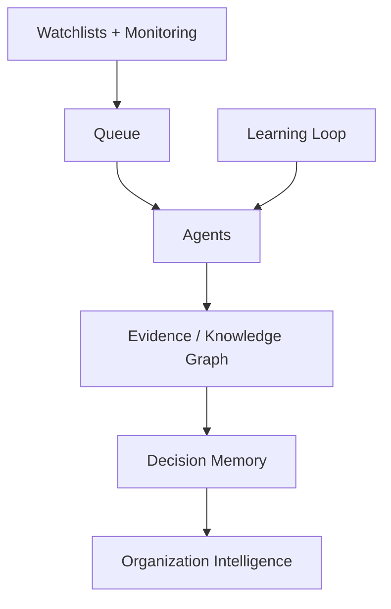

---

## 7. AI Architecture & Evolution

### 7.1 Current vs aspirational subsystem map

| Subsystem | Current | Next | Future |
|-----------|---------|------|--------|
| **Planning** | Classifier domains + intent | Mission Planner lite + DAG UI | Full Mission + Execution Planners |
| **Reasoning** | Synthesizer + mind map | Thinking Timeline + reasoning summary | Reasoning Graph |
| **Memory** | user_memory + pgvector recall | Cross-agent scratchpad | Decision Memory + KG |
| **Execution** | Execution Engine + grounding | Planner-gated Stage-2 | Multi-channel autonomous sequences |
| **Evidence** | Sources list + quality gate | Claim↔URL trail + trust tiers | Evidence Graph |
| **Monitoring** | Not implemented | Alerts cron | Continuous competitive monitoring |
| **Knowledge** | Message metadata | Competitor profiles | Knowledge Graph Explorer |
| **Learning** | Feedback + refine | Hardened metrics loop | Multi-sweep learning |

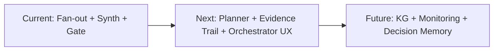

### 7.2 Subsystem implementation order (updated)
1. Adaptive Agent Selection UI + Orchestrator View — **Phase 3B**  
2. Evidence Trail / Claim↔Source — **Phase 3B**  
3. Mission / Execution Planners + Scratchpad — **Phase 4**  
4. Inngest queue — **Phase 4**  
5. Evidence / Knowledge Graph — **Phase 7**  
6. Continuous Monitoring — **Phase 5**  
7. Organization Intelligence — **Phase 6 / Optional Future**

---

## 8. Infrastructure Architecture

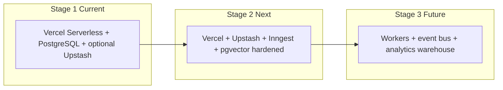

---

## 9. Phase-by-Phase Implementation Plan Overview

```mermaid
graph LR
    P0["0 Foundation ✅"] --> P1["1 Security ✅"]
    P1 --> P1B["1B DevEx ✅"]
    P1B --> P2["2 Architecture 🟡"]
    P2 --> P2B["2B Observability 🟡"]
    P2B --> P2C["2C Performance 🟡"]
    P2C --> P3["3 UX Features 🟡"]
    P3 --> P3Q["3Q Quality 🟡"]
    P3Q --> P3B["3B Competition UX ⬜"]
    P3B --> P4["4 AI + Queue ⬜"]
    P4 --> P5["5 Continuous ⬜"]
    P5 --> P6["6 Enterprise ⬜"]
    P6 --> P7["7 Knowledge ⬜"]
```

### Phase metadata template (apply to every active phase)

For each phase below and in §10, teams must fill/maintain:

| Field | Required |
|-------|----------|
| Purpose | Yes |
| Current Status | Yes |
| Business / Technical / Customer / Competition Value | Yes |
| Expected Outcome | Yes |
| Dependencies | Yes |
| Parallel Development Opportunities | Yes (FE·BE·AI·DB·DevOps·QA·UX) |
| Estimated Complexity | Yes |
| Verification Checklist | Yes (checkboxes) |
| Definition of Done | Yes |
| Exit Criteria | Yes |
| Success KPI | Yes |

---

## 10. Detailed Step-by-Step Task Specifications

> Completed Phase 0–1B task narratives from V1 are retained below with **Status: Done**. Open tasks updated to match codebase. New Phase 3B/3Q/4+ tasks added.

### Phase 0: Engineering Foundation & Governance

#### Task 0.1: Repository Governance & ADRs
- **Task ID**: `TASK-0.1` | **Priority**: P0 | **Status**: Done (2026-07-21) | **Owner**: Lead Architect
- **Purpose**: Establishes repository decision logs and coding standards.
- **Business Value**: High | **Technical Value**: High | **Customer Value**: Indirect trust | **Competition Value**: Low (invisible)
- **Expected Outcome**: ADR process live
- **Dependencies**: None | **Complexity**: Low | **Effort**: 1.0 Day
- **Parallel**: Docs only
- **Verification Checklist**:
  - [x] `docs/adr/` directory exists
  - [x] `docs/adr/template.md` exists
  - [x] `0001-governance-and-standards.md` published
  - [x] Markdown / formatting review complete
- **Definition of Done**: ADR 0001 published and committed to main.
- **Exit Criteria**: TASK-0.1 complete
- **Success KPI**: 100% of future major design choices recorded in ADRs.

#### Task 0.2: Centralized Environment Schema (`lib/config.ts`)
- **Task ID**: `TASK-0.2` | **Priority**: P0 | **Status**: Done (2026-07-21) | **Owner**: Lead Backend Engineer
- **Purpose**: Validates environment variables on boot using `zod`.
- **Business / Technical / Customer / Competition Value**: High / Critical / Reliability / Indirect
- **Expected Outcome**: Fail-fast boot
- **Dependencies**: TASK-0.1 | **Complexity**: Low
- **Verification Checklist**:
  - [x] `zod` is a direct dependency
  - [x] `lib/config.ts` created (fail-fast, no secret fallbacks)
  - [x] Critical consumers wired
  - [x] `.env.example` updated
  - [x] Missing key triggers exception
  - [x] `npm test` passes
- **Definition of Done**: App boots when `.env` valid; fails when invalid.
- **Exit Criteria**: TASK-0.1 + TASK-0.2 complete
- **Success KPI**: Zero runtime crashes from missing env vars.

---

### Phase 1: Security Hardening & Critical Fixes

#### Task 1.1: Security Hardening
- **Task ID**: `TASK-1.1` | **Priority**: P0 | **Status**: Done (2026-07-21)
- **Purpose**: Remove secret fallbacks, URL API keys, hardcoded VPS IPs.
- **Values**: Critical across business/security
- **Competition Value**: Low (invisible to judges; required for trust)
- **Verification Checklist**:
  - [x] Plaintext secret fallbacks removed
  - [x] Gemini key passed via header
  - [x] VPS IPs isolated in `.env`
  - [x] Security scan passes
- **Definition of Done**: 0 secrets in URLs/code
- **Success KPI**: 0 credential leaks in logs

#### Task 1.2: Sliding-Window API Rate Limiting
- **Task ID**: `TASK-1.2` | **Priority**: P0 | **Status**: Done (2026-07-21) — prod enforce when Upstash set
- **Purpose**: Prevent billing exhaustion
- **Verification Checklist**:
  - [x] Upstash rate limiter integrated
  - [x] HTTP 429 returned on limit overflow (when enabled)
  - [x] UI handles 429
  - [ ] Manual QA with live Upstash
- **Definition of Done**: Max 10 sweeps/hour/user when Redis configured
- **Success KPI**: Zero cost DoS incidents

---

### Phase 1B: DevEx & CI/CD

#### Task 1B.1: GitHub Actions + Husky
- **Task ID**: `TASK-1B.1` | **Priority**: P0 | **Status**: Done (2026-07-21) — branch protection manual open
- **Verification Checklist**:
  - [x] CI workflow on PR
  - [x] `husky` blocks invalid commits
  - [ ] Branch protection active
- **Definition of Done**: Automated CI gate active
- **Success KPI**: 0 broken builds merged to main

---

### Phase 2: Architecture & Component Refactoring

#### Task 2.1: Decompose `app/page.tsx`
- **Task ID**: `TASK-2.1` | **Priority**: P0 | **Status**: 🟡 In progress (extractions; shell still heavy)
- **Purpose**: Modular components/hooks; enable parallel FE work
- **Business Value**: High | **Technical Value**: Critical | **Customer Value**: Snappier UI | **Competition Value**: Medium (demo polish)
- **Expected Outcome**: `page.tsx` &lt;250 lines; agent picker live or deleted
- **Dependencies**: TASK-1B.1
- **Parallel**: FE · UX · QA
- **Complexity**: High | **Remaining Effort**: ~2–3 days
- **Verification Checklist**:
  - [x] Components split into `components/ui/`
  - [x] `useChatStream` hook functional
  - [ ] `page.tsx` &lt;250 lines
  - [ ] Agent toggles mounted or unused files removed
  - [ ] SSE streaming without state loss
- **Definition of Done**: Thin shell; state in hooks/subcomponents; picker resolved
- **Exit Criteria**: Checklist complete + regression pass
- **Success KPI**: Measurable reduction in re-renders during SSE

#### Task 2.2: Native pgvector
- **Task ID**: `TASK-2.2` | **Priority**: P1 | **Status**: 🟡 Code complete; benchmarks/QA open
- **Purpose**: Native vector search
- **Parallel**: DB · BE · QA
- **Verification Checklist**:
  - [x] `pgvector` + HNSW path in migrations/schema
  - [x] `/api/recall` uses `<=>`
  - [ ] Latency &lt;20ms benchmarked
  - [ ] Manual QA in chat UI
- **Definition of Done**: Indexed embeddings; measured latency target met
- **Success KPI**: Sub-20ms recall

---

### Phase 3: UX & High-Value Product Features

#### Task 3.1: Executive PDF Export
- **Task ID**: `TASK-3.1` | **Priority**: P0 | **Status**: 🟡 PDF Done; DOCX optional open
- **Purpose**: Branded executive PDF from sweeps
- **Business Value**: 🌟 Very High | **Competition Value**: High
- **Verification Checklist**:
  - [x] Export button active
  - [x] PDF contains summary, mind map, matrix, sources
  - [x] Links clickable
  - [ ] DOCX optional
- **Definition of Done**: Client PDF export live
- **Success KPI**: &gt;35% sweeps exported (when analytics wired)

#### Task 3.2 / 3.3
- **Status**: Done — unified composer; auth brand lockup (see §0 tracker)

---

### Phase 3Q: Output Quality Gates

#### Task 3Q.1: Anti-hallucination pipeline
- **Task ID**: `TASK-3Q.1` | **Priority**: Must Have | **Status**: 🟡 Mostly Done (2026-07-23)
- **Purpose**: Entity-matched sources + abstain rules + plain language
- **Competition Value**: High (credibility)
- **Verification Checklist**:
  - [x] `source-relevance` + `output-quality` modules
  - [x] Orchestrator wiring
  - [x] Placeholder competitor ban
  - [x] `npm run test:quality` passes
  - [x] Notion false-positive fixed
  - [ ] UI Evidence Strength Meter
- **Definition of Done**: Gate live + UI meter
- **Success KPI**: Ambiguous-entity runs abstain; known brands do not false-flag

---

### Phase 3B: Competition Explainability & Orchestration UX

#### Task 3B.1: Evidence Trail
- **Priority**: **Must Have** | **Status**: Planned | **Complexity**: Medium | **Effort**: 3.5–4d
- **Purpose**: Every recommendation claim links to sources
- **Why it matters / Competition Impact**: Judges ask “prove it” — this is the answer
- **Customer Value**: Trust | **Business Value**: Very High
- **Dependencies**: Phase 3Q | **Lanes**: AI · BE · FE · QA
- **Acceptance Checklist**:
  - [ ] Schema/metadata for claim→URLs
  - [ ] UI trail on Decision/Recs
  - [ ] PDF includes links
  - [ ] Tests for binding helpers

#### Task 3B.2: Confidence Breakdown + Evidence Strength Meter
- **Priority**: **Must Have** | **Effort**: 2d | **Lanes**: FE · AI
- **Acceptance Checklist**:
  - [ ] Breakdown components visible
  - [ ] Meter on Decision card
  - [ ] Matches quality gate score

#### Task 3B.3: Thinking Timeline + Live Orchestrator View
- **Priority**: **Must Have** | **Effort**: 4–5d | **Lanes**: FE · BE · UX
- **Acceptance Checklist**:
  - [ ] Logs rendered live
  - [ ] DAG updates on agent_update
  - [ ] Works in Board Mode

#### Task 3B.4–3B.8
See §0 Phase 3B checklists (Agent Graph, Trust badges, Board Mode, Strategy Canvas, Adaptive UI).

**Phase 3B Expected Outcome:** Competition demo shows *how* Veracity thinks, not only *what* it answers.  
**Exit Criteria:** TASK-3B.1 + 3B.2 + 3B.3 + 3B.6 Done; agent picker resolved.  
**Success KPI:** Judges can explain Veracity’s method after one demo without reading code.

---

### Phase 4: AI Systems Orchestration & Queue Scale

#### Task 4.1: Inngest Queue
- **Priority**: Must Have (scale) / Should Have (competition if demos stay &lt;90s)
- **Status**: Planned | **Complexity**: High | **Effort**: 5d
- **Parallel**: BE · DevOps · FE · QA
- **Verification Checklist**:
  - [ ] `/api/inngest` active
  - [ ] Sweeps &gt;120s without timeout
  - [ ] Progress streaming preserved
  - [ ] Feature-flag rollback works
- **Definition of Done**: Long sweeps async without HTTP 504
- **Success KPI**: Zero 504s on long sweeps

#### Task 4.2–4.4
Mission/Execution Planners, Adaptive cost selection, Research Replay / Scenario Comparison — see §0 Phase 4.

---

### Phase 5–7
Continuous Platform, Enterprise, Knowledge Platform — trackers in §0; detail in §18–§20. Not competition-blocking unless time remains.

---

## 11. System Dependency Graph

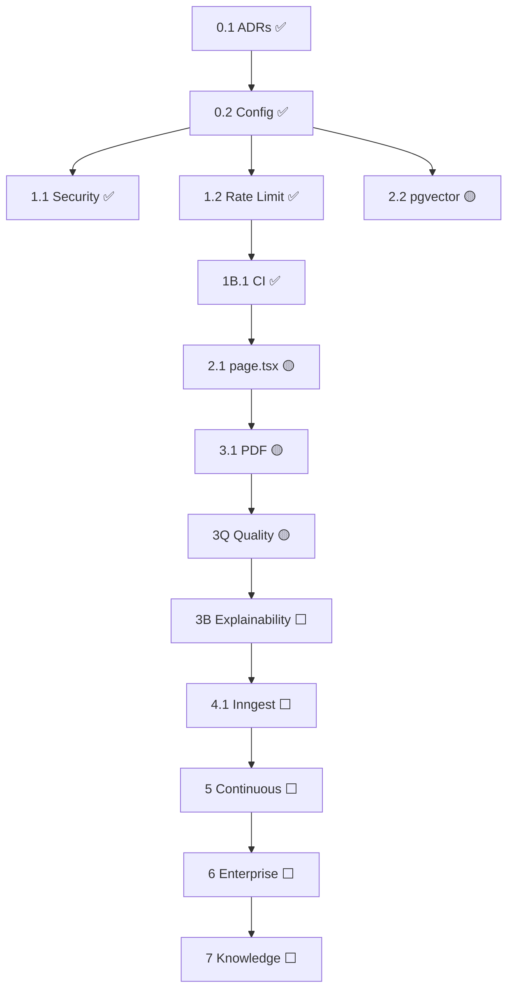

---

## 12. Gantt Timeline

### Release milestones

| Milestone | Meaning | Exit when |
|-----------|---------|-----------|
| **M1 Competition-Ready** | Judge-visible explainability | Phase 3B Must-Haves (3B.1–3B.3, 3B.6) + agent picker resolved |
| **M2 Async-Scale** | Long sweeps reliable | TASK-4.1 Done + `ff_async_sweep` validated |
| **M3 Continuous** | Always-on intel | Phase 5 alerts/watchlists MVP |
| **M4 Enterprise-Ready** | Multi-tenant trust | Phase 6 RBAC/SSO baseline |

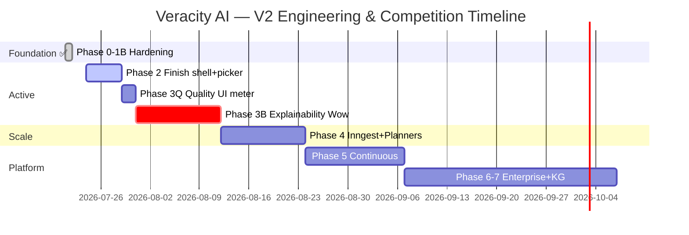

---

## 13. Technical Debt Backlog

**Process:** Each week pick ≥1 open High/Critical TD if any remain. Every TD row must link a TASK id or be marked `won't fix` with owner. Re-audit silent catches quarterly. Close TD-03 only after prod recall benchmark is `[x]` in TASK-2.2.

| ID | Item | Severity | Status |
|----|------|----------|--------|
| TD-01 | `page.tsx` still heavy post-extract | High | Open → TASK-2.1 |
| TD-02 | Empty/swallowing catch patterns in tools | Medium | Open (re-audit count) |
| TD-03 | In-memory JS cosine | — | **Mostly resolved** (native `<=>` path) — confirm prod migration → TASK-2.2 |
| TD-04 | Excess `any` types | Medium | Open |
| TD-05 | Naming: `generateHuggingFace*` vs Gemini | Low | Open |
| TD-06 | Unused packages / dead tools (`patents`, `linkedin-ads`, `url-discovery`) | Medium | Open |
| TD-07 | Agent UI components unmounted | High | Open → TASK-2.1 / 3B.8 |
| TD-08 | Rate limit fail-open without Upstash | Medium | Open (ops) |
| TD-09 | No claim↔URL evidence binding | High | Open → TASK-3B.1 |
| TD-10 | Dual auth naming (Supabase shims vs local JWT) | Medium | Open |
| TD-11 | Docs path drift (`docs/` vs workspace `doc/`) | Low | Keep git SoT in `docs/`; sync workspace copy when editing |
| TD-12 | Sync orchestration timeout risk | High | Open → TASK-4.1 |

---

## 14. Product Feature Backlog

> **Status index only.** Feature definitions and acceptance live in [§15](#15-competition-roadmap--wow-features). Progress checkboxes live in [§0](#0-phase-completion-tracker-living-checklist).

| Feature | Phase | Priority | Status |
|---------|-------|----------|--------|
| Executive PDF | 3 | Must Have | 🟡 Done (DOCX open) |
| Unified composer | 3 | Must Have | ✅ Done |
| Output quality gate | 3Q | Must Have | 🟡 Done (UI meter open) |
| Evidence Trail | 3B | Must Have | Planned |
| Live Orchestrator View | 3B | Must Have | Planned |
| Confidence Breakdown | 3B | Must Have | Planned |
| Executive Board Mode | 3B | Must Have | Planned |
| Source Trust Badges | 3B | Should Have | Planned |
| Adaptive Agent UI | 3B | Must Have | Planned |
| Strategy Canvas / Battlefield | 3B | Should Have | Planned |
| Inngest Queue | 4 | Must Have (scale) | Planned |
| Mission/Execution Planners | 4 | Should Have | Planned |
| Research Replay / What-If | 4 | Nice to Have | Planned |
| Weekly Alerts / Watchlists | 5 | Should Have | Planned |
| Decision Memory | 5 | Should Have | Planned |
| Evidence/Knowledge Graph | 7 | Future Vision | Planned |
| SWOT Matrix Viewport | 3B/3 | Nice to Have | Planned |

---

## 15. Competition Roadmap & Wow Features

### Purpose of this section
Define what turns Veracity from a strong engineering project into a **memorable competition-winning product** — without gimmicks. Every feature must improve at least one of: Decision Intelligence · Explainability · Executive Experience · Research Transparency · AI Collaboration · Strategic Analysis.

### Priority legend
- **Must Have** — competition critical  
- **Should Have** — high impact if time  
- **Nice to Have** — polish  
- **Future Vision** — post-competition / platform  

### Wow feature catalog

| Feature | Purpose | Why it matters | Business | Competition | Customer | Complexity | Deps | Phase | Priority | Effort | Acceptance |
|---------|---------|----------------|----------|-------------|----------|------------|------|-------|----------|--------|------------|
| **Mission Planner** | Decompose goals into research steps | Shows deliberate AI planning | High | High | High | High | Classifier | 4 (lite 3B) | Should / Must-lite | 5d / 2d lite | Steps visible before fan-out |
| **Execution Planner** | Gate Stage-2 assets | Clear research vs action | High | Medium | High | Med | Intent detect | 4 | Should | 3d | Execution only when asked |
| **Interactive AI Thinking Timeline** | Streamed reasoning log UI | Transparency | Med | **Must** | High | Med | SSE logs | 3B | Must | 3d | Live timeline during run |
| **Live Orchestrator View** | DAG of agents | Collaboration visible | Med | **Must** | High | Med | agent_update | 3B | Must | 4d | DAG updates live |
| **Agent Collaboration Graph** | Who shares what context | Multi-agent story | Med | Should | Med | Med | Orchestrator | 3B | Should | 3d | Graph matches run |
| **Evidence Graph** | Fact↔source network | Trust at scale | Very High | Should→Future | Very High | High | Trail schema | 7 | Future / Should seed | 10d | Graph queryable |
| **Claim-to-Source Traceability** | Bind claims to URLs | “Prove it” | Very High | **Must** | Very High | Med | 3Q | 3B | Must | 4d | Every top rec linked |
| **Confidence Breakdown** | Show score parts | Calibrated trust | High | **Must** | High | Low | Quality gate | 3B | Must | 2d | Breakdown matches gate |
| **Reasoning Graph** | Visual synthesis logic | Advanced explainability | Med | Nice | Med | High | Synth | 4–7 | Nice | 6d | Optional panel |
| **Decision Tree** | Branching options | Strategic clarity | Med | Nice | Med | Med | Recs | 3B–4 | Nice | 3d | Tree from recs |
| **Strategy Canvas** | One-screen strategy | Executive clarity | High | Should | High | Med | Mind map | 3B | Should | 3d | Canvas in Board Mode |
| **Competitive Battlefield** | Interactive matrix | Memorable visual | High | Should | High | Med | Matrix | 3B | Should | 3d | Hover→evidence |
| **Opportunity Heatmap** | Adjacent threats viz | Adjacent agent value | Med | Nice | Med | Med | Adjacent | 3B–5 | Nice | 2d | Heatmap renders |
| **Executive Board Mode** | Full-screen brief | Stakeholder demo | Very High | **Must** | Very High | Med | Results | 3B | Must | 3d | 5-min demo stays here |
| **Research Replay** | Replay past sweep | Auditability | Med | Nice | High | Med | Logs store | 4 | Nice | 4d | Replay matches history |
| **Scenario Comparison** | Side-by-side runs | Decision support | High | Should | High | High | Sessions | 4 | Should | 5d | Compare 2 runs |
| **What-If Simulator** | Perturb assumptions | Strategy depth | High | Nice | High | High | Planners | 4–7 | Nice | 8d | Flagged experimental |
| **Recommendation Explainability** | Why this rec | Trust | High | **Must** | High | Med | Trail | 3B | Must | incl. 3B.1 | Expandable why |
| **Evidence Strength Meter** | Visual gate score | Credibility | High | **Must** | High | Low | 3Q | 3B | Must | 1d | Meter on Decision |
| **Source Trust Score** | Tier badges | Source quality | High | Should | High | Low | validator | 3B | Should | 1d | Badges on sources |
| **Research Scratchpad** | Shared agent state | True multi-agent | High | Should | Med | High | Orch | 4 | Should | 5d | Agents read/write scratch |
| **Cross-Agent Memory** | Persistent agent mem | Continuity | Med | Future | Med | High | Memory | 7 | Future | 8d | Scoped memory API |
| **Mission DAG Visualization** | Planner UI | Planning wow | Med | Should | Med | Med | Planner | 3B–4 | Should | 3d | DAG from mission |
| **Research Pipeline Visualization** | Pipeline stages UI | Clarity | Med | Should | Med | Low | Existing props | 2C–3B | Should | 2d | Stages render |
| **Knowledge Graph Explorer** | Browse KG | Platform story | High | Future | High | High | Phase 7 | 7 | Future | 12d | Explore entities |
| **Organization Intelligence Dashboard** | Org-level intel | SaaS expansion | High | Future | High | High | Phase 6 | 6 / Optional | Future | 15d | Multi-workspace |
| **Strategic Watchlists** | Track competitors | Retention | Very High | Should | Very High | Med | Phase 5 | 5 | Should | 7d | Alerts fire |
| **Market Monitoring** | Continuous scans | Moat | Very High | Future | Very High | High | Queue | 5 | Future | 10d | Cron sweeps |
| **Competitive Timeline** | History of moves | Narrative | High | Nice | High | Med | Profiles | 5–7 | Nice | 5d | Timeline UI |
| **Presentation Mode** | Presenter keys | Demo polish | High | Should | High | Low | Board Mode | 3B | Should | 1d | Keyboard nav |
| **Executive Presentation Generator** | Auto deck | Shareability | High | Nice | High | Med | PDF | 3–4 | Nice | 4d | Export slides/PDF |
| **Decision Memory** | Store decisions | Learning | High | Should | High | Med | DB | 5 | Should | 5d | Decisions recallable |

---

## 16. Competition Winning Strategy

### What judges usually evaluate
1. Clear problem + differentiated solution  
2. Working multi-agent system with tools (not a single prompt)  
3. Live data + transparency  
4. Polished UX and demo narrative  
5. Learning / feedback loop  
6. Engineering excellence (without needing to see infra)

### How Veracity should demonstrate strengths
- Start in **Executive Board Mode** with a crisp Notion vs Linear (or category) query  
- Show **Live Orchestrator View** while agents run  
- Land on **Decision + Evidence Trail + Confidence Breakdown**  
- Open matrix / strategy canvas with source clicks  
- Export **PDF**  
- Optional: thumbs → refine, or Steal strategy tab  

### Highlight now (already implemented)
Multi-agent fan-out · SSE progress · Artifacts · Mind map · PDF · Quality gate · Feedback/refine · Memory/recall · Steal strategy · Usage metrics  

### Biggest wow to build next (Phase 3B)
Evidence Trail · Orchestrator View · Thinking Timeline · Board Mode · Confidence/Evidence meters · Agent picker  

### Invisible engineering (lower competition priority unless blocking)
Inngest internals · Sentry · branch protection · pgvector benchmarks · package cleanup — do them for production, but don’t spend demo week here if Phase 3B is incomplete.

---

## 17. Demo Roadmap

### 5-minute Demo
1. Auth → Board Mode  
2. Run prepared query  
3. Orchestrator View (or progress grid)  
4. Decision + 2 recs + Evidence Trail  
5. Matrix highlight + Export PDF  

### 10-minute Demo
5-min script + Strategy Canvas + follow-up question + feedback thumbs + API usage cost strip + Steal strategy 60s  

### Offline Demo
- Recorded Board Mode walkthrough + pre-generated PDF  
- Screenshots of Orchestrator View / Evidence Trail  
- Local seed session in DB if network tools unavailable  

### Backup Demo
- Cached session replay (Research Replay when built; until then load prior session from sidebar)  
- Static PDF + architecture mermaid from this doc  

### Failure Recovery
- If tools fail: show graceful degradation + quality abstain honesty  
- If timeout: shorter agent set via picker / targeted follow-up  
- If auth fails: pre-authed demo account  

### Readiness checklists

**Demo readiness**
- [ ] Auth works on demo machine  
- [ ] One golden query rehearsed (&lt;90s preferred)  
- [ ] PDF export works offline-capable after run  
- [ ] Failure Recovery path rehearsed  

**Competition readiness (M1)**
- [ ] TASK-3B.1 Evidence Trail usable  
- [ ] TASK-3B.3 Orchestrator or Timeline visible  
- [ ] TASK-3B.6 Board Mode usable **or** clean Intelligence layout fallback  
- [ ] Confidence / Evidence meter visible (3B.2 or 3Q UI)  
- [ ] Agent picker resolved (mounted or removed)  
- [ ] Judges can restate method after one run  

**Production readiness**
- [ ] `UPSTASH_*` set; rate limit enforced  
- [ ] Branch protection on `main`  
- [ ] No P0 security debt open  
- [ ] pgvector migration applied on prod DB  
- [ ] Rollback path verified (§33)  

**Technical readiness**
- [ ] `npm test` + `npm run test:quality` green  
- [ ] `npm run typecheck` + lint green  
- [ ] Correlation logs on `/api/chat`  
- [ ] Feature flags documented for any gated 3B UI  

---

## 18. Knowledge Platform Roadmap

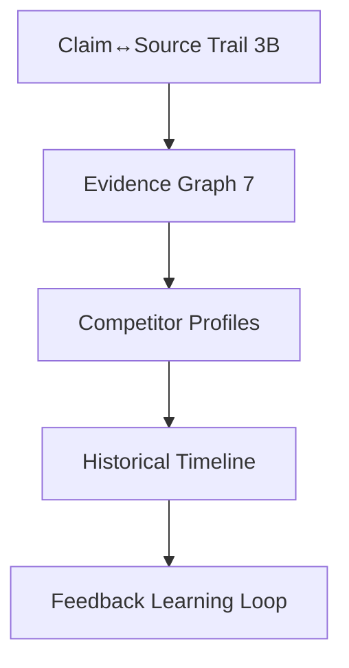

- [ ] Seed trail schema in 3B  
- [ ] Full Evidence Graph in Phase 7  
- [ ] Competitor profiles + timeline  
- [ ] Knowledge Graph Explorer UI  

---

## 19. Enterprise Roadmap

- **Phase 1 ✅**: Rate limiting, header security, config fail-fast  
- **Phase 5**: Audit logs  
- **Phase 6**: Multi-tenant RLS, RBAC, SAML  

---

## 20. Optional Future Platform

> **Not competition requirements.** Build only after Must/Should competition items.

- [ ] Enterprise RBAC / SAML (also Phase 6)  
- [ ] Organization Intelligence Dashboard  
- [ ] Agent Marketplace  
- [ ] Autonomous Monitoring agents  
- [ ] Voice Analyst  
- [ ] Browser Automation agent  
- [ ] Local LLM Support  
- [ ] Enterprise Connectors (CRM/Slack)  
- [ ] Full Strategic Simulation environment  

---

## 21. DevOps Roadmap

> Status tracker — details in §0 / §1B / §4.1 / §29.

- [x] GitHub Actions CI (`lint`, `tsc`, `test`)  
- [x] Husky pre-commit  
- [ ] Branch protection  
- [ ] Inngest workers (Phase 4)  
- [ ] Preview env discipline  

---

## 22. Security Roadmap

> Status tracker — details in §0 Phase 1 / §5.

- [x] Fail-fast config, header API keys, IP isolation  
- [x] Sliding-window rate limit (enforce with Upstash)  
- [ ] Prompt-injection hardening review  
- [ ] Local Postgres RLS parity with Supabase migrations  
- [ ] Secrets scanning in CI  

---

## 23. Observability Roadmap

> Status tracker — details in §0 Phase 2B.

- [x] Structured logger + correlation IDs  
- [x] Gemini usage metadata  
- [ ] Wire tool latency helpers everywhere  
- [ ] Sentry (optional DSN)  
- [ ] PostHog product analytics  

---

## 24. Performance Roadmap

> Status tracker — details in §0 Phase 2 / 2C / 4.

- [x] Dynamic imports + skeletons  
- [ ] Finish `page.tsx` split  
- [ ] pgvector latency SLA verification  
- [ ] Inngest for long sweeps  

---

## 25. UX Roadmap

> Status tracker — definitions in §15; checkboxes in §0 Phase 3/3B.

- [x] PDF export · unified composer · results priority layout · theme/brand  
- [ ] Board Mode · Orchestrator View · Evidence Trail · Trust badges  
- [ ] Presentation keyboard mode  

---

## 26. Product Analytics Roadmap

- [x] Local analytics stub  
- [ ] PostHog: query activation, export rate, refine rate, latency  

---

## 27. Reliability Engineering Roadmap

- **SLO**: 99.5% successful sweep completion  
- **SLI**: 200/206 without unhandled exceptions or 504  
- **Error budget**: 0.5% / 30 days  

---

## 28. Cost Optimization Roadmap

- Adaptive agent selection (Phase 3B UI + Phase 4 policy)  
- Deprecate idle remote VPS dependency; prefer env-configured MiroFish  
- Cache hit rate monitoring on `signal_cache`  

---

## 29. Release Strategy

1. **Feature Flagging**: Gate Phase 3B/4 surfaces — `ff_board_mode`, `ff_orchestrator_view`, `ff_evidence_trail`, `ff_async_sweep` (env or config; default off until demo-ready).  
2. **Staging Deployments**: Preview environments for QA testing.  
3. **Database Migrations**: Backward-compatible expand-contract DDL scripts.  
4. **PR gate**: CI + §5 review checklist before merge to `main`.  

---

## 30. Testing Strategy

| Level | Target | Tooling |
|-------|--------|---------|
| Unit | Core logic + quality gate | Vitest |
| Quality script | `npm run test:quality` | tsx script |
| API | Critical routes | Vitest / fetch |
| E2E | Chat → Export | Playwright (planned) |

---

## 31. Verification Checklists

Every task release:
- [ ] Feature works as specified  
- [ ] Automated tests pass  
- [ ] `eslint` + `tsc --noEmit` pass  
- [ ] Security expectations verified  
- [ ] Telemetry/correlation where applicable  
- [ ] Rollback plan noted  

---

## 32. Deployment Strategy

1. Apply DB migrations  
2. Deploy API/app to preview  
3. Run automated checks  
4. Promote to production  

---

## 33. Rollback Strategy

1. Instant platform rollback to prior deployment  
2. Feature-flag off Phase 3B/4 surfaces if error rate &gt;1%  

---

## 34. Definition of Ready

A task is Ready when:
- Scope unambiguous  
- Dependencies merged  
- Checklist + tests defined  
- Lane Primary assigned (§5 ownership matrix)  
- **Task-level acceptance checkboxes** exist in §0 (authoritative)

---

## 35. Definition of Done

A task is Done when:
- Implementation complete  
- Tests + lint/typecheck green  
- Checklist `[x]` in **§0**  
- Merged via CI  
- §0C Now/Next updated if the task was in flight

---

## 36. Phase Exit Criteria

- 100% phase Must-Have tasks Done  
- No open P0/P1 security or demo-blocking bugs  
- Leadership Board sign-off  
- For competition phases: §17 Competition readiness checklist complete

---

## 37. Success KPIs

| KPI | Target | How measured |
|-----|--------|--------------|
| Security | 0 plaintext credentials exposed | Source scan + config tests |
| Performance | Vector recall &lt;20ms | TASK-2.2 benchmark on target DB |
| Reliability | 0 HTTP 504 on async sweeps | Inngest/job metrics when 4.1 live |
| Engagement | &gt;35% sweeps exported | Analytics when PostHog wired; until then manual sample |
| Quality | Known-brand false-flag ≈0; ambiguous abstains | `npm run test:quality` + spot UI runs |
| Competition | Judges restate method after one Board Mode demo | §17 Competition readiness dry-run |

---

## 38. Risks and Trade-offs

| Risk | Impact | Likelihood | Mitigation | Owner | Linked |
|------|--------|------------|------------|-------|--------|
| Sync sweep hits serverless timeout | High | Med | Shorter agent set; then TASK-4.1 / `ff_async_sweep` | BE / DevOps | TD-12 |
| Hallucinated pivots / bad entities | High | Med | Quality gate + TASK-3B.1 Evidence Trail | AI | 3Q / 3B.1 |
| Rate limit fail-open (no Upstash) | Med | High in dev | Set `UPSTASH_*` in prod | DevOps | TASK-1.2 |
| Tool/API cost spike | High | Med | Adaptive agents (3B.8 / 4.3) | AI / CPO | 4.3 |
| Demo depends on SerpAPI/Gemini uptime | High | Low–Med | Offline/backup demo (§17) | QA | §17 |
| `page.tsx` merge conflicts | Med | Med | TASK-2.1 owner; conflict rules §5 | FE | TASK-2.1 |
| 3B slips → weak competition story | High | Med | Protect §0C Next; defer Inngest | CPO / CTO | M1 |

**Trade-offs:** Serverless vs Inngest complexity; explainability UI before queue for competition; pgvector in-Postgres vs separate vector DB; fail-open rate limit vs local DX.

---

## 39. Features to Remove

1. **❌ Hardcoded remote MiroFish VPS IPs** — env-only (done in Phase 1)  
2. **❌ Fake quantitative certainty without evidence** — quality gate + abstain  
3. **❌ Duplicate follow-up composer** — removed  
4. **Evaluate**: unused agent UI files — mount or delete (Phase 2)  
5. **Evaluate**: dead tool modules — wire or remove  

---

## 40. Features to Postpone

1. Multi-tenant RBAC / SAML — Phase 6 / Optional  
2. Public REST API — Phase 7  
3. Full Knowledge Graph Explorer — Phase 7  
4. Voice / browser automation / local LLM — Optional Future  

---

## 41. Future Research Topics

1. Local SLM synthesis for cost control  
2. Vision-based scraping when HTML scrapers fail  
3. Calibrated confidence vs human-rated accuracy datasets  

### Open architectural questions (deferred)

| Question | Status | Decide by |
|----------|--------|-----------|
| Inngest vs alternate queue | Deferred | Phase 4 kickoff |
| Retain MiroFish Live VPS path? | Deferred | After competition |
| Evidence Graph storage model | Deferred | Phase 7 |
| Env flags vs LaunchDarkly-class service | Deferred | Multi-env SaaS |

---

## 42. CTO Final Recommendations (V2)

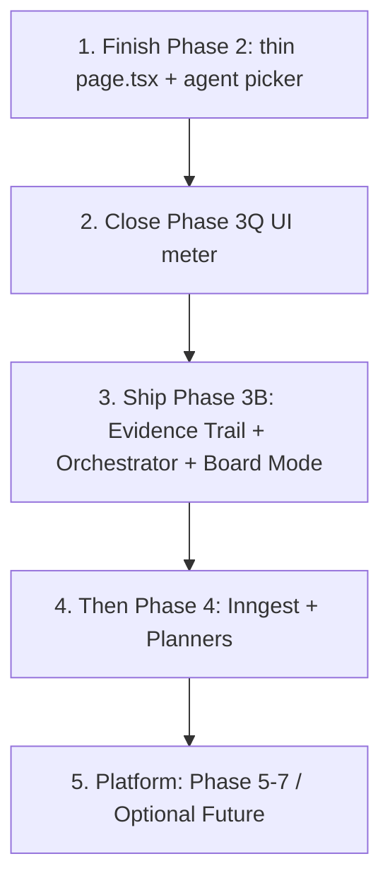

1. **Do not reopen completed Phase 0–1B checklists** — only finish remaining manual items (branch protection, Upstash QA).  
2. **Competition path = Phase 3B Must-Haves** after finishing shell/picker.  
3. **Production scale path = Phase 4 queue** — critical for SaaS, secondary for a short live demo if sweeps stay under timeout.  
4. **Keep this file as the only roadmap**; update checkboxes as code lands.  
5. **V1 backup retained** at `doc/phase_by_phase_improvement_plan.v1.backup.md`.

---

> **Status:** Version **2.0.1** living Product Engineering & Competition Master Plan.  
> Start of day: [§0C Current Focus](#0c-current-focus-now--next--later).  
> Track checkboxes in [§0 Phase Completion Tracker](#0-phase-completion-tracker-living-checklist).  
> Feature specs in [§15](#15-competition-roadmap--wow-features).  
> Mark verification boxes only when work exists in `/Users/oneionei/MyProjects/Veracity/Veracity`.
