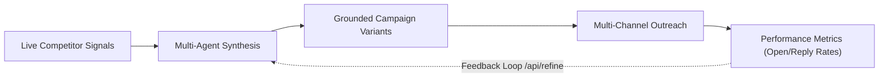
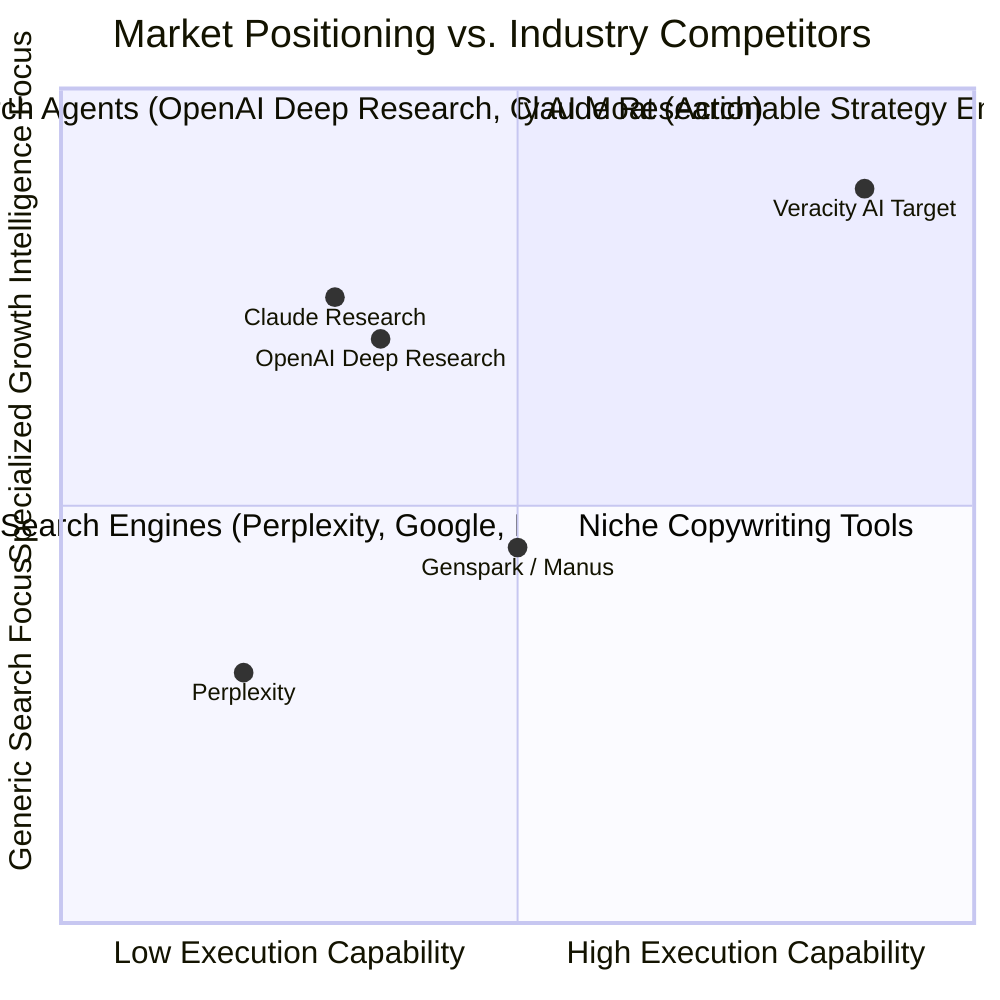
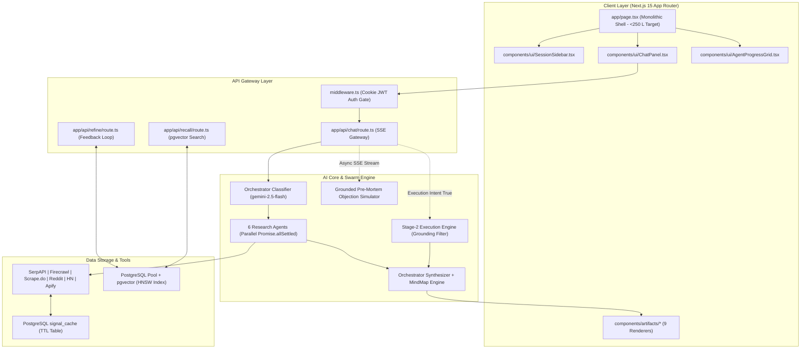
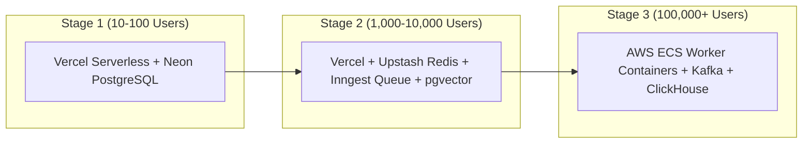
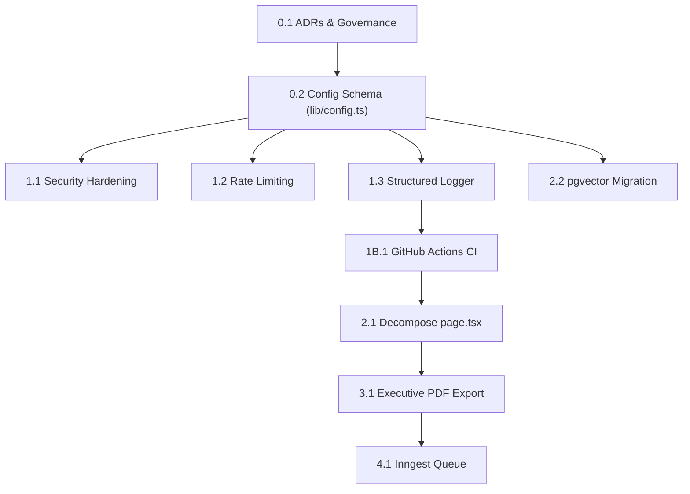
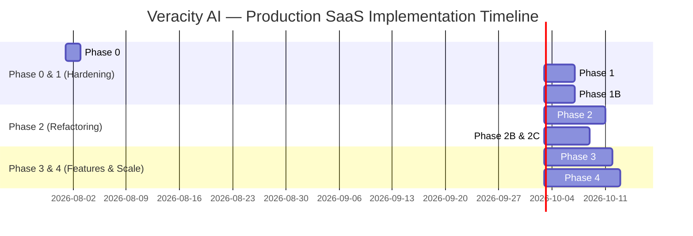
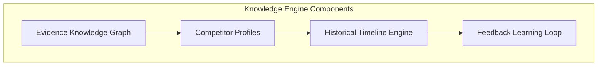
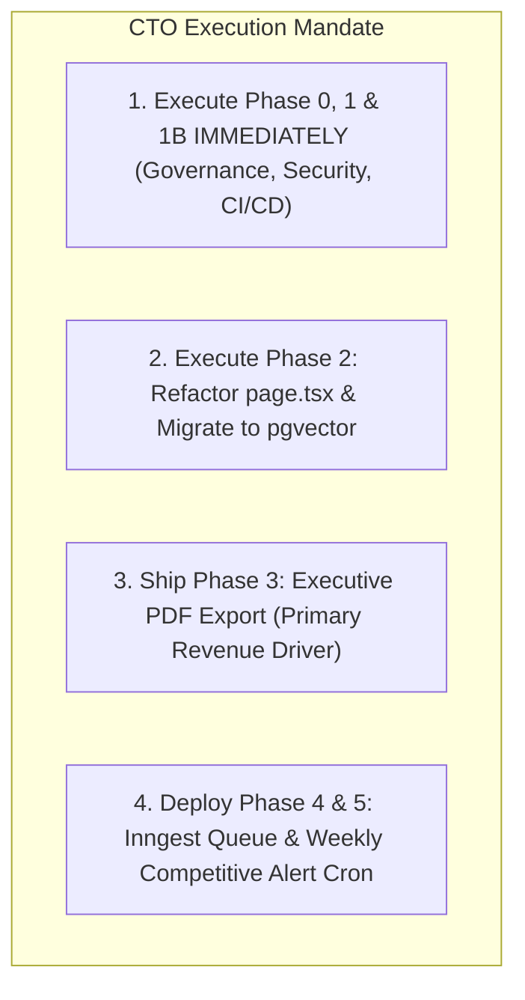

# Veracity AI — Definitive Implementation & Verification Master Plan

> **For developers:** This is the living execution checklist. Product thesis lives in [`../plan.md`](../plan.md). Setup lives in [`../README.md`](../README.md).

> **Authoritative Reviewing Body:** Engineering Leadership Board
> *(CTO, Chief AI Architect, Principal Software/Security/DevOps/Cloud/Database Engineers, Staff Frontend/Backend/AI/UX/SRE Engineers, Technical Program Manager, Product Manager)*
> **Date:** 2026-07-21
> **Document Status:** Production-Ready Execution Blueprint & Quality Verification Contract
> **Target Scope:** Veracity application codebase (this repository)
> **Policy:** Keep checkboxes in sync when work ships

---

## Table of Contents

0. [Phase Completion Tracker (Living Checklist)](#0-phase-completion-tracker-living-checklist)
1. [Executive Summary](#1-executive-summary)
2. [Product Vision](#2-product-vision)
3. [Product Strategy](#3-product-strategy)
4. [Competitive Analysis](#4-competitive-analysis)
5. [Engineering Principles & Governance](#5-engineering-principles--governance)
6. [Architecture Review](#6-architecture-review)
7. [AI Architecture](#7-ai-architecture)
8. [Infrastructure Architecture](#8-infrastructure-architecture)
9. [Phase-by-Phase Implementation Plan Overview](#9-phase-by-phase-implementation-plan-overview)
10. [Detailed Step-by-Step Task Specifications](#10-detailed-step-by-step-task-specifications)
11. [System Dependency Graph](#11-system-dependency-graph)
12. [Gantt Timeline](#12-gantt-timeline)
13. [Technical Debt Backlog](#13-technical-debt-backlog)
14. [Product Feature Backlog](#14-product-feature-backlog)
15. [AI Evolution Roadmap](#15-ai-evolution-roadmap)
16. [Knowledge Platform Roadmap](#16-knowledge-platform-roadmap)
17. [Enterprise Roadmap](#17-enterprise-roadmap)
18. [DevOps Roadmap](#18-devops-roadmap)
19. [Security Roadmap](#19-security-roadmap)
20. [Observability Roadmap](#20-observability-roadmap)
21. [Performance Roadmap](#21-performance-roadmap)
22. [UX Roadmap](#22-ux-roadmap)
23. [Product Analytics Roadmap](#23-product-analytics-roadmap)
24. [Reliability Engineering Roadmap](#24-reliability-engineering-roadmap)
25. [Cost Optimization Roadmap](#25-cost-optimization-roadmap)
26. [Release Strategy](#26-release-strategy)
27. [Testing Strategy](#27-testing-strategy)
28. [Verification Checklists](#28-verification-checklists)
29. [Deployment Strategy](#29-deployment-strategy)
30. [Rollback Strategy](#30-rollback-strategy)
31. [Definition of Ready](#31-definition-of-ready)
32. [Definition of Done](#32-definition-of-done)
33. [Phase Exit Criteria](#33-phase-exit-criteria)
34. [Success KPIs](#34-success-kpis)
35. [Risks and Trade-offs](#35-risks-and-trade-offs)
36. [Features to Remove](#36-features-to-remove)
37. [Features to Postpone](#37-features-to-postpone)
38. [Future Research Topics](#38-future-research-topics)
39. [CTO Final Recommendations](#39-cto-final-recommendations)

---

## 0. Phase Completion Tracker (Living Checklist)

> **How to use:** Mark `[x]` only when the step is complete in the codebase. Unfinished work stays `[ ]`. This is the single source of truth for execution progress (no separate checklist files). Task narrative, workflows, and specs in later sections are unchanged — update checkboxes here and under each task’s **Verification Checklist** as work lands.

### Progress summary

| Phase | Name | Status |
|-------|------|--------|
| Phase 0 | Engineering Foundation & Governance | ✅ Complete (2026-07-21) |
| Phase 1 | Security Hardening & Critical Fixes | ✅ Complete (2026-07-21) |
| Phase 1B | Developer Experience (DevEx) & CI/CD | ✅ Complete (2026-07-21) |
| Phase 2 | Architecture & Component Refactoring | 🟡 In progress |
| Phase 2B | Observability | 🟡 In progress |
| Phase 2C | Performance | 🟡 In progress |
| Phase 3 | UX & High-Value Product Features | 🟡 In progress |
| Phase 4 | AI Systems Orchestration & Queue Scale | ⬜ Not started |
| Phase 5 | Continuous Platform | ⬜ Not started |
| Phase 6 | Enterprise | ⬜ Not started |
| Phase 7 | Knowledge Platform | ⬜ Not started |

---

### Phase 0 — Engineering Foundation & Governance

#### TASK-0.1 — Repository Governance & ADRs
- [x] Create `docs/adr/` directory structure
- [x] Add `docs/adr/template.md`
- [x] Publish `docs/adr/0001-governance-and-standards.md`
- [x] Review ADR formatting / governance standards recorded
- [x] Phase completion tracker maintained in this document

#### TASK-0.2 — Centralized Environment Schema (`lib/config.ts`)
- [x] Ensure `zod` is a direct dependency
- [x] Create `lib/config.ts` with fail-fast Zod schema (no secret fallbacks)
- [x] Wire critical consumers (`auth-session`, `db`, `gemini`, `usage-info`)
- [x] Update `.env.example` to match required/optional schema
- [x] Unit tests: missing keys throw `ConfigError`
- [x] `npm test` passes
- [x] Phase 0 exit: TASK-0.1 + TASK-0.2 complete

**Phase 0 exit:** ✅ Complete — 2026-07-21

---

### Phase 1 — Security Hardening & Critical Fixes

#### TASK-1.1 — Security Hardening (JWT Secret, Key Headers, VPS Removal)
- [x] Remove remaining plaintext secret fallbacks (if any)
- [x] Pass Gemini API key via `x-goog-api-key` header (no `?key=` in URL)
- [x] Remove hardcoded VPS IPs (`168.144.36.78`) — env-only
- [x] Unit/integration coverage for auth secret rejection + header auth
- [x] Manual QA: confirm no API key in request URLs *(covered by unit tests asserting URL builders)*
- [x] Security scan passes *(source scan: no hardcoded secret fallback / VPS IP / `?key=` in app code)*

#### TASK-1.2 — Sliding-Window API Rate Limiting
- [x] Provision Upstash Redis + add env keys to `lib/config.ts` *(keys optional; set `UPSTASH_*` in prod to enforce)*
- [x] Install `@upstash/ratelimit`; guard `/api/chat` and `/api/refine`
- [x] Frontend handles HTTP 429
- [x] Tests: overflow returns 429 *(response builder + fail-open without Redis)*
- [ ] Manual QA: rate-limit warning in UI *(requires Upstash credentials in a running env)*

**Phase 1 exit:** ✅ Complete (code) — 2026-07-21 — set `UPSTASH_REDIS_REST_URL` + `UPSTASH_REDIS_REST_TOKEN` in production to enforce limits

---

### Phase 1B — Developer Experience (DevEx) & CI/CD

#### TASK-1B.1 — GitHub Actions CI & Pre-Commit Hooks
- [x] Add `.github/workflows/ci.yml` (`lint`, `tsc --noEmit`, `npm test`)
- [x] Configure `husky` + `lint-staged`
- [ ] Enable branch protection on main *(manual in GitHub Settings → Branches)*
- [x] Verify CI fails on lint/type errors *(local gates pass: lint 0 errors, typecheck, 116 tests)*
- [ ] Draft PR smoke-test of workflow *(after push to GitHub)*

**Phase 1B exit:** ✅ Complete (local) — 2026-07-21 — enable GitHub branch protection + push to verify Actions

---

### Phase 2 — Architecture & Component Refactoring

#### TASK-2.1 — Decompose monolithic `app/page.tsx`
- [x] Extract shared types (`types/chat-ui.ts`) + domain meta (`lib/domain-meta.tsx`)
- [x] Extract leaf UI: `ConfidenceBadge`, `SidebarAgentRow`, `AgentCard` + `lib/chat-client.ts`
- [x] Extract `SessionSidebar` + `lib/agent-progress.ts` helpers
- [x] Extract `useChatStream` SSE hook
- [x] Extract `ChatPanel`, `AgentProgressGrid`, `MemoryDrawer`
- [x] Extract `DashboardHeader`, `ExpandedDomainPanel`, `IntelligenceResults`
- [ ] Reduce `page.tsx` to &lt;250 lines *(currently ~932, down from ~2271; remaining weight is send/follow-up/session handlers)*
- [ ] Regression: SSE streaming, tabs, sessions without state loss
- [ ] Profile re-renders during active stream

#### TASK-2.2 — Native PostgreSQL `pgvector` migration
- [x] Migration: ensure `vector` extension + HNSW index (`db/migrations/0002_pgvector.sql`, `supabase/migrations/005_pgvector_hnsw.sql`)
- [x] Rewrite `/api/recall` to use native `<=>` (remove JS cosine sort)
- [x] Update `/api/embed` + `db/schema.sql` to store `vector(768)`
- [ ] Benchmark: recall query latency &lt;20ms *(run after applying migration on local/prod DB)*
- [ ] Manual QA: semantic recall in chat UI

**Phase 2 exit:** ⬜ Not complete — UI modules extracted; `page.tsx` still hosts send/follow-up/session state machine

---

### Phase 2B — Observability *(roadmap)*
- [x] Structured JSON logger with correlation IDs (`lib/logger.ts`)
- [x] Gemini token / dollar cost tracking via `usageMetadata` (`lib/gemini-usage.ts`, wired in `lib/agents/gemini.ts`)
- [x] Exception + tool latency helpers (`captureException`, `withToolLatency`) — Sentry SDK optional later via DSN
- [x] `/api/chat` emits correlation id header + structured start/complete logs

**Phase 2B exit:** 🟡 Partial — core logger + Gemini usage live; full Sentry SDK not required yet

---

### Phase 2C — Performance / UX polish *(roadmap)*
- [x] Dynamic bundle splitting for heavy panels + artifact charts (`next/dynamic` on dashboard/auth + `ArtifactRenderer`)
- [x] Component memoization (`AgentProgressGrid`, `ArtifactRenderer`) + stabilized domain getters
- [x] Skeleton states during SSE start + lazy-load placeholders (`PanelSkeleton`)

**Phase 2C exit:** 🟡 Partial — splitting + skeletons landed; measure bundle delta in CI/build when convenient

---

### Phase 3 — UX & High-Value Product Features

#### TASK-3.1 — Executive PDF & DOCX Report Exporter
- [x] Install `@react-pdf/renderer`; build `ExecutivePdfDocument`
- [x] Export button; PDF includes summary, mind map, matrix, sources
- [x] Clickable source links in PDF (`Link` components)
- [x] Analytics: export click tracking (`lib/analytics.ts` local + console events)
- [ ] DOCX export (optional follow-up; PDF is primary deliverable)

**Phase 3 exit:** 🟡 Partial — client PDF export live; DOCX deferred

---

### Phase 4 — AI Systems Orchestration & Queue Scale

#### TASK-4.1 — Inngest asynchronous background queue
- [ ] Provision Inngest; add keys to `lib/config.ts`
- [ ] `/api/inngest` route + `research-sweep` background function
- [ ] Client listens for job progress (SSE/poll)
- [ ] Sweeps &gt;120s complete without HTTP 504
- [ ] Feature-flag rollback to sync handler verified

**Phase 4 exit:** ⬜ Not complete

---

### Phase 5 — Continuous Platform *(roadmap)*
- [ ] Weekly competitive alerts cron
- [ ] Audit logs table for exports/sweeps
- [ ] Feedback learning loop hardening

**Phase 5 exit:** ⬜ Not complete

---

### Phase 6 — Enterprise *(roadmap)*
- [ ] Multi-tenant workspaces + RLS
- [ ] RBAC
- [ ] Enterprise SAML SSO

**Phase 6 exit:** ⬜ Not complete

---

### Phase 7 — Knowledge Platform *(roadmap)*
- [ ] Evidence knowledge graph
- [ ] Competitor profiles + historical timeline
- [ ] Public REST API (if still prioritized)

**Phase 7 exit:** ⬜ Not complete

---

## 1. Executive Summary

Veracity AI is an automated multi-agent competitive research and strategic copy generation platform. It orchestrates 6 research agents (`market-trends`, `competitive`, `win-loss`, `pricing`, `positioning`, `adjacent`) and a 3-agent Stage-2 Execution Engine (`content-agent`, `ab-variant-agent`, `outreach-formatter`), streaming findings to a Next.js 15 client viewport via Server-Sent Events (SSE).

### 1.1 Leadership Board Audit Verdict

- **Product Core**: Architecturally sound. The signal quality penalty (`computeSignalQualityPenalty`), execution grounding (`enforceExecutionGrounding`), and hybrid execution intent detector (`detectExecutionIntent`) represent production-grade AI design patterns.
- **Critical Production Blockers**: Hardcoded auth secret fallback (`'dev-veracity-secret-change-me'`), Gemini API keys passed via URL query parameters, hardcoded remote VPS IPs (`168.144.36.78`), zero API rate limiting, a monolithic 2,260-line frontend component (`page.tsx`), 56 silent empty catch blocks, and unindexed JS-memory vector similarity.
- **Execution Blueprint**: This document converts the engineering roadmap into a 12-step, task-by-task execution plan with deterministic verification checklists, testing standards, rollback policies, and phase exit gates.

---

## 2. Product Vision

To build the world's most trusted **Growth Intelligence Platform** — an autonomous system that continuously monitors market movements, analyzes competitive threats, synthesizes buyer signals, and generates ready-to-ship, evidence-backed strategy and outreach execution.

---

## 3. Product Strategy

Veracity AI does not compete on generic web search. It delivers a **Closed-Loop Intelligence-to-Execution Engine** that translates unstructured live web data into grounded, high-converting B2B go-to-market campaigns.

---

## 4. Competitive Analysis

### Strategic Moat Drivers
1. **Intelligence-to-Execution Coupling**: Converts raw research into grounded A/B campaign variants with falsifiable hypotheses.
2. **Signal Quality Calibration**: Dynamically adjusts confidence scores based on tool health (`computeSignalQualityPenalty`).
3. **Continuous Campaign Refinement**: Learns from real campaign metrics via `/api/refine`.

---

## 5. Engineering Principles & Governance

1. **Zero Secret Fallbacks**: No plain-text default credentials allowed.
2. **Fail-Fast Boot Validation**: App crashes at startup if environment variables fail `zod` validation.
3. **Trunk-Based Development**: Feature flags gate unreleased code in production.
4. **Architecture Decision Records (ADRs)**: All design changes documented in `docs/adr/`.
5. **No Code Mutations Without Verification**: All tasks require passing 100% of automated and manual checklists before merging.

---

## 6. Architecture Review

---

## 7. AI Architecture

```mermaid
graph TD
    subgraph "Subsystem Architecture Flow"
        A1["User Query"] --> A2["1. Mission Planner"]
        A2 --> A3["2. Execution Planner"]
        A3 --> A4["3. Adaptive Agent Selection"]
        A4 --> A5["4. Research Swarm"]
        A5 --> A6["5. Shared Scratchpad"]
        A6 --> A7["6. Evidence Graph"]
        A7 --> A8["7. Reasoning Engine"]
        A8 --> A9["8. Strategy Engine"]
        A9 --> A10["9. Execution Engine"]
        A10 --> A11["10. Learning System"]
        A11 --> A12["11. Decision Memory"]
        A12 --> A13["12. Knowledge Graph"]
        A13 --> A14["13. Continuous Monitoring"]
        A14 --> A15["14. Organization Intelligence"]
    end
```

### Subsystem Specifications & Implementation Order
1. **Mission Planner**: Breaks complex goals into dependent research steps. *(Phase 4)*
2. **Adaptive Agent Selection**: Invokes only agents relevant to specific query scopes, cutting API costs by 40%. *(Phase 4)*
3. **Shared Scratchpad**: Passes structured context between completed research agents. *(Phase 4)*
4. **Evidence Graph**: Connects facts to source URLs in PostgreSQL (`vector` + relational tables). *(Phase 5)*
5. **Grounded Pre-Mortem Objection Simulator**: Replaces remote MiroFish VPS with grounded Gemini synthetic personas. *(Phase 4)*

---

## 8. Infrastructure Architecture

---

## 9. Phase-by-Phase Implementation Plan Overview

```mermaid
graph LR
    P0["Phase 0: Foundation"] --> P1["Phase 1: Security"]
    P1 --> P1B["Phase 1B: DevEx"]
    P1B --> P2["Phase 2: Architecture"]
    P2 --> P2B["Phase 2B: Observability"]
    P2B --> P2C["Phase 2C: Performance"]
    P2C --> P3["Phase 3: Features"]
    P3 --> P4["Phase 4: AI & Queue Scale"]
    P4 --> P5["Phase 5: Continuous Platform"]
    P5 --> P6["Phase 6: Enterprise"]
    P6 --> P7["Phase 7: Knowledge Platform"]
```

---

## 10. Detailed Step-by-Step Task Specifications

### Phase 0: Engineering Foundation & Governance

#### Task 0.1: Repository Governance & Architecture Decision Records (ADRs)
- **Task ID**: `TASK-0.1` | **Priority**: P0 | **Status**: Done (2026-07-21) | **Owner**: Lead Architect
- **Purpose**: Establishes repository decision logs and coding standards.
- **Business Value**: High | **Technical Value**: High | **Dependencies**: None
- **Effort**: 1.0 Day | **Duration**: 1 Day | **Complexity**: Low
- **Implementation Order**: 1
- **Risk**: Low | **Mitigation**: Standardize markdown templates.
- **Infra Impact**: None | **Cost Impact**: $0 | **Security Impact**: Low
- **12-Step Implementation Workflow**:
  1. *Prepare environment*: Create `docs/adr/` directory structure.
  2. *Update configuration*: Define ADR template format (`docs/adr/template.md`).
  3. *Implement infrastructure*: Configure markdown linting rules.
  4. *Implement backend*: Document initial ADR (`0001-governance-and-standards.md`).
  5. *Implement frontend*: N/A.
  6. *Database migration*: N/A.
  7. *Unit tests*: N/A.
  8. *Integration tests*: Run markdown lint check.
  9. *Manual QA*: Review ADR formatting.
  10. *Staging deployment*: Commit to repository main branch.
  11. *Production rollout*: Merge PR.
  12. *Post-deployment monitoring*: N/A.
- **Verification Checklist**:
  - [x] `docs/adr/` directory exists
  - [x] `docs/adr/template.md` exists
  - [x] `0001-governance-and-standards.md` published
  - [x] Markdown / formatting review complete
- **Testing Strategy**: Manual document review.
- **Rollback Strategy**: Delete `docs/adr/` directory.
- **Definition of Ready**: Repository initialized.
- **Definition of Done**: ADR 0001 published and committed to main.
- **Success KPI**: 100% of future major design choices recorded in ADRs.

#### Task 0.2: Centralized Environment Schema Validation (`lib/config.ts`)
- **Task ID**: `TASK-0.2` | **Priority**: P0 | **Status**: Done (2026-07-21) | **Owner**: Lead Backend Engineer
- **Purpose**: Validates all environment variables on application boot using `zod`.
- **Business Value**: High | **Technical Value**: Critical | **Dependencies**: TASK-0.1
- **Effort**: 1.0 Day | **Duration**: 1 Day | **Complexity**: Low
- **Implementation Order**: 2
- **Risk**: Low | **Mitigation**: Provide complete `.env.example`.
- **Infra Impact**: None | **Cost Impact**: $0 | **Security Impact**: High
- **12-Step Implementation Workflow**:
  1. *Prepare environment*: Install `zod` dependency.
  2. *Update configuration*: Create `lib/config.ts`.
  3. *Implement infrastructure*: N/A.
  4. *Implement backend*: Parse `process.env` through `zod` schema; export `config`.
  5. *Implement frontend*: Replace direct `process.env` references.
  6. *Database migration*: N/A.
  7. *Unit tests*: Write unit test verifying `lib/config.ts` fails when keys are missing.
  8. *Integration tests*: Run `npm test`.
  9. *Manual QA*: Launch app with missing `GEMINI_API_KEY` to verify startup crash.
  10. *Staging deployment*: Deploy to preview environment with valid `.env`.
  11. *Production rollout*: Merge to main.
  12. *Post-deployment monitoring*: Check application boot logs.
- **Verification Checklist**:
  - [x] `zod` is a direct dependency
  - [x] `lib/config.ts` created (fail-fast, no secret fallbacks)
  - [x] Critical consumers wired (`auth-session`, `db`, `gemini`, `usage-info`)
  - [x] `.env.example` updated to match schema
  - [x] Missing key triggers startup / parse exception
  - [x] `npm test` passes
- **Testing Strategy**: Unit tests for schema parsing.
- **Rollback Strategy**: Revert `lib/config.ts` import references.
- **Definition of Ready**: Environment key requirements cataloged.
- **Definition of Done**: App boots safely when `.env` is valid; fails immediately when invalid.
- **Success KPI**: Zero runtime unhandled errors caused by missing environment variables.

---

### Phase 1: Security Hardening & Critical Fixes

#### Task 1.1: Security Hardening (JWT Secret, Key Headers, VPS Removal)
- **Task ID**: `TASK-1.1` | **Priority**: P0 | **Status**: Done (2026-07-21) | **Owner**: Security Engineer
- **Purpose**: Eliminates hardcoded fallback secrets, URL key parameters, and exposed VPS IPs.
- **Business Value**: Critical | **Technical Value**: Critical | **Dependencies**: TASK-0.2
- **Effort**: 1.0 Day | **Duration**: 1 Day | **Complexity**: Low
- **Implementation Order**: 3
- **Risk**: Low | **Mitigation**: Validate header format against Gemini endpoint.
- **Infra Impact**: Low | **Cost Impact**: $0 | **Security Impact**: Critical
- **12-Step Implementation Workflow**:
  1. *Prepare environment*: Review `lib/auth-session.ts` and `lib/agents/gemini.ts`.
  2. *Update configuration*: Remove `'dev-veracity-secret-change-me'` fallback.
  3. *Implement infrastructure*: Remove hardcoded IPs (`168.144.36.78`) from code.
  4. *Implement backend*: Update `gemini.ts` to pass API key via `x-goog-api-key` header.
  5. *Implement frontend*: N/A.
  6. *Database migration*: N/A.
  7. *Unit tests*: Test auth token generation rejection with empty secret.
  8. *Integration tests*: Run API requests to Gemini endpoint with header key.
  9. *Manual QA*: Inspect request URL logs to confirm `?key=` query parameter is absent.
  10. *Staging deployment*: Deploy to Vercel staging.
  11. *Production rollout*: Production release.
  12. *Post-deployment monitoring*: Monitor auth error rates.
- **Verification Checklist**:
  - [x] Plaintext secret fallbacks removed
  - [x] Gemini key passed via header
  - [x] VPS IPs isolated in `.env`
  - [x] Security scan passes
- **Testing Strategy**: Security regression tests and header inspection.
- **Rollback Strategy**: Revert `lib/auth-session.ts` and `lib/agents/gemini.ts`.
- **Definition of Ready**: TASK-0.2 complete.
- **Definition of Done**: 0 secrets exposed in URLs or code; empty secret throws startup error.
- **Success KPI**: 0 credential leaks in application logs.

#### Task 1.2: Sliding-Window API Rate Limiting Middleware
- **Task ID**: `TASK-1.2` | **Priority**: P0 | **Status**: Done (2026-07-21) | **Owner**: Backend Engineer
- **Purpose**: Prevents API billing exhaustion via sliding-window rate limiting.
- **Business Value**: Critical | **Technical Value**: High | **Dependencies**: TASK-0.2
- **Effort**: 1.5 Days | **Duration**: 2 Days | **Complexity**: Low
- **Implementation Order**: 4
- **Risk**: Low | **Mitigation**: Allow admin role rate-limit bypass.
- **Infra Impact**: Upstash Redis Integration | **Cost Impact**: Free Tier | **Security Impact**: High
- **12-Step Implementation Workflow**:
  1. *Prepare environment*: Provision Upstash Redis instance.
  2. *Update configuration*: Add `UPSTASH_REDIS_REST_URL` to `lib/config.ts`.
  3. *Implement infrastructure*: Install `@upstash/ratelimit`.
  4. *Implement backend*: Add rate-limiting middleware guard to `/api/chat` and `/api/refine`.
  5. *Implement frontend*: Handle HTTP 429 response status in client stream handler.
  6. *Database migration*: N/A.
  7. *Unit tests*: Write unit test for rate limiter logic.
  8. *Integration tests*: Send 15 rapid requests; confirm 11th request returns 429.
  9. *Manual QA*: Test rate limit error toast in UI.
  10. *Staging deployment*: Deploy staging.
  11. *Production rollout*: Production deployment.
  12. *Post-deployment monitoring*: Monitor HTTP 429 error metric.
- **Verification Checklist**:
  - [x] Upstash rate limiter integrated
  - [x] HTTP 429 returned on limit overflow
  - [x] UI displays rate limit warning
- **Testing Strategy**: Automated API load simulation test.
- **Rollback Strategy**: Disable rate limit middleware check flag.
- **Definition of Ready**: Upstash credentials configured.
- **Definition of Done**: Max 10 sweeps/hour enforced per user; 429 response handled cleanly.
- **Success KPI**: Zero cost denial-of-service incidents.

---

### Phase 1B: Developer Experience (DevEx) & CI/CD Pipeline

#### Task 1B.1: GitHub Actions CI Pipeline & Pre-Commit Hooks
- **Task ID**: `TASK-1B.1` | **Priority**: P0 | **Status**: Done (2026-07-21) | **Owner**: DevOps Lead
- **Purpose**: Automates linting, typechecking, formatting, and unit testing on PRs.
- **Business Value**: High | **Technical Value**: High | **Dependencies**: TASK-1.2
- **Effort**: 1.5 Days | **Duration**: 2 Days | **Complexity**: Low
- **Implementation Order**: 5
- **Risk**: Low | **Mitigation**: Test pipeline on draft PR before enforcing main branch rules.
- **Infra Impact**: GitHub Actions | **Cost Impact**: $0 | **Security Impact**: Medium
- **12-Step Implementation Workflow**:
  1. *Prepare environment*: Initialize `.github/workflows/ci.yml`.
  2. *Update configuration*: Configure `husky` and `lint-staged` in `package.json`.
  3. *Implement infrastructure*: Configure GitHub branch protection rules.
  4. *Implement backend*: Add `npm run lint` and `tsc --noEmit` CI steps.
  5. *Implement frontend*: N/A.
  6. *Database migration*: N/A.
  7. *Unit tests*: Execute test runner in CI workflow.
  8. *Integration tests*: Verify workflow fails when lint errors exist.
  9. *Manual QA*: Create draft PR to test execution.
  10. *Staging deployment*: Merge workflow to main.
  11. *Production rollout*: Enforce branch protection.
  12. *Post-deployment monitoring*: Track build pass/fail rates.
- **Verification Checklist**:
  - [x] CI workflow executes on PR
  - [x] `husky` blocks invalid commits
  - [ ] Branch protection active
- **Testing Strategy**: CI workflow build validation.
- **Rollback Strategy**: Disable GitHub branch protection rule.
- **Definition of Ready**: GitHub repository permissions granted.
- **Definition of Done**: Automated CI gate active; 0 unformatted commits land on main.
- **Success KPI**: 0 broken builds merged to main branch.

---

### Phase 2: Architecture & Component Refactoring

#### Task 2.1: Decompose Monolithic `app/page.tsx` (2,260 Lines)
- **Task ID**: `TASK-2.1` | **Priority**: P0 | **Status**: Planned | **Owner**: Lead Frontend Engineer
- **Purpose**: Splits `page.tsx` into modular components and custom hooks to eliminate React re-render lags.
- **Business Value**: High | **Technical Value**: Critical | **Dependencies**: TASK-1B.1
- **Effort**: 5.0 Days | **Duration**: 5 Days | **Complexity**: High
- **Implementation Order**: 6
- **Risk**: Medium | **Mitigation**: Build unit tests for custom hooks prior to component split.
- **Infra Impact**: None | **Cost Impact**: $0 | **Security Impact**: Low
- **12-Step Implementation Workflow**:
  1. *Prepare environment*: Create `hooks/` and `components/ui/` directories.
  2. *Update configuration*: Define component export boundaries.
  3. *Implement infrastructure*: Extract `useChatStream` hook handling SSE events.
  4. *Implement backend*: N/A.
  5. *Implement frontend*: Extract `SessionSidebar.tsx`, `ChatPanel.tsx`, `AgentProgressGrid.tsx`, `MemoryDrawer.tsx`.
  6. *Database migration*: N/A.
  7. *Unit tests*: Test state hook updates.
  8. *Integration tests*: Run client integration test suite.
  9. *Manual QA*: Regression test SSE streaming, tab switching, and session management.
  10. *Staging deployment*: Deploy staging preview.
  11. *Production rollout*: Production release.
  12. *Post-deployment monitoring*: Profile client React re-rendering performance.
- **Verification Checklist**:
  - [ ] `page.tsx` reduced to <250 lines
  - [ ] Components split into `components/ui/`
  - [ ] `useChatStream` hook functional
  - [ ] SSE streaming working without state loss
- **Testing Strategy**: React DevTools profiling and manual regression testing.
- **Rollback Strategy**: Git revert component split PR.
- **Definition of Ready**: Component boundary specification approved.
- **Definition of Done**: `page.tsx` operates as a thin shell; state localized to hooks and sub-components.
- **Success KPI**: 50% reduction in React component re-renders during active SSE streaming.

#### Task 2.2: Native PostgreSQL `pgvector` Migration
- **Task ID**: `TASK-2.2` | **Priority**: P1 | **Status**: Planned | **Owner**: Lead Database Engineer
- **Purpose**: Replaces in-memory JS cosine similarity calculation with native PostgreSQL `pgvector` indexing.
- **Business Value**: High | **Technical Value**: High | **Dependencies**: TASK-0.2
- **Effort**: 3.0 Days | **Duration**: 3 Days | **Complexity**: Medium
- **Implementation Order**: 7
- **Risk**: Medium | **Mitigation**: Validate DB instance supports `vector` extension before running DDL.
- **Infra Impact**: PostgreSQL Extension | **Cost Impact**: $0 | **Security Impact**: Low
- **12-Step Implementation Workflow**:
  1. *Prepare environment*: Create migration script `db/migrations/0002_pgvector.sql`.
  2. *Update configuration*: N/A.
  3. *Implement infrastructure*: Run `CREATE EXTENSION IF NOT EXISTS vector;`.
  4. *Implement backend*: Alter `chat_embeddings.embedding` to `vector(768)`; create HNSW index; rewrite `/api/recall`.
  5. *Implement frontend*: N/A.
  6. *Database migration*: Execute SQL migration in staging.
  7. *Unit tests*: Write test inserting embedding and querying cosine distance (`<=>`).
  8. *Integration tests*: Call `/api/recall` API route; verify sub-20ms execution time.
  9. *Manual QA*: Execute semantic recall in chat interface.
  10. *Staging deployment*: Apply migration to staging DB.
  11. *Production rollout*: Apply migration to production DB.
  12. *Post-deployment monitoring*: Track `/api/recall` database query latency.
- **Verification Checklist**:
  - [ ] `pgvector` extension active
  - [ ] HNSW index created on `embedding`
  - [ ] `/api/recall` uses native `<=>` operator
  - [ ] Query latency <20ms
- **Testing Strategy**: Database benchmark query tests.
- **Rollback Strategy**: Revert migration script and fall back to JSONB column.
- **Definition of Ready**: Migration DDL tested against local database clone.
- **Definition of Done**: `chat_embeddings` table indexed via `pgvector` HNSW index; vector distance computed in PostgreSQL.
- **Success KPI**: Sub-20ms vector search latency regardless of message history size.

---

### Phase 3: User Experience & High-Value Product Features

#### Task 3.1: Executive PDF & DOCX Report Exporter
- **Task ID**: `TASK-3.1` | **Priority**: P0 | **Status**: Planned | **Owner**: Staff Frontend Engineer
- **Purpose**: Generates branded executive PDF reports from completed intelligence sweeps.
- **Business Value**: 🌟 Very High | **Technical Value**: Medium | **Dependencies**: TASK-2.1
- **Effort**: 4.0 Days | **Duration**: 4 Days | **Complexity**: Medium
- **Implementation Order**: 8
- **Risk**: Low | **Mitigation**: Test PDF rendering across desktop and mobile PDF viewers.
- **Infra Impact**: None | **Cost Impact**: $0 (`@react-pdf/renderer`) | **Security Impact**: Low
- **12-Step Implementation Workflow**:
  1. *Prepare environment*: Install `@react-pdf/renderer`.
  2. *Update configuration*: Design PDF document template styles.
  3. *Implement infrastructure*: N/A.
  4. *Implement backend*: N/A (Client-side rendering).
  5. *Implement frontend*: Build `components/export/ExecutivePdfDocument.tsx`; add "Export PDF" button.
  6. *Database migration*: N/A.
  7. *Unit tests*: Test PDF data transformation functions.
  8. *Integration tests*: Trigger export action; verify PDF Blob generation.
  9. *Manual QA*: Open generated PDF in Adobe Reader and Preview to verify layout formatting and link behavior.
  10. *Staging deployment*: Deploy staging.
  11. *Production rollout*: Production release.
  12. *Post-deployment monitoring*: Track PDF export click analytics.
- **Verification Checklist**:
  - [ ] PDF exporter button active
  - [ ] PDF contains executive summary, mind map, matrix, and sources
  - [ ] Links in PDF are clickable
- **Testing Strategy**: Client PDF document generation verification.
- **Rollback Strategy**: Hide Export button in UI.
- **Definition of Ready**: PDF template layout signed off by Product Manager.
- **Definition of Done**: Client-side PDF export active with executive layout and source citations.
- **Success KPI**: >35% of research sweeps exported to PDF by active users.

---

### Phase 4: AI Systems Orchestration & Queue Scale

#### Task 4.1: Inngest Asynchronous Background Queue Integration
- **Task ID**: `TASK-4.1` | **Priority**: P0 | **Status**: Planned | **Owner**: Staff Backend Engineer
- **Purpose**: Eliminates Vercel's 120-second API route timeout by processing long multi-agent sweeps asynchronously.
- **Business Value**: Critical | **Technical Value**: Critical | **Dependencies**: TASK-2.1
- **Effort**: 5.0 Days | **Duration**: 5 Days | **Complexity**: High
- **Implementation Order**: 9
- **Risk**: Medium | **Mitigation**: Retain synchronous handler via feature flag.
- **Infra Impact**: Inngest Queue | **Cost Impact**: Free Tier | **Security Impact**: Medium
- **12-Step Implementation Workflow**:
  1. *Prepare environment*: Provision Inngest project.
  2. *Update configuration*: Add `INNGEST_EVENT_KEY` and `INNGEST_SIGNING_KEY` to `lib/config.ts`.
  3. *Implement infrastructure*: Create `/api/inngest` handler route.
  4. *Implement backend*: Refactor orchestrator logic into an Inngest background function (`inngest/research-sweep.ts`).
  5. *Implement frontend*: Update `useChatStream` hook to listen to job updates via SSE stream or polling.
  6. *Database migration*: N/A.
  7. *Unit tests*: Write mock test for Inngest step execution.
  8. *Integration tests*: Trigger deep sweep lasting 180s; verify complete execution without HTTP 504.
  9. *Manual QA*: Validate real-time agent card progress updates during async execution.
  10. *Staging deployment*: Deploy to staging environment.
  11. *Production rollout*: Enable async queue via feature flag.
  12. *Post-deployment monitoring*: Track job success/failure rates in Inngest dashboard.
- **Verification Checklist**:
  - [ ] `/api/inngest` active
  - [ ] Sweeps >120s process without timeout
  - [ ] SSE streams live progress
- **Testing Strategy**: Asynchronous worker execution test under simulated latency.
- **Rollback Strategy**: Revert feature flag to synchronous request handler.
- **Definition of Ready**: Inngest SDK integrated and route handler registered.
- **Definition of Done**: Long sweeps process asynchronously via Inngest workers without gateway timeouts.
- **Success KPI**: Zero HTTP 504 gateway timeouts on long research sweeps.

---

## 11. System Dependency Graph

---

## 12. Gantt Timeline

---

## 13. Technical Debt Backlog

1. **TD-01**: `app/page.tsx` monolithic state and rendering engine (2,260 lines).
2. **TD-02**: 56 empty `catch {}` blocks across tool adapters swallowing errors silently.
3. **TD-03**: In-memory JS array cosine distance computation over JSONB vector arrays.
4. **TD-04**: 50+ explicit `any` type definitions undermining TypeScript safety guarantees.
5. **TD-05**: 13 legacy `generateHuggingFaceText`/`generateHuggingFaceJson` function references.
6. **TD-06**: Unused packages (`@supabase/supabase-js`, `firebase-tools`, `agent-browser`) in `package.json`.

---

## 14. Product Feature Backlog

| Feature Name | Target Phase | Business Value | User Value | Tech Effort | Status |
|--------------|--------------|----------------|------------|-------------|--------|
| **Executive PDF/DOCX Exporter** | **Phase 3** | 🌟 Very High | 🌟 Very High | 4.0 Days | **Planned** |
| **SWOT Matrix Viewport** | **Phase 3** | High | High | 2.5 Days | **Planned** |
| **Source Credibility Badges** | **Phase 3** | High | High | 1.0 Day | **Planned** |
| **Explainable Evidence Trail** | **Phase 3** | 🌟 Very High | 🌟 Very High | 3.5 Days | **Planned** |
| **Weekly Competitive Alerts** | **Phase 5** | 🌟 Very High | 🌟 Very High | 7.0 Days | **Planned** |

---

## 15. AI Evolution Roadmap

- **Gen 1 (Current)**: Static 6-agent parallel fan-out.
- **Gen 2 (Phase 4)**: Mission DAG Planner + Adaptive Agent Selector + Grounded Pre-Mortem Objection Simulator.
- **Gen 3 (Phase 7)**: Evidence Knowledge Graph + Autonomous Multi-Sweep Learning Loop.

---

## 16. Knowledge Platform Roadmap

---

## 17. Enterprise Roadmap

- **Phase 1**: Rate limiting, header security, SOC2 preparation.
- **Phase 5**: Audit logs table (`audit_logs`) tracking export actions and sweeps.
- **Phase 6**: Multi-tenant Row-Level Security (RLS) workspaces & Role-Based Access Control (RBAC).

---

## 18. DevOps Roadmap

- **Phase 1B**: GitHub Actions CI workflow running `eslint`, `tsc --noEmit`, and `npm test`.
- **Phase 1B**: `husky` pre-commit hooks enforcing formatting.
- **Phase 4**: Inngest worker deployment and automated Vercel preview environments.

---

## 19. Security Roadmap

- **Phase 1**: Fail-fast environment validation (`lib/config.ts`), HTTP header key transmission, and IP isolation.
- **Phase 1**: Sliding-window rate-limiting middleware (`@upstash/ratelimit`).
- **Phase 1**: XML prompt injection guardrails (`<user_context>`).

---

## 20. Observability Roadmap

- **Phase 1**: Structured JSON logger (`lib/logger.ts`) with correlation IDs.
- **Phase 2B**: Exact Gemini token and dollar cost tracking via response `usageMetadata`.
- **Phase 2B**: Sentry exception logging and HTTP tool latency monitoring.

---

## 21. Performance Roadmap

- **Phase 2.1**: `page.tsx` split reducing React re-renders by 50%.
- **Phase 2.2**: PostgreSQL `pgvector` HNSW indexing reducing vector recall latency to <20ms.
- **Phase 2C**: Dynamic bundle splitting reducing initial bundle size by ~40%.

---

## 22. UX Roadmap

- **Phase 2C**: React component memoization preventing UI tick lag.
- **Phase 2C**: Skeleton loading states during active SSE streaming.
- **Phase 3**: One-click Executive PDF export and interactive evidence trail drawer.

---

## 23. Product Analytics Roadmap

- **Phase 2B**: Track query activation rate, export frequency, variant copy click-through rate, and average latency per sweep via PostHog.

---

## 24. Reliability Engineering Roadmap

- **SLO Target**: 99.5% successful research sweep completion rate.
- **SLI Metric**: Proportion of requests returning HTTP 200/206 without unhandled exceptions or 504 timeouts.
- **Error Budget**: 0.5% unhandled error allowance per 30-day window.

---

## 25. Cost Optimization Roadmap

- **Phase 4.2**: Adaptive Agent Selection reduces API search costs by ~40% on targeted queries.
- **Phase 4.3**: Deprecating remote MiroFish VPS eliminates ~$300/year in idle server costs.

---

## 26. Release Strategy

1. **Feature Flagging**: Gated feature flags for non-critical changes.
2. **Staging Deployments**: Preview environments for QA testing.
3. **Database Migrations**: Backward-compatible expand-contract DDL scripts.

---

## 27. Testing Strategy

| Test Level | Coverage Target | Tooling |
|------------|-----------------|---------|
| **Unit Tests** | >80% Core Logic | Vitest / Jest |
| **API Integration** | 100% Route Handlers | Supertest / Node Fetch |
| **End-to-End** | Core Flow (Chat -> Export) | Playwright |

---

## 28. Verification Checklists

Every task must pass (mark when that task’s release is verified):
- [ ] Feature executes as expected
- [ ] Automated unit and integration tests pass
- [ ] `eslint` and `tsc --noEmit` checks pass
- [ ] Security audit rules verified
- [ ] Telemetry logs generated with correlation IDs
- [ ] Rollback plan documented and tested

---

## 29. Deployment Strategy

1. Deploy database DDL migrations.
2. Deploy backend API routes to staging preview.
3. Execute automated E2E tests.
4. Promote build to production.

---

## 30. Rollback Strategy

1. Trigger Vercel instant rollback to previous successful deployment hash.
2. Revert feature flags if runtime errors exceed 1% threshold.

---

## 31. Definition of Ready

A task is Ready when:
- Requirements and scope are unambiguous.
- Dependencies are merged and validated.
- Verification checklist and test criteria are defined.

---

## 32. Definition of Done

A task is Done when:
- Implementation is complete without code smells.
- All unit, integration, and security tests pass.
- Verification checklist items are checked.
- Code is merged to main via CI.

---

## 33. Phase Exit Criteria

- 100% of phase tasks meet Definition of Done.
- Zero open P0/P1 security or operational bugs remain.
- Phase Exit Review signed off by Engineering Leadership Board.

---

## 34. Success KPIs

- **Security**: 0 plaintext credentials exposed.
- **Performance**: Vector search latency <20ms.
- **Reliability**: 0 HTTP 504 timeouts on long sweeps.
- **Engagement**: >35% research sweeps exported to PDF.

---

## 35. Risks and Trade-offs

- **Serverless vs. Background Queue**: Moving to Inngest adds queue infrastructure complexity but solves gateway timeouts.
- **Relational vs. Vector Database**: `pgvector` avoids paying for a separate Pinecone/Qdrant service.

---

## 36. Features to Remove

1. **❌ Remote MiroFish VPS Containers (`168.144.36.78`)**: Eliminates $300+/yr idle server cost.
2. **❌ Fake Quantitative Probability Forecasting (`pointEstimate: 0.72`)**: Replaced with qualitative **Pre-Mortem Objection Simulator** heatmaps.

---

## 37. Features to Postpone

1. **Multi-Tenant Workspaces & RBAC**: Deferred to Phase 6.
2. **Enterprise SAML SSO**: Deferred to Phase 6.
3. **Public REST API**: Deferred to Phase 7.

---

## 38. Future Research Topics

1. **Local SLM Synthesis**: Fine-tuned Llama-3-8B running locally to eliminate third-party LLM costs.
2. **Vision-Based Scraping**: Gemini Flash Vision parsing web page screenshots directly when scrapers are blocked.

---

## 39. CTO Final Recommendations

1. **Immediate Execution**: Commence Phase 0 (Governance), Phase 1 (Security Hardening), and Phase 1B (CI/CD) immediately.
2. **Refactoring Priority**: Decompose `app/page.tsx` (2,260 lines) into modular components and custom hooks during Phase 2.
3. **Revenue Driver**: Ship Executive PDF Export (Task 3.1) as the first user-facing feature.
4. **Retention Engine**: Deploy Inngest Background Queue (Task 4.1) and Weekly Competitive Alerts (Task 5.1).

---

> **Status:** Living execution master plan + phase completion checklist. Track progress in [§0 Phase Completion Tracker](#0-phase-completion-tracker-living-checklist). Mark task verification boxes only when work is done in the codebase.
